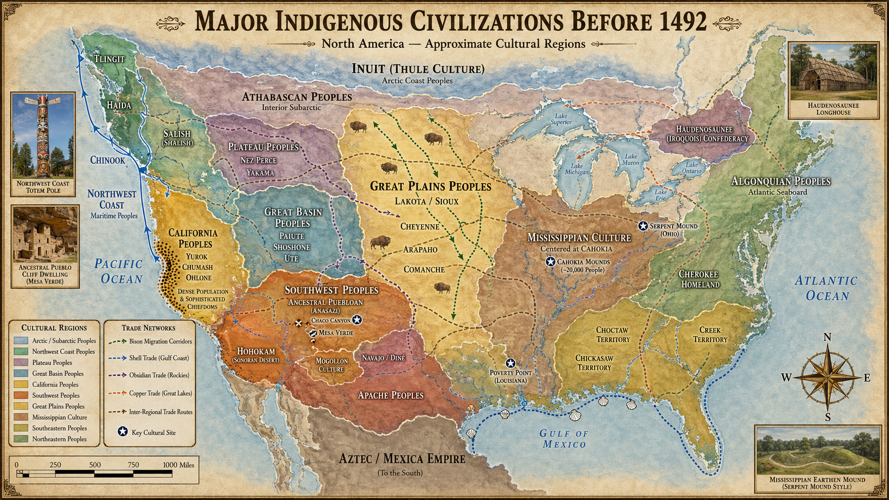
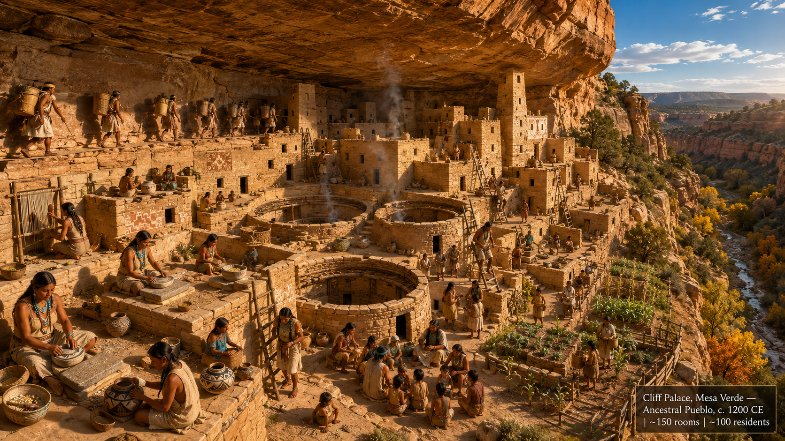
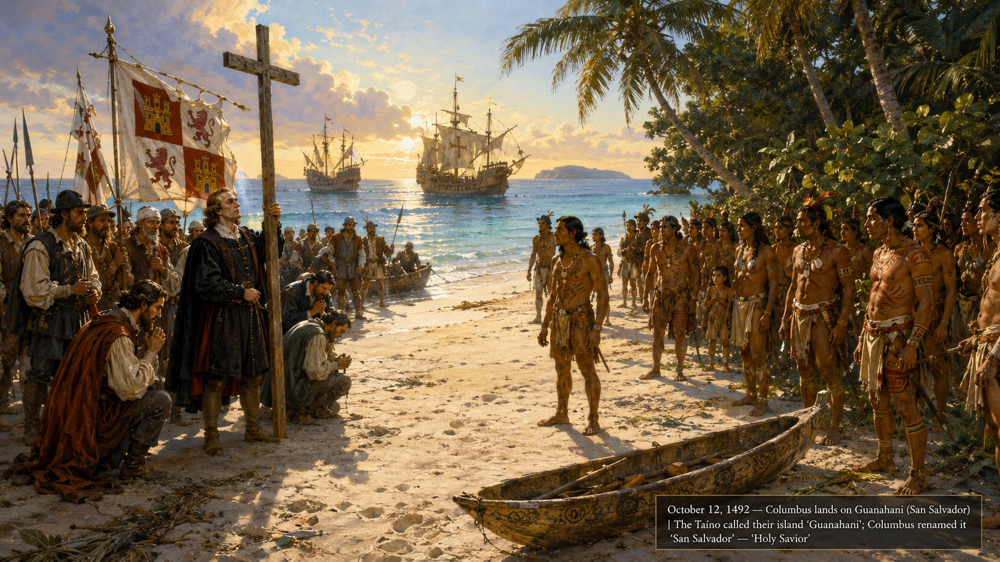
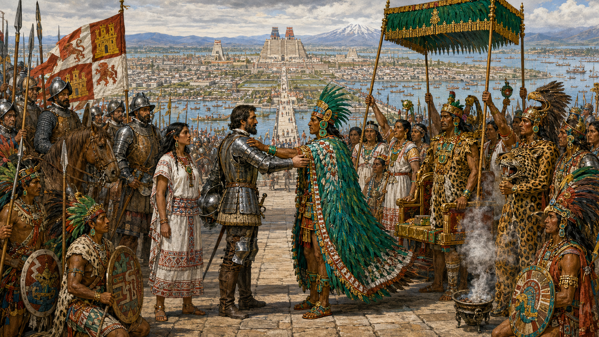
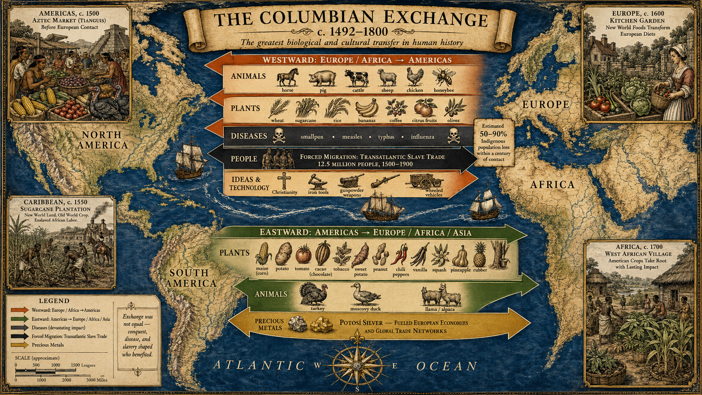
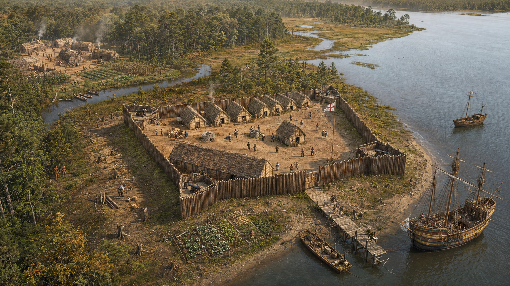

# Pre-Columbian Americas and European Contact

## Summary

This chapter surveys the rich civilizations of the Americas before 1492 and traces the dramatic consequences of European arrival — from the Columbian Exchange and its biological and cultural upheaval, to the Spanish, French, Dutch, and English ventures that permanently altered two hemispheres. The chapter establishes the foundational context for all subsequent American history.

## Concepts Covered

This chapter covers the following 20 concepts from the learning graph:

1. Pre-Columbian Civilizations
2. Indigenous North American Cultures
3. Atlantic Slave Trade Origins
4. Aztec Empire
5. Inca Empire
6. Mississippian Culture
7. Iroquois Confederacy
8. European Exploration Motives
9. Christopher Columbus
10. Spanish Conquistadors
11. Columbian Exchange
12. Disease and Indigenous Depopulation
13. French Exploration
14. Dutch Exploration
15. English Exploration
16. Treaty of Tordesillas
17. Encomienda System
18. Jamestown Settlement
19. John Smith
20. Powhatan Confederacy

## Prerequisites

This chapter assumes only the historical thinking skills introduced in Chapter 1.

---

!!! mascot-welcome "A world before 1492"
    
    Welcome to Chapter 2! Most textbooks treat 1492 as a beginning — but it was a collision between two worlds that had been developing for thousands of years. Before we follow Columbus's ships, we need to understand what those ships were sailing toward. Let's investigate the evidence!

## The Americas Before European Contact

The land Europeans called the "New World" was not new. By 1491, the Western Hemisphere was home to an estimated 50 to 100 million people — a figure comparable to Europe's population at the time. These people lived in hundreds of distinct societies, speaking more than a thousand languages, organized into city-states, confederacies, nomadic bands, and agricultural villages. The term **pre-Columbian civilizations** refers to the full range of complex societies that existed in the Americas before European contact.

Understanding this world matters for two reasons. First, it corrects a persistent misconception: that North and South America were sparsely populated "wilderness" awaiting settlement. Second, it establishes the baseline against which we can measure the catastrophic disruption that European contact produced.

### Major Civilizations of the Americas

Before examining contact and its consequences, three civilizations warrant close attention because of their scale, sophistication, and the role they played in early European colonization.

The **Aztec Empire** (more precisely called the Mexica or Triple Alliance) dominated central Mexico from its capital at Tenochtitlan — a city built on an island in Lake Texcoco that, by 1500, had a population of roughly 200,000, larger than any city in Europe at the time. The Aztec state was built on tribute networks, agricultural engineering including chinampas (floating gardens), and a sophisticated calendar and writing system. It was also a militaristic empire that conducted large-scale warfare and ritual sacrifice, practices that created both resentment among subject peoples and shock among European observers.

The **Inca Empire** (Tawantinsuyu) stretched 2,500 miles along the western coast of South America and governed an estimated 10 million people. The Incas built an extraordinary road network — over 25,000 miles — across the Andes, operated a relay runner system for communication, and organized massive agricultural terracing on steep mountain slopes. Unlike the Aztecs, the Incas had no writing system but kept elaborate records using knotted strings called quipus.

The **Mississippian Culture** flourished in the river valleys of what is now the central and southeastern United States from roughly 800 to 1600 CE. Mississippian peoples built large earthen mounds — some of which still stand — around which they organized complex chiefdoms. Cahokia, near present-day St. Louis, may have housed 20,000 people at its peak around 1100 CE, making it one of the largest pre-contact cities north of Mexico. Most Mississippian societies had declined before sustained European contact, possibly due to drought, internal conflict, or early epidemic disease.

### Indigenous North American Cultures

North of the Rio Grande, **Indigenous North American cultures** were enormously diverse — from the agriculture-based Pueblo peoples of the Southwest to the salmon-fishing nations of the Pacific Northwest, from the nomadic Plains cultures to the densely settled eastern woodlands nations. No single description captures this range, and one of the most important habits of mind in this course is resisting the tendency to treat "Native Americans" as a single, undifferentiated group.

The **Iroquois Confederacy** (Haudenosaunee, or "People of the Longhouse") is especially significant for later American history. Five nations — the Mohawk, Onondaga, Cayuga, Oneida, and Seneca — had formed a political alliance, possibly as early as the 12th century, governed by a council that operated by consensus. The Confederacy's constitution, the Great Law of Peace, established principles of representative governance, checks on power, and peaceful dispute resolution. Some historians have argued that Iroquois political ideas influenced the framers of the U.S. Constitution, though the extent of this influence remains debated among scholars.

#### Diagram: Pre-Columbian Americas Interactive Map

<iframe src="../../sims/pre-columbian-americas-map/main.html" width="100%" height="520px" scrolling="no"></iframe>

Pre-Columbian Americas Interactive Map

Type: map
**sim-id:** pre-columbian-americas-map 
**Library:** p5.js 
**Status:** Specified

Purpose: Allow students to explore the geographic locations, approximate extents, and key characteristics of major pre-Columbian civilizations by clicking labeled regions on a simplified map of the Americas.

Bloom Level: Remember (L1)
Bloom Verb: Identify

Learning Objective: Students identify the geographic locations of the Aztec Empire, Inca Empire, Mississippian Culture, and Iroquois Confederacy and recall one defining characteristic of each.

Canvas layout:
- Responsive width; height approximately 520px
- Simplified outline map of North and South America fills the left 70% of the canvas
- Right panel (30%) is an infobox that updates when a region is clicked

Clickable regions (colored zones on the map):
1. Central Mexico (gold) — Aztec Empire
2. Andean South America (teal) — Inca Empire
3. Mississippi River Valley (orange) — Mississippian Culture
4. Great Lakes / northeastern woodlands (indigo) — Iroquois Confederacy
5. Southwest desert (red-brown) — Pueblo cultures (bonus region)
6. Pacific Northwest coast (green) — Pacific Northwest peoples (bonus region)

Each region infobox contains:
- Region name and civilization
- Approximate dates of peak development
- Estimated population at peak
- One distinctive feature (e.g., "Floating gardens — chinampas — fed a city of 200,000")
- One consequence of European contact

Color scheme: muted earth tones for land; blue for water; each civilization in a distinct accent color. Unclicked regions appear at 60% opacity; clicked region brightens to full color.

Interactivity:
- Clicking a region fills the right panel with the infobox
- Hovering a region shows a tooltip with the civilization name
- A "Reset" button clears the infobox and dims all regions

Responsive behavior: Below 650px canvas width, the infobox panel moves to below the map.

Implementation: p5.js; map drawn as simplified polygon shapes, no external GIS library needed.

## Part 1: European Motives and the Age of Exploration

The civilizations described above were not static or isolated. They traded, warred, migrated, and built diplomatic relationships across vast distances. What disrupted this world was the arrival of Europeans — and understanding why Europeans came is essential for understanding how contact unfolded.

### European Exploration Motives

The term **European exploration motives** covers several interlocking pressures that drove 15th- and 16th-century European expansion. No single motive was sufficient on its own; the combination created an explosive push outward.

**Economic motives** were primary. The overland trade routes to Asia — the source of silk, spices, and luxury goods — were long, expensive, and increasingly controlled by Ottoman intermediaries after the fall of Constantinople in 1453. Finding a sea route to Asia would bypass these middlemen and dramatically reduce costs. This was the logic behind Portuguese exploration of the African coast and Columbus's westward gamble.

**Religious motives** ran parallel to economic ones. The Catholic Church and the Spanish Crown viewed expansion as an opportunity to spread Christianity to peoples they considered pagans. This was not mere rationalization — many explorers and missionaries genuinely believed they were saving souls. But it also provided ideological cover for conquest and forced labor.

**Political and competitive motives** shaped which nations explored and when. Once Portugal and Spain demonstrated that Atlantic voyages were profitable, England, France, and the Netherlands rushed to compete. Exploration became a form of geopolitical rivalry, and control of trade routes, territories, and populations became a measure of national power.

### Christopher Columbus and the Treaty of Tordesillas

**Christopher Columbus** was a Genoese navigator funded by the Spanish Crown who sailed west from the Canary Islands in 1492, believing he could reach Asia. He landed instead in the Caribbean — in what he called the "Indies" — and made four voyages, never accepting that he had reached continents unknown to Europeans.

Columbus's voyages triggered an immediate geopolitical scramble. Spain and Portugal were both expanding rapidly, and conflict between them was likely. The **Treaty of Tordesillas** (1494) resolved this by drawing an imaginary line through the Atlantic: Spain would claim lands west of the line; Portugal would claim lands to the east. This is why Brazil, which lies east of the line, became Portuguese rather than Spanish, while most of the rest of the Americas fell under Spanish claim.

The treaty illustrates a key systems thinking principle: powerful actors can define the rules of a game in ways that lock in their advantage — but the rules they set often produce consequences they didn't foresee. The treaty assumed the Americas were thinly populated and easily divided. Neither assumption proved correct.

## Part 2: Spanish Conquest and Its Consequences

### Spanish Conquistadors

**Spanish conquistadors** — military adventurers funded by the Spanish Crown on contract — carried out the conquest of the major American empires in a remarkably short time. Hernán Cortés arrived in Mexico in 1519 with roughly 500 soldiers and, by 1521, had captured Tenochtitlan and shattered the Aztec Empire. Francisco Pizarro conquered the Inca Empire between 1532 and 1572 with an even smaller force.

How was this possible? Historians point to several converging factors:

- **Epidemic disease** had already devastated Indigenous populations before full military contact
- **Political divisions** within the Aztec and Inca empires meant that many subject peoples initially welcomed or allied with Spanish forces as liberators
- **Military technology** — firearms, steel armor, and horses — gave Spanish forces significant tactical advantages in open combat
- **Psychological shock** at the appearance and behavior of the Spanish disrupted established patterns of warfare

None of these factors alone explains the conquests. All of them together, operating simultaneously, produced an outcome that the participants on both sides found astonishing.

!!! mascot-thinking "Applying systems thinking to the conquest"
    
    The Spanish conquests are a classic case of reinforcing feedback loops. Each conquest produced wealth (gold, silver, land), which funded more expeditions, which produced more conquests. Meanwhile, epidemic disease created a balancing dynamic — depopulation reduced the labor supply that made colonial wealth possible, which is one reason the Spanish eventually turned to African enslaved labor. Can you draw a rough causal loop diagram of this system?

### The Columbian Exchange

The **Columbian Exchange** refers to the transfer of plants, animals, diseases, and people between the Eastern and Western Hemispheres that began with Columbus's voyages and continued for centuries. It is one of the most consequential biological events in human history.

Before 1492, the two hemispheres had been ecologically separated for roughly 10,000 years, since the last land bridge between Asia and North America was submerged. Each had developed distinct ecosystems, crops, and disease environments. Contact abruptly merged them.

The exchange moved in both directions, but its most dramatic short-term effect flowed from East to West.

**From the Americas to Europe:**

- Maize (corn), potatoes, tomatoes, cacao, tobacco, sweet potatoes, and many other crops
- These foods transformed European diets and, over centuries, contributed to European population growth

**From Europe to the Americas:**

- Horses, cattle, pigs, sheep, and chickens
- Wheat, rice, sugarcane, and other grains
- Smallpox, measles, influenza, typhus, and dozens of other diseases

The last category — disease — produced catastrophic consequences.

### Disease and Indigenous Depopulation

**Disease and Indigenous depopulation** represents one of the largest demographic collapses in human history. Because the peoples of the Americas had been separated from Eurasia for millennia, they had no acquired immunity to European diseases. When smallpox, measles, and influenza arrived, mortality rates in many communities reached 50 to 90 percent within a generation.

The historian Alfred Crosby estimated that the Indigenous population of the Americas fell from roughly 50–100 million in 1491 to fewer than 10 million by 1600. The precise numbers are debated, but the scale of the collapse is not. Entire cultures, languages, and systems of knowledge were lost.

Critically, disease often arrived *before* European soldiers did, traveling through trade networks ahead of any direct contact. When Cortés reached Tenochtitlan, smallpox had already devastated the city. This complicates the straightforward "conquest by military force" narrative and is a vivid example of unintended consequences at a civilizational scale.

| Region | Estimated 1491 population | Estimated 1600 population | Decline |
|--------|--------------------------|--------------------------|---------|
| Mexico | 25 million | 2 million | ~92% |
| Caribbean islands | 1–8 million | Near zero | ~100% |
| North America (north of Mexico) | 5–18 million | 1–2 million | ~80–90% |
| Andean South America | 12–15 million | 1–2 million | ~85–90% |

*(Population estimates vary significantly among historians; figures represent scholarly ranges.)*

### The Encomienda System

The Spanish Crown needed a way to govern and profit from its new territories without physically relocating millions of Spanish settlers. The **encomienda system** was their solution: the Crown granted Spanish colonizers (encomenderos) the right to extract labor and tribute from a specific group of Indigenous people, in exchange for the encomenderos' obligation to protect and Christianize them.

In practice, the encomienda was a system of forced labor barely distinguishable from slavery. Indigenous people were compelled to work in mines (particularly the silver mines of Potosí in present-day Bolivia), in fields, and in domestic service. The combination of overwork, malnutrition, and epidemic disease killed enslaved laborers faster than they could be replaced.

The encomienda system's labor crisis is directly connected to the **origins of the Atlantic slave trade**. As Indigenous populations collapsed, Spanish colonizers turned to enslaved Africans as a replacement labor source. Portuguese traders, who had been conducting slave raids on the West African coast since the 1440s, were positioned to supply this demand. The transatlantic slave trade that would shape the next four centuries of American history grew directly from the labor needs created by Indigenous depopulation.

#### Diagram: The Columbian Exchange Interactive Web

<iframe src="../../sims/columbian-exchange-web/main.html" width="100%" height="520px" scrolling="no"></iframe>

The Columbian Exchange Interactive Web

Type: infographic
**sim-id:** columbian-exchange-web 
**Library:** p5.js 
**Status:** Specified

Purpose: Allow students to explore the bidirectional flow of plants, animals, and diseases between the Old and New Worlds, and understand which transfers had the most significant historical consequences.

Bloom Level: Understand (L2)
Bloom Verb: Explain

Learning Objective: Students explain the bidirectional nature of the Columbian Exchange and identify at least two transfers from each direction that had significant historical consequences.

Canvas layout:
- Responsive width; height approximately 520px
- Two large circle regions: left = "Americas (New World)," right = "Europe/Africa (Old World)"
- Center = "Atlantic Ocean" with bidirectional arrows
- Items are represented as labeled icons arranged in each circle

Items in Americas circle (flowing East):
- Maize (corn) icon
- Potato icon
- Tomato icon
- Cacao/chocolate icon
- Tobacco icon
- Sweet potato icon

Items in Old World circle (flowing West):
- Smallpox virus icon (red, marked "Deadly")
- Horse icon
- Cattle icon
- Wheat icon
- Sugarcane icon
- Measles icon (red, marked "Deadly")

Interactivity:
- Clicking any item icon opens a right-side panel with: item name, direction of transfer, a 2-sentence historical significance note, and a "historical consequence" rating (Low / Medium / High / Catastrophic)
- Disease items pulse with a red animation to signal danger before they are clicked
- A toggle button switches between "Show all items" and "Show consequences only" — the latter highlights only items rated High or Catastrophic
- Arrows between the circles animate to show directionality when hovered

Color scheme:
- Americas circle: warm green (#2e7d32 tint)
- Old World circle: indigo (#3949ab tint)
- Arrows: gold for food/animals, red for disease

Responsive behavior: Below 600px width, the two circles stack vertically with arrows pointing downward.

Implementation: p5.js; icons are simple geometric shapes with text labels, no external image files needed.

## Part 3: Other European Powers Enter the Americas

Spain's early dominance did not go unchallenged. France, England, and the Netherlands each pursued their own strategies in the Americas, driven by the same combination of economic competition, religious rivalry, and political ambition.

### French Exploration

**French exploration** focused primarily on North America rather than the tropics. Jacques Cartier explored the St. Lawrence River in the 1530s, claiming the region that would become New France (Canada) for the French Crown. French explorers — called voyageurs and coureurs des bois — pushed deep into the interior of North America, establishing relationships with Indigenous nations that were often more cooperative and less violently extractive than Spanish colonial relationships in the south. The French were primarily interested in the fur trade, which required Indigenous trading partners rather than enslaved labor.

This difference in colonial strategy produced different kinds of relationships with Indigenous peoples. French traders often lived among Native communities, learned their languages, and formed kinship alliances through marriage. These relationships were not free of exploitation or violence, but they differed structurally from the encomienda labor system.

### Dutch Exploration

**Dutch exploration** was driven by the Dutch East India Company (VOC) and the Dutch West India Company, both joint-stock corporations — a significant institutional innovation. The Dutch established New Amsterdam at the southern tip of Manhattan (1626) and built a fur-trading empire along the Hudson River. The Dutch approach to colonization was characteristically commercial: the goal was profit, not settlement or conversion. New Amsterdam was ethnically diverse from its founding, a reflection of the Netherlands' relatively tolerant religious climate and its role as a center of European trade.

### English Exploration

**English exploration** arrived comparatively late. England's first sustained attempt at American colonization, the Roanoke Colony (1585–1590), vanished without explanation — the "Lost Colony" remains one of American history's enduring mysteries. English ambitions crystallized around the Virginia Company, a joint-stock corporation that founded **Jamestown** in 1607.

**Jamestown Settlement** was the first permanent English settlement in North America, established on a swampy peninsula in the James River in what is now Virginia. Its early years were catastrophic. Most settlers were gentlemen or craftsmen who had no agricultural experience and arrived with no clear plan for feeding themselves. By the winter of 1609–1610, the "Starving Time" had killed roughly 80 percent of the settlers. The colony survived only because of supplies from the **Powhatan Confederacy**.

**John Smith**, the colony's most famous early leader, established a policy of trading with the Powhatan people for food — essential to the colony's survival. Smith's famous account of being saved from execution by Pocahontas is likely embellished or invented, a reminder that primary sources — especially self-promoting memoirs — require sourcing before they are trusted.

The **Powhatan Confederacy** was a loose alliance of approximately 30 Algonquian-speaking nations in the Chesapeake region, led by the paramount chief Wahunsenacah (called "Powhatan" by the English). The Confederacy initially chose to trade with and tolerate the English, viewing them as potentially useful allies against rival nations. When it became clear that the English intended permanent settlement and land seizure, the relationship deteriorated into a series of Anglo-Powhatan Wars (1610–1646) that ended with the Confederacy's defeat and the destruction of most of its member nations.

!!! mascot-warning "Watch the perspective in sources about Indigenous peoples"
    
    Nearly all primary sources from this period were written by Europeans. That means we have extensive documentation of European perceptions of Indigenous peoples — and very little documentation of what Indigenous peoples thought about Europeans, at least in written form. When you read colonial-era sources, ask: whose experience is being recorded, and whose is being filtered through someone else's interpretation?

#### Diagram: European Exploration Timeline

<iframe src="../../sims/european-exploration-timeline/main.html" width="100%" height="480px" scrolling="no"></iframe>

European Exploration Timeline — 1450 to 1620

Type: timeline
**sim-id:** european-exploration-timeline 
**Library:** p5.js 
**Status:** Specified

Purpose: Give students an interactive overview of the sequence and nationality of major European exploration events between 1450 and 1620, with clickable events that reveal context and significance.

Bloom Level: Remember (L1)
Bloom Verb: Recall

Learning Objective: Students recall the sequence of major European exploration events and the national powers behind them.

Canvas layout:
- Responsive width; height approximately 480px
- Horizontal timeline spanning 1450 to 1620
- Events represented as labeled vertical markers (circles) above or below the timeline axis
- Color-coded by nation: Portugal (dark green), Spain (red/gold), France (blue), England (dark red), Netherlands (orange)

Events to include:
- 1488: Dias rounds the Cape of Good Hope (Portugal)
- 1492: Columbus reaches the Caribbean (Spain)
- 1494: Treaty of Tordesillas (Spain/Portugal)
- 1497: Cabot explores North America (England)
- 1498: Vasco da Gama reaches India (Portugal)
- 1513: Balboa sees the Pacific (Spain)
- 1519–1521: Cortés conquers the Aztec Empire (Spain)
- 1524: Verrazzano explores North America (France)
- 1532–1572: Pizarro conquers the Inca Empire (Spain)
- 1534–1535: Cartier explores the St. Lawrence (France)
- 1585: First Roanoke Colony (England)
- 1607: Jamestown founded (England)
- 1609: Hudson explores New Netherlands (Netherlands)

Interactivity:
- Clicking any event marker opens a detail panel below the timeline with: date, explorer/event name, nation, a 2-sentence significance note, and connection to later history
- Nation filter buttons above the timeline allow students to show only one nation's events at a time
- Hovering a marker shows the event name in a tooltip

Color scheme matches nation flag colors (listed above). Timeline axis is dark gray on white background.

Responsive behavior: On narrow canvas, timeline scrolls horizontally; all markers remain clickable.

Implementation: p5.js; no external library needed

## Part 4: Systems Thinking — Contact as a System

The events of this chapter are not a simple sequence of discovery, conquest, and settlement. They form an interconnected system with reinforcing loops, balancing forces, and cascading unintended consequences.

The core reinforcing loop of European colonization ran as follows: European military and technological advantages produced initial conquest. Conquest produced access to American silver and gold (especially from Potosí). Silver funded larger expeditions and military forces. Larger forces produced more conquest. This loop ran so powerfully that within a century, Spain had extracted more wealth from the Americas than existed in all of Europe at the time of Columbus's first voyage.

But the system also contained devastating balancing and collapse dynamics. The same conquest and forced labor that produced wealth destroyed the labor force through overwork and disease. Spanish colonial administrators repeatedly debated how to manage this contradiction — occasionally producing legislation like the New Laws of 1542 that attempted to limit encomienda abuses — but the economic incentives for exploitation consistently overwhelmed regulatory intent.

A second-order effect of Indigenous depopulation was the Atlantic slave trade. A third-order effect was the creation of new racial categories and hierarchies to justify enslaved labor — categories that would shape American society for four centuries beyond the period covered in this chapter.

!!! mascot-tip "The power of second-order thinking"
    
    When historians say that the Atlantic slave trade "grew from" Indigenous depopulation, they are doing second-order thinking. The first-order effect of colonization was labor extraction. The second-order effect was demographic collapse. The third-order effect was the transatlantic slave trade. Tracing these orders of effect — what caused what caused what — is one of the most powerful tools in historical analysis.

## Summary

Before 1492, the Americas held complex, diverse civilizations — from the urban splendor of Tenochtitlan to the political sophistication of the Iroquois Confederacy. European contact, beginning with Columbus and accelerating through Spanish conquest, transformed the hemisphere through three interconnected mechanisms: military conquest, epidemic disease, and economic exploitation through systems like the encomienda.

The Columbian Exchange moved plants, animals, and diseases in both directions across the Atlantic, but disease moved most fatally westward, killing 50–90 percent of Indigenous populations within a century of contact. The labor crisis this created drove the development of the Atlantic slave trade — linking the story of Indigenous America directly to the story of African America that will run through every chapter that follows.

France, England, and the Netherlands entered the Americas later and with different strategies, but all were driven by the same combination of economic ambition and geopolitical competition. England's Jamestown, founded in 1607 with help from the Powhatan Confederacy it would eventually destroy, marks the beginning of the North American story that is the central subject of this course.

??? question "Knowledge Check 1 — Click to reveal"
    **Question:** A student argues that the Spanish conquered the Aztec Empire because they had better weapons. Apply the concept of historical causation to evaluate this claim.

    **Answer:** The student has identified one **immediate cause** — superior Spanish military technology (firearms, steel, horses). But a full causal account requires acknowledging **underlying causes** as well: epidemic disease had already devastated Tenochtitlan's population before the final siege; political divisions within the Aztec Empire led many subject nations to ally with the Spanish; and the Spanish benefited from the psychological shock their arrival produced. Reducing the conquest to weapons alone is a classic oversimplification that the causation skill is designed to prevent.

??? question "Knowledge Check 2 — Click to reveal"
    **Question:** The Columbian Exchange transferred crops from the Americas to Europe that eventually contributed to European population growth. What systems thinking term describes this kind of delayed, indirect consequence?

    **Answer:** This is a **second-order effect**. The direct (first-order) effect of the Columbian Exchange was the transfer of new crops — potatoes, maize, tomatoes — to European diets. The second-order effect, operating over decades and centuries, was that these more calorie-dense and disease-resistant crops reduced famine, improved nutrition, and contributed to European population growth. The third-order effect was that larger European populations created more pressure for emigration — driving further colonization of the Americas. This chain of effects illustrates why historians must think beyond immediate consequences.

!!! mascot-celebration "Chapter 2 Complete!"
    
    You've just surveyed a world of stunning complexity — hundreds of distinct cultures, two hemispheres colliding, and consequences that are still unfolding. The patterns you've seen here — reinforcing feedback loops driving conquest, unintended consequences reshaping entire continents, in-group favoritism shaping whose story gets told — will appear again and again in the chapters ahead. In Chapter 3, we turn to the British colonies that will become the foundation of the United States.

[See Annotated References](./references.md)
