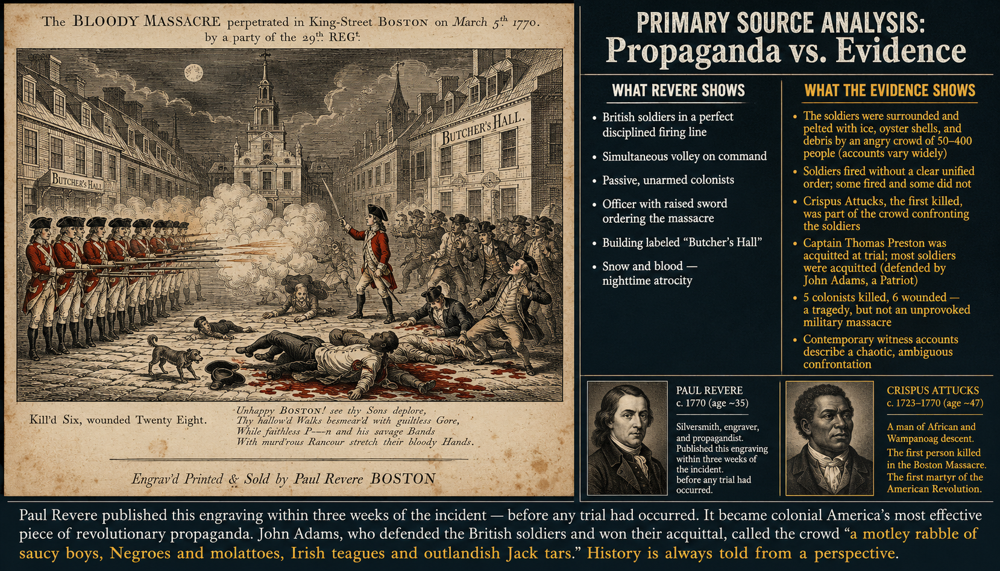
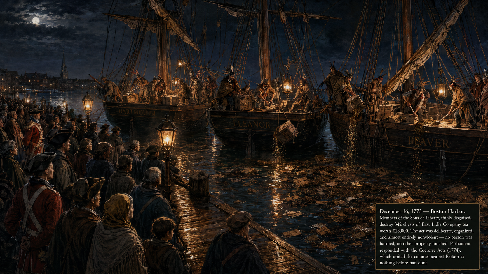
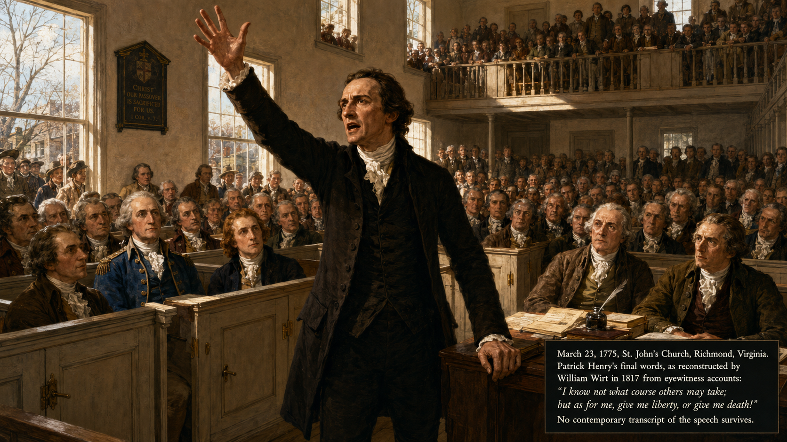
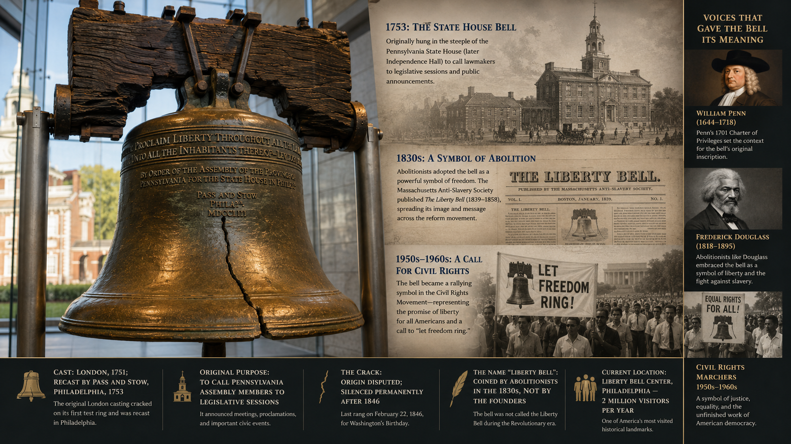
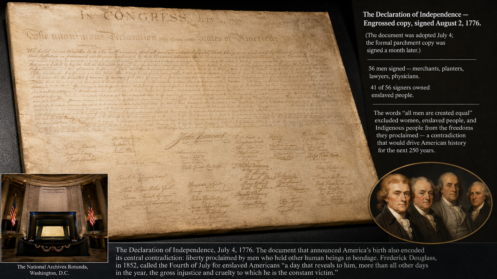
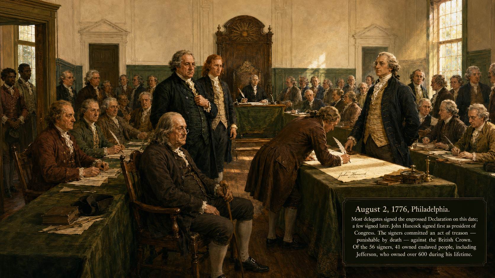
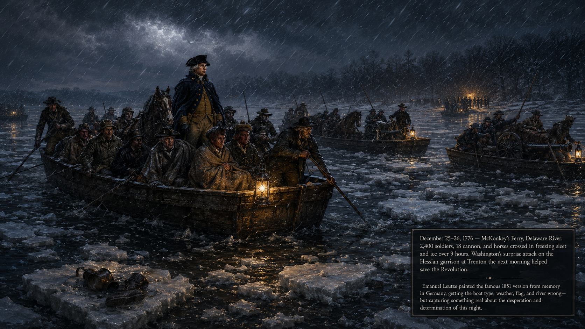
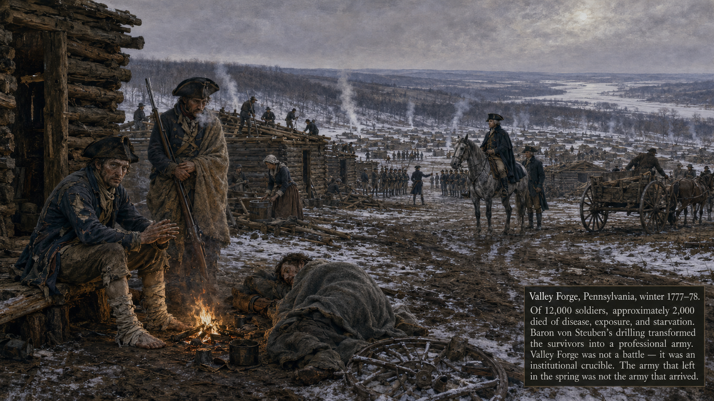
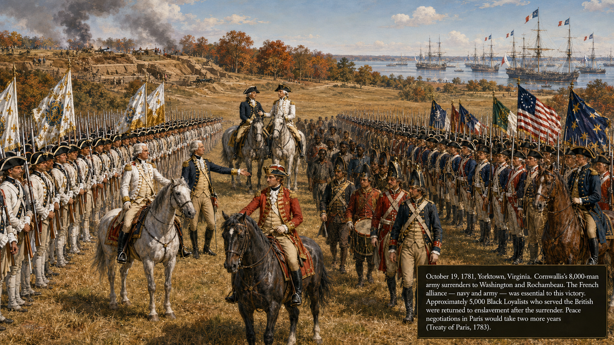

# The American Revolution (1754–1783)

## Summary

This chapter traces the escalating conflict between Britain and its American colonies — from the French and Indian War's financial aftermath through the protest movements, battles, and the Declaration of Independence — to the Treaty of Paris that secured American sovereignty. Students analyze how colonial grievances, Enlightenment ideas, and political organizing produced a successful revolution.

## Concepts Covered

This chapter covers the following 17 concepts from the learning graph:

1. French and Indian War
2. Proclamation of 1763
3. Stamp Act
4. Townshend Acts
5. Boston Massacre
6. Boston Tea Party
7. Intolerable Acts
8. First Continental Congress
9. Lexington and Concord
10. Second Continental Congress
11. Common Sense (Paine)
12. Declaration of Independence
13. Thomas Jefferson
14. Revolutionary War Major Battles
15. Valley Forge
16. Marquis de Lafayette
17. Treaty of Paris 1783

## Prerequisites

This chapter builds on concepts from:
- [Chapter 3: Colonial America](../03-colonial-america/index.md)

---

!!! mascot-welcome "The world's first modern revolution"
    
    Welcome to Chapter 4! Revolutions don't begin with battles — they begin with arguments. The argument between Britain and its American colonies about taxation, representation, and sovereignty ran for more than a decade before a single shot was fired at Lexington. Understanding that argument — not just the battles — is the real historical work of this chapter. Let's investigate the evidence!

## The War That Changed Everything: The French and Indian War

The American Revolution did not emerge from nothing. Its immediate origins lie in a war that ended in British victory — yet set in motion dynamics that made the Revolution almost inevitable.

### The French and Indian War (1754–1763)

The **French and Indian War** was the North American theater of a global conflict known in Europe as the Seven Years' War. Britain and France, perpetually at war for imperial advantage, had competing claims to the Ohio River Valley — a region prized by both powers and by the Indigenous nations who had lived there for generations. The war began when Virginia militia officer George Washington (then 22) clashed with French forces near present-day Pittsburgh.

The war's outcome transformed North America. Britain won decisively. France ceded Canada and all territory east of the Mississippi River. Spain, which had allied with France, ceded Florida. Britain now controlled the entire eastern half of North America — and had accumulated enormous debt fighting for it.

That debt became the central problem of the next decade. Britain had spent approximately £70 million fighting the Seven Years' War globally. British taxpayers were already paying among the highest tax rates in Europe. The British government concluded, reasonably from its perspective, that the American colonies — which had benefited enormously from France's removal — should contribute to the cost of their own defense. American colonists concluded, with equal conviction, that they should not be taxed by a Parliament in which they had no representatives.

### The Proclamation of 1763

Even before addressing taxation, Britain took a step that infuriated the colonial land-owning class. The **Proclamation of 1763** prohibited colonial settlement west of the Appalachian Mountains. The British intended this as a temporary measure to prevent costly conflicts with Indigenous nations while they worked out a more permanent policy. American colonists — many of whom had served in the French and Indian War specifically to win access to western land — saw it as an outrageous imposition.

George Washington, who had speculated heavily in western land grants, described the Proclamation privately as "a temporary expedient to quiet the minds of the Indians" and assumed it would quickly be reversed. He began quietly acquiring western land warrants anyway, in violation of the law.

The Proclamation reveals an important pattern: a policy that seems reasonable from London looks very different from the colonies. This gap in perspective — call it a **systems thinking** gap, where actors in different parts of a system see the same situation entirely differently — runs through the entire pre-revolutionary period.

## Part 1: The Road to Revolution — Taxes and Resistance

### The Stamp Act (1765) and Colonial Protest

The **Stamp Act** of 1765 was Britain's first direct attempt to tax the colonies internally — that is, to impose a tax on the colonists themselves rather than on trade between countries. The act required a government stamp (and a tax payment) on legal documents, newspapers, almanacs, and playing cards.

The colonial response was swift and largely unified. The objection was not primarily about the amount of the tax — the Stamp Act revenues would have been modest — but about the *principle*. The colonial argument, articulated most powerfully by James Otis, was that "taxation without representation is tyranny." Parliament had no right to tax the colonists because the colonists had no elected representatives in Parliament. This argument drew directly on English constitutional traditions: Magna Carta (1215) and the English Bill of Rights (1689) had established that the Crown could not tax subjects without their consent through their representatives.

Colonial protesters formed the **Sons of Liberty** — networks of activists who organized boycotts, published pamphlets, and in some cases physically threatened stamp tax collectors. The Stamp Act Congress, a meeting of delegates from nine colonies, petitioned Parliament to repeal the act. Parliament did repeal it in 1766, but simultaneously passed the Declaratory Act, asserting that Parliament had the right to legislate for the colonies "in all cases whatsoever." This assertion — that Parliament's authority was unlimited — was precisely what the colonists denied.

### The Townshend Acts and Escalating Tension

The **Townshend Acts** (1767) tried a different approach: taxing goods that the colonies imported from Britain, rather than taxing colonists directly. The acts taxed tea, glass, paper, and paint. Colonial leaders argued that these were still unconstitutional taxes — Parliament was taxing them through imports rather than income, but the principle was the same.

The Townshend Acts produced a coordinated colonial boycott of British goods. Merchants signed non-importation agreements; women organized spinning bees to produce domestic cloth rather than buy British fabric. The boycotts were economically significant — British exports to the colonies dropped sharply — and they demonstrated that colonial resistance had a mass base, not just an elite leadership.

Britain responded by sending soldiers to Boston to restore order. The presence of a standing army in a civilian city inflamed tensions dramatically.

### The Boston Massacre (1770)

The **Boston Massacre** of March 5, 1770, was a street confrontation in which British soldiers, surrounded by an aggressive crowd throwing ice, rocks, and debris, fired into the crowd and killed five colonists. The event was immediately seized upon by colonial propagandists, most effectively Paul Revere, whose engraving depicted the British as cold-blooded murderers firing in formation at innocent citizens.

The "massacre" framing requires careful historical thinking. Applying sourcing and corroboration to the event reveals a more complex picture: the soldiers were frightened, the crowd was violent, and the confrontation was in some sense provoked. John Adams — a Patriot and future president — defended the British soldiers in court and won acquittals for most of them, believing that the rule of law required even unpopular defendants to have legal counsel.

Yet the political effect of the Boston Massacre was real regardless of what actually happened. The Revere engraving traveled through the colonies and created a shared narrative of British tyranny. Confirmation bias operated powerfully: colonists already suspicious of British intentions interpreted the event as evidence of what they already believed. This is a case where understanding cognitive bias helps explain how a contested event became a political catalyst.

!!! mascot-thinking "Sourcing the Boston Massacre"
    
    Paul Revere's engraving of the Boston Massacre was one of the most politically powerful images of the revolutionary era — and one of the most historically misleading. Practice sourcing it: who created it, for what audience, and for what purpose? How does knowing the answers to those questions change how you read the image? This is exactly what lateral reading asks you to do.

### The Boston Tea Party (1773) and the Intolerable Acts

Parliament repealed most of the Townshend duties by 1770 but kept the tax on tea. In 1773, it passed the Tea Act, which gave the British East India Company a monopoly on tea sales to the colonies — actually making tea cheaper — but maintaining the principle of parliamentary taxation. The **Boston Tea Party** (December 1773), in which members of the Sons of Liberty dressed as Mohawks boarded East India Company ships and dumped 342 chests of tea into Boston Harbor, was a deliberate political act aimed at the principle, not the price.

Parliament's response — the **Intolerable Acts** of 1774 — was severe: it closed Boston Harbor until the tea was paid for, revoked Massachusetts's charter of self-government, required colonists to house British soldiers, and extended the boundaries of Quebec. The acts were intended to punish Massachusetts and isolate it from the other colonies. They had the opposite effect.

#### Diagram: Colonial Resistance Timeline (1763–1775)

<iframe src="../../sims/colonial-resistance-timeline/main.html" width="100%" height="480px" scrolling="no"></iframe>

Colonial Resistance Timeline — 1763 to 1775

Type: timeline
**sim-id:** colonial-resistance-timeline 
**Library:** p5.js 
**Status:** Specified

Purpose: Allow students to trace the escalating cycle of British taxation and colonial resistance between 1763 and 1775, identifying the reinforcing feedback loops that drove both sides toward open conflict.

Bloom Level: Analyze (L4)
Bloom Verb: Examine

Learning Objective: Students examine the escalating cycle of British action and colonial response and identify how each British measure produced colonial resistance that intensified the next British measure.

Canvas layout:
- Responsive width; height approximately 480px
- Horizontal timeline with two tracks: top track = British actions (red/gold), bottom track = Colonial responses (blue)
- Each event is a clickable circle; connected events (action → response) are linked by curved arrows

Events to include (paired action-response):
1. Proclamation of 1763 → Colonial land speculation in violation of the law
2. Stamp Act 1765 → Stamp Act Congress; Sons of Liberty formed; boycott
3. Townshend Acts 1767 → Non-importation agreements; spinning bees
4. British troops sent to Boston 1768 → Increased colonial anger
5. Boston Massacre 1770 → Revere engraving; radicalization
6. Tea Act 1773 → Boston Tea Party
7. Intolerable Acts 1774 → First Continental Congress; intercolonial unity
8. Lexington and Concord 1775 → Second Continental Congress; war begins

Clicking any event shows a panel with:
- Event name and date
- Who initiated it (British or colonial)
- A 2-sentence description
- A "Systems thinking" note identifying whether this was a reinforcing or balancing loop moment

Color scheme:
- British actions: gold (#f9a825) circles
- Colonial responses: indigo (#3949ab) circles
- Connecting arrows: gray with directional arrowheads
- Selected event: highlighted in bright white border

Responsive behavior: Timeline scrolls horizontally on narrow canvases; all events remain clickable.

Implementation: p5.js

## Part 2: From Resistance to Revolution

### The Continental Congresses

The **First Continental Congress** (September–October 1774) was convened in Philadelphia in response to the Intolerable Acts. Delegates from twelve colonies (only Georgia was absent) agreed to a boycott of British goods and petitioned the King — pointedly not Parliament — for the repeal of the objectionable acts. They also agreed to meet again if Britain did not respond favorably. Britain did not respond favorably.

The **Second Continental Congress** (May 1775–March 1781) convened after the battles of Lexington and Concord had already begun the shooting war. It became, in effect, the government of the United States during the Revolution — organizing the Continental Army, appointing George Washington as its commander, authorizing paper currency, conducting diplomacy, and ultimately approving the Declaration of Independence.

### Lexington and Concord (April 1775)

The first military engagements of the Revolution were not a planned confrontation — they grew from a British attempt to seize colonial weapons stored at Concord, Massachusetts. On April 19, 1775, British troops marched from Boston; Paul Revere and others rode ahead to warn the countryside. At **Lexington**, a small group of militia faced the British column on the village green. Shots were fired — who fired first remains historically disputed — and eight militia members were killed.

At **Concord**, the British found that most weapons had been hidden, and on the return march to Boston they were ambushed by thousands of militia firing from behind stone walls and trees. By the end of the day, the British had suffered more than 270 casualties. The "shot heard 'round the world," as Ralph Waldo Emerson would later call it, began the Revolutionary War.

### Common Sense and the Case for Independence

For most of 1775, colonial leaders framed the conflict as a fight for their rights as British subjects, not as a bid for independence. Many colonists still hoped for reconciliation.

**Common Sense**, a pamphlet written by the recent English immigrant Thomas Paine and published in January 1776, changed the terms of the debate.

Paine argued in plain, forceful language that monarchy was an absurd and destructive form of government, that the British Crown had forfeited any claim to colonial loyalty, and that independence was not merely a right but a duty. *Common Sense* sold approximately 500,000 copies in a country of roughly 2.5 million — an extraordinary circulation for the time — and is credited with moving public opinion decisively toward independence.

### The Declaration of Independence

The **Declaration of Independence**, adopted July 4, 1776, was primarily drafted by **Thomas Jefferson** with revisions by Benjamin Franklin, John Adams, and the Continental Congress as a whole. It served two purposes: as a statement of political philosophy justifying revolution, and as a diplomatic document addressed to potential European allies (particularly France) who needed a principled rationale to support the American cause.

Its most famous passage drew directly on Enlightenment philosophy — particularly John Locke's ideas about natural rights and the social contract:

> "We hold these truths to be self-evident, that all men are created equal, that they are endowed by their Creator with certain unalienable Rights, that among these are Life, Liberty and the pursuit of Happiness."

The Declaration was a radical document by the standards of its time. It provided a universal language of rights that could be — and was — turned against the slaveholders who wrote it. Within decades, abolitionists were quoting the Declaration's second sentence in arguments against slavery. In the 20th century, civil rights leaders would invoke it in arguments for racial equality. The gap between the Declaration's universal claims and the realities of American society at its founding created a tension that has run through American history ever since.

!!! mascot-warning "Jefferson and the limits of the Declaration"
    
    Thomas Jefferson owned more than 600 enslaved people over the course of his life, including at the moment he wrote that "all men are created equal." Pointing this out is not presentism — Jefferson's contemporaries pointed it out too. Samuel Johnson, the English writer, asked sarcastically: "How is it that we hear the loudest yelps for liberty among the drivers of negroes?" Evaluating this contradiction honestly, without either excusing Jefferson or dismissing his ideas, is the kind of nuanced historical thinking this course asks you to practice.

## Part 3: Fighting and Winning the Revolution

### Revolutionary War Major Battles

The Revolutionary War was fought over eight years (1775–1783) across the eastern seaboard, the frontier, and at sea. Several **Revolutionary War major battles** shaped its outcome:

- **Bunker Hill (1775)** — A British assault on fortified colonial positions near Boston. The British won the hill but suffered devastating casualties (~1,000 vs. ~450 colonial). It demonstrated that colonial militia could inflict serious damage on professional troops.
- **Trenton (1776)** — Washington's famous Christmas night crossing of the Delaware River and surprise attack on Hessian troops. After a series of defeats, this victory revived Continental Army morale.
- **Saratoga (1777)** — A major American victory in which General Burgoyne's entire British army of 6,000 surrendered. Saratoga convinced France to formally enter the war as an American ally — the most consequential diplomatic event of the Revolution.
- **Yorktown (1781)** — The final major battle, in which Washington and French General Rochambeau trapped General Cornwallis's British army on the Virginia peninsula. French naval forces blocked British relief, and Cornwallis surrendered. The war effectively ended.

### Valley Forge

**Valley Forge** (winter 1777–1778) was not a battle but a crisis of survival. Washington's Continental Army camped at Valley Forge, Pennsylvania, through a brutal winter with inadequate food, clothing, and shelter. Roughly 2,000 of 12,000 soldiers died of cold, disease, and starvation.

Valley Forge is remembered as a test of revolutionary resolve — and for good reason. The soldiers who survived emerged in spring 1778 better trained (thanks to the Prussian officer Baron von Steuben, who drilled them in European military discipline) and more tightly bonded. But Valley Forge also illustrates the dysfunction of the Continental Congress, which repeatedly failed to supply the army it had called into existence.

### International Dimensions — The Marquis de Lafayette

The American Revolution was not fought alone. French, Spanish, and Dutch support — financial, military, and naval — was essential to the American victory. The **Marquis de Lafayette**, a young French aristocrat, joined the Continental Army as a volunteer, served with distinction, and used his influence in France to argue for military assistance.

France's decision to support the American Revolution was not idealistic — it was strategic. France had lost the Seven Years' War and saw an opportunity to weaken Britain by supporting Britain's rebellious colonies. The alliance that followed Saratoga gave the Americans French troops, a naval force capable of challenging British sea power, and financial credit when the Continental Congress was bankrupt.

The dependence on French support is an important corrective to narratives of the Revolution as a purely American achievement. It also illustrates how international systems of rivalry and alliance shaped what was nominally a domestic conflict.

#### Diagram: Revolutionary War Battles Map

<iframe src="../../sims/revolutionary-war-battles/main.html" width="100%" height="520px" scrolling="no"></iframe>

Revolutionary War Major Battles — Interactive Map

Type: map
**sim-id:** revolutionary-war-battles 
**Library:** p5.js 
**Status:** Specified

Purpose: Allow students to explore the geographic distribution of major Revolutionary War battles, understand the strategic logic of each campaign, and identify how the war's geography shaped its outcome.

Bloom Level: Understand (L2)
Bloom Verb: Explain

Learning Objective: Students explain the strategic significance of at least three major Revolutionary War battles and describe how geography influenced the war's outcome.

Canvas layout:
- Responsive width; height approximately 520px
- Simplified map of the eastern seaboard from Maine to Georgia
- Battle sites marked with clickable star icons
- British-controlled territory shaded light red; American/contested territory light blue

Battle sites to include (with years):
- Bunker Hill, MA (1775) — British victory, high British casualties
- Trenton, NJ (1776) — American surprise victory
- Philadelphia, PA (1777) — British occupation
- Saratoga, NY (1777) — American decisive victory; key to French alliance
- Valley Forge, PA (1777–78) — Winter encampment (not a battle; marked differently)
- Charleston, SC (1780) — British victory; beginning of Southern campaign
- Cowpens, SC (1781) — American victory in the South
- Yorktown, VA (1781) — Final British surrender

Clicking a battle site opens a panel showing:
- Battle name, date, and outcome (American win / British win / Draw)
- A 2-sentence strategic significance note
- A "Why it mattered" line connecting to the war's overall arc

Visual treatment:
- American victory stars: blue/gold
- British victory stars: red
- Valley Forge: brown tent icon (not a battle)
- Arrows showing the movement of British Southern campaign (1780–81)

Interactivity:
- Click site for detail panel
- "Show campaign" toggle draws a strategic overview arrow for the Northern (1775–76) and Southern (1780–81) campaigns

Responsive behavior: Map scales with canvas width; clickable areas scale proportionally.

Implementation: p5.js; map as simplified polygon coastline

### The Treaty of Paris (1783)

The **Treaty of Paris** (September 3, 1783) formally ended the Revolutionary War. Its terms were extraordinarily favorable to the United States: Britain recognized American independence, ceded all territory east of the Mississippi River (south of Canada, north of Florida), and granted Americans fishing rights in Canadian waters.

The American negotiators — Franklin, Adams, and Jay — achieved these terms partly by negotiating separately from their French allies, who had their own strategic interests. France had hoped to limit American expansion westward; the American negotiators signed a preliminary peace with Britain without informing France, violating the alliance treaty but securing better terms for the United States.

The treaty solved the immediate problem — independence and territory — but left several issues unresolved that would define the next decade: the status of Loyalists whose property had been seized, the treatment of British debts owed by American merchants, and the fundamental question of what kind of government could hold the new nation together.

## Summary

The American Revolution followed a clear causal logic driven by reinforcing feedback loops. British efforts to tax the colonies to pay for imperial defense produced colonial resistance grounded in constitutional principles. Each round of British enforcement produced more organized and radical colonial resistance. Each escalation of colonial resistance produced more aggressive British enforcement. This cycle ran for twelve years before breaking into open warfare.

The Revolution was won by a combination of factors: colonial military persistence, serious British strategic errors, the indispensable French alliance, and — crucially — British willingness to negotiate a peace rather than fight indefinitely. The Declaration of Independence created a set of universal claims about human rights that the new nation did not yet fulfill, but that would be invoked by generations of Americans seeking to expand the boundaries of liberty.

??? question "Knowledge Check 1 — Click to reveal"
    **Question:** The British argued that the colonies had "virtual representation" in Parliament — that Parliament represented the interests of all British subjects, not just those in specific constituencies. The colonists rejected this argument. Which historical thinking skill helps you understand why the same constitutional system looked so different from London and from Boston?

    **Answer:** **Historical contextualization**. From London's perspective, the British constitutional system had always operated on virtual representation — most British men did not have direct representation in Parliament either, and yet Parliament governed them. From Boston's perspective, the colonial assemblies were the legitimate representative bodies, built over a century of local self-governance. Neither side was wrong about their own experience — they were contextualizing the same constitutional principles within very different political histories. Recognizing that both perspectives were internally consistent is more historically useful than simply declaring one right and one wrong.

??? question "Knowledge Check 2 — Click to reveal"
    **Question:** Common Sense sold 500,000 copies in a nation of 2.5 million people in 1776 — the equivalent of selling roughly 65 million copies today. What does this tell us about the relationship between Paine's pamphlet and the shift toward independence? Does it prove Paine caused the Revolution?

    **Answer:** The circulation of Common Sense tells us that Paine's arguments resonated with a population already predisposed to find them compelling — but it does not prove that Paine *caused* the shift toward independence. Correlation is not causation. A more accurate claim is that *Common Sense* crystallized and accelerated a shift that was already underway because of underlying causes: twelve years of escalating conflict, the battles of Lexington and Concord, the failure of the Olive Branch Petition. Paine provided the ideological vocabulary for a decision many colonists were already approaching emotionally. The distinction between cause and catalyst is a key application of historical causation.

!!! mascot-celebration "Chapter 4 Complete!"
    
    You've just traced the twelve-year arc from postwar British taxation to American independence — one of the most consequential political transformations in modern history. You've seen how reinforcing feedback loops can drive a system toward crisis even when both parties prefer peace, and how a pamphlet and a declaration can carry ideas that outlast the people who wrote them. In Chapter 5, the hard work of building a republic begins.

[See Annotated References](./references.md)
