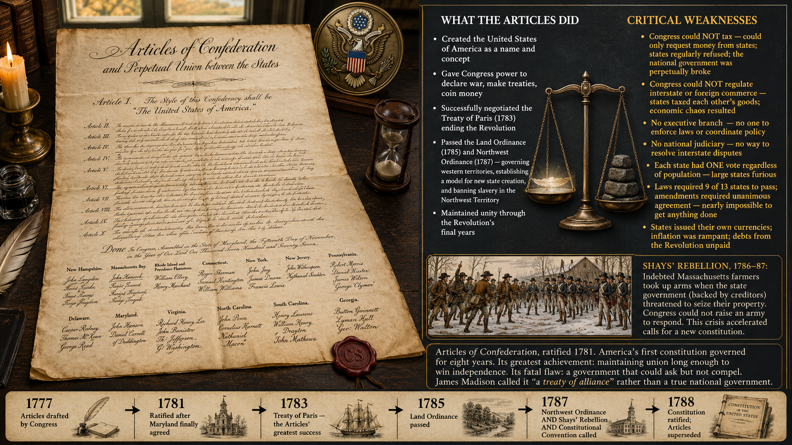
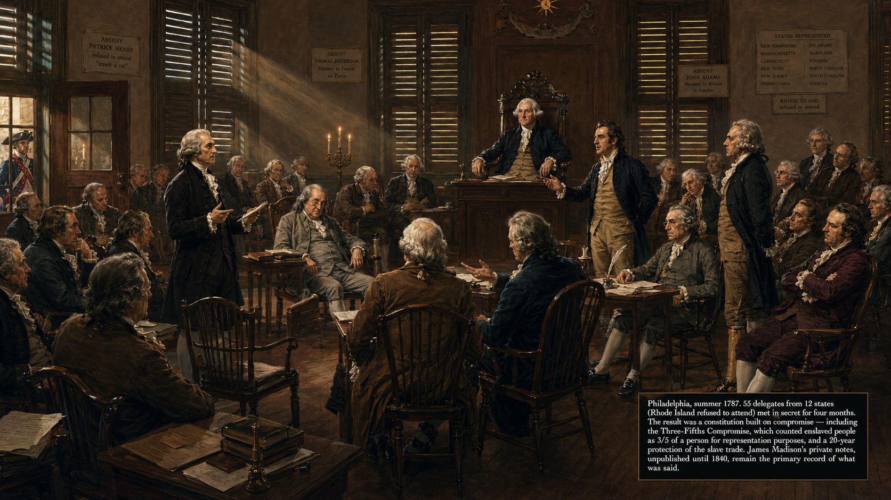
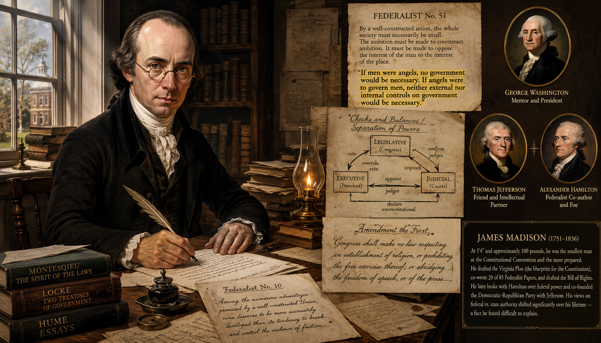
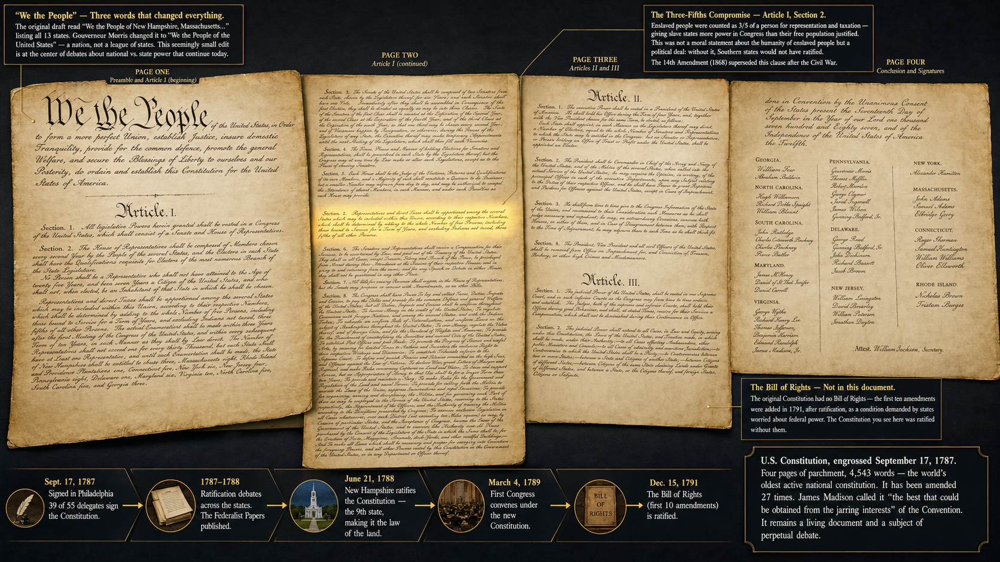
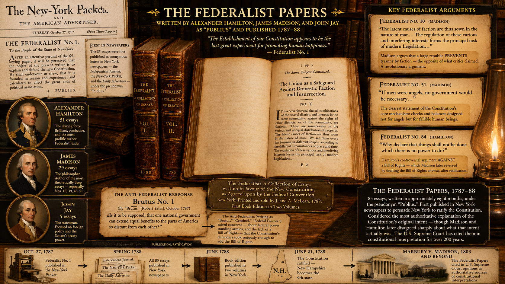
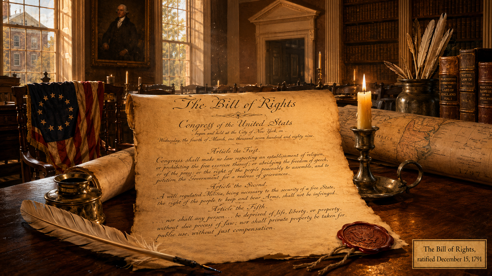
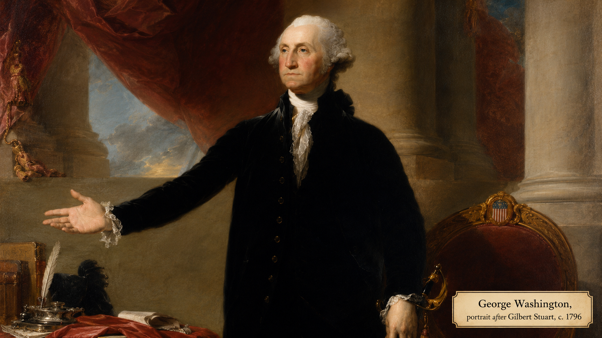

# Founding the Republic (1783–1800)

## Summary

This chapter covers the critical decade of constitution-making and early governance: from the failures of the Articles of Confederation through Shays' Rebellion, the Constitutional Convention, the ratification debates, and the Washington and Adams administrations. It introduces the structural features of American government — separation of powers, checks and balances, the Bill of Rights, the Electoral College — and the AP themes of American Identity and Politics and Power as analytical lenses for the entire course.

## Concepts Covered

This chapter covers the following 29 concepts from the learning graph:

1. Articles of Confederation
2. Shays' Rebellion
3. Constitutional Convention
4. Great Compromise
5. Three-Fifths Compromise
6. Anti-Federalism
7. Federalist Papers
8. George Washington as President
9. Alexander Hamilton
10. Thomas Jefferson as Secretary of State
11. National Bank Debate
12. Washington's Farewell Address
13. John Adams Presidency
14. XYZ Affair
15. Alien and Sedition Acts
16. Virginia and Kentucky Resolutions
17. Federalism
18. Bill of Rights
19. Separation of Powers
20. Checks and Balances
21. First Amendment Freedoms
22. Fourth Amendment Rights
23. Constitutional Amendments Overview
24. Executive Power Expansion
25. Congressional War Powers
26. Filibuster and Senate Rules
27. Electoral College
28. American and National Identity
29. Politics and Power

## Prerequisites

This chapter builds on concepts from:
- [Chapter 4: The American Revolution](../04-american-revolution/index.md)

---

!!! mascot-welcome "Building the architecture of democracy"
    
    Welcome to Chapter 5! Winning the Revolution was the easy part. The harder question was what came next — what kind of government would hold thirteen very different states together without becoming the tyranny they had just fought to escape? The Founders' answers to that question still govern the United States today, for better and for worse. Let's investigate the evidence!

## The First Attempt: The Articles of Confederation

Before the Constitution, there was the **Articles of Confederation** — the United States' first national government, ratified in 1781. The Articles created a loose alliance of sovereign states. Congress could declare war, make treaties, and manage western land, but it had no power to tax, no power to regulate commerce between states, and no executive or judicial branch. Any change to the Articles required unanimous consent of all thirteen states.

The Articles reflected the Founders' deepest fear: a powerful central government that could oppress citizens as the British Crown had. But they created a government too weak to function. Congress could not pay the national debt from the Revolutionary War. It could not stop states from imposing tariffs on each other. It could not negotiate credibly with foreign powers. And it could not respond to internal crises.

### Shays' Rebellion (1786–1787)

The crisis that forced action was **Shays' Rebellion**. In western Massachusetts, farmers who had taken on debt during the Revolution were now facing foreclosure as state courts enforced loan repayments. Daniel Shays led an armed uprising of roughly 4,000 farmers who closed courthouses to prevent foreclosures and, in January 1787, attempted to seize the federal arsenal at Springfield.

The rebellion was suppressed by a private militia funded by Massachusetts merchants — the national government had no army and no money to raise one. But its political effect was immediate. George Washington wrote that the rebellion had convinced him that "something must be done, or the fabric must fall." Across the country, Founders who had previously been satisfied with the Articles concluded that the national government needed a fundamental overhaul.

**Shays' Rebellion** illustrates the systems thinking concept of a balancing feedback loop forcing a correction. The Articles of Confederation were too weak to maintain social order; Shays' Rebellion was the distress signal that the system was failing and that a corrective response was required.

## Part 1: The Constitutional Convention

### The Convention and Its Great Compromises

The **Constitutional Convention** met in Philadelphia in the summer of 1787, ostensibly to revise the Articles of Confederation. Instead, delegates quickly decided to write an entirely new document. Fifty-five delegates attended; they included some of the most accomplished political thinkers in the Atlantic world, including James Madison (the primary architect of the Constitution), George Washington (elected presiding officer), Benjamin Franklin, Alexander Hamilton, and Gouverneur Morris.

Two fundamental disagreements had to be resolved before a document could be written.

The first was representation. Large states wanted representation proportional to population; small states wanted equal representation regardless of size. The **Great Compromise** — proposed by Roger Sherman of Connecticut — resolved this by creating a bicameral legislature: a House of Representatives with seats proportional to state population, and a Senate where each state had two seats regardless of size. This bicameral structure created an inherent tension between popular representation (the House) and state equality (the Senate) that has shaped American politics ever since.

The second was slavery. Southern states, where enslaved people constituted a large fraction of the population, wanted them counted for purposes of representation. Northern states argued that enslaved people were property, not citizens, and should not be counted. The **Three-Fifths Compromise** resolved this by counting each enslaved person as three-fifths of a person for purposes of apportioning House seats and direct taxes. This compromise gave Southern states a significant boost in congressional representation and in the Electoral College — a boost that helped Southern slaveholders dominate the federal government for the next seven decades.

The Three-Fifths Compromise is one of the clearest examples of how slavery was embedded in the constitutional structure from the beginning. It was not a peripheral issue — it was written into the founding document.

### Federalism, Separation of Powers, and Checks and Balances

Three structural principles define the Constitution's architecture. Understanding them is essential for reading every chapter of American political history that follows.

**Federalism** divides sovereignty between the national government and the states. The Constitution gives the federal government specific enumerated powers — to levy taxes, regulate commerce, declare war, coin money, and so on. All other powers are reserved to the states by the Tenth Amendment. In practice, the boundary between federal and state power has been contested in every generation, and the meaning of federalism has shifted dramatically over time.

**Separation of powers** divides governmental authority among three branches — the legislative (Congress), executive (President), and judicial (courts) — each with distinct functions. This principle, drawn from the French philosopher Montesquieu, was designed to prevent any single person or faction from controlling the whole government.

**Checks and balances** gives each branch tools to limit the other two. Congress passes laws; the President can veto them; Congress can override the veto with two-thirds majorities. The President nominates judges; the Senate must confirm them. The Supreme Court can declare laws unconstitutional. This web of mutual constraints is the Constitution's answer to the Founders' fear of concentrated power.

#### Diagram: Constitutional Structure — Checks and Balances Explorer

<iframe src="../../sims/checks-and-balances-explorer/main.html" width="100%" height="520px" scrolling="no"></iframe>

Checks and Balances Explorer — Three Branches Interactive Diagram

Type: infographic
**sim-id:** checks-and-balances-explorer 
**Library:** p5.js 
**Status:** Specified

Purpose: Allow students to explore the web of checks and balances connecting the three branches of government by clicking on any power to see which branch exercises it, which branch can check it, and a historical example of that check being used.

Bloom Level: Understand (L2)
Bloom Verb: Explain

Learning Objective: Students explain how checks and balances distribute power among the three branches and give at least two examples of checks being exercised in American history.

Canvas layout:
- Responsive width; height approximately 520px
- Triangle arrangement with three branch nodes: Legislative (Congress) at top-left, Executive (President) at top-right, Judicial (Supreme Court) at bottom-center
- Each branch node is a large rounded rectangle with its name and key powers listed inside
- Between each pair of branches, two curved arrows (one in each direction) represent the mutual checks

Branch contents:
- Legislative: Make laws, override vetoes, control budget, declare war, confirm appointments, impeach
- Executive: Sign or veto laws, command military, nominate judges, executive orders, pardon power
- Judicial: Declare laws unconstitutional, interpret laws, rule on executive action

Arrows between branches (12 total, two per pair per direction):
- Congress → President: Override veto, impeach, control budget
- President → Congress: Veto, call special sessions, recommend legislation
- Congress → Courts: Confirm judges, set court jurisdiction, impeach judges
- Courts → Congress: Declare laws unconstitutional
- President → Courts: Nominate judges
- Courts → President: Declare executive actions unconstitutional

Interactivity:
- Clicking any arrow opens a detail panel showing: power name, which branch exercises it, which branch it constrains, and one historical example (e.g., "Nixon's Saturday Night Massacre," "FDR's court-packing plan," "Senate filibuster of judicial nominations")
- Clicking a branch node highlights all checks that branch can exercise and all checks it faces
- A "Historical Moments" button cycles through famous check-and-balance confrontations in U.S. history with dates

Color scheme:
- Legislative: indigo (#3949ab)
- Executive: red (#c62828)
- Judicial: gold (#f9a825)
- Arrows: color of the branch exercising the check

Responsive behavior: Triangle layout adjusts to available width; on narrow canvas, branches listed vertically.

Implementation: p5.js

## Part 2: Ratification and the Bill of Rights

### The Federalist vs. Anti-Federalist Debate

The Constitution had to be ratified by nine of thirteen states before it could take effect. This produced an intense public debate — one of the most substantive debates about the nature of democratic government in the history of political thought.

**Anti-Federalism** was the position of those who opposed ratification. Anti-Federalists — including Patrick Henry, George Mason, and "Brutus" (Robert Yates) — argued that the Constitution gave the federal government dangerous power over the states, that a republic could not function over a large territory, and critically, that the Constitution lacked a Bill of Rights protecting individual liberties.

**The Federalist Papers** were a series of 85 essays published in New York newspapers under the pseudonym "Publius" by Alexander Hamilton, James Madison, and John Jay, arguing for ratification. The Federalist Papers are the most important American contribution to political philosophy and remain widely cited by judges and scholars interpreting the Constitution. Federalist No. 10 (Madison) argued that a large republic would be *more* stable than a small one because the multiplicity of factions would prevent any single faction from dominating. Federalist No. 51 explained the logic of checks and balances.

The key Anti-Federalist demand — a Bill of Rights — was eventually met. James Madison drafted the first ten amendments to the Constitution, ratified in 1791 as the **Bill of Rights**. The Bill of Rights protects specific individual freedoms against federal government action:

The **First Amendment** protects freedom of religion, speech, press, peaceful assembly, and petition of the government. These five freedoms are often grouped together because they all protect the ability of citizens to form and express beliefs without government interference — the foundation of political liberty.

The **Fourth Amendment** protects against unreasonable searches and seizures, requiring warrants based on probable cause. It is the constitutional basis for modern privacy law, criminal procedure, and much of the ongoing legal debate about surveillance and digital privacy.

The **Constitutional Amendments Overview**: beyond the Bill of Rights, the Constitution has been amended 17 additional times, most significantly after the Civil War (13th, 14th, 15th — abolishing slavery, defining citizenship, protecting voting rights) and during the Progressive Era (16th, 17th, 18th, 19th — income tax, direct election of senators, Prohibition, women's suffrage).

### The Electoral College

The **Electoral College** is the constitutional mechanism for electing the President. Rather than electing the President by direct popular vote, citizens vote for slates of electors in each state; electors then vote for President. The number of electors per state equals its congressional delegation (House + Senate), giving each state a minimum of three.

The Electoral College was a compromise among several competing concerns: the Founders' distrust of direct democracy, the small states' desire for some protection against large-state dominance, and the impracticality of national popular voting in an era without mass communication. Its effect today — five presidents have won the presidency while losing the popular vote — remains deeply controversial.

## Part 3: The Washington and Hamilton Era

### George Washington as President

**George Washington** served as the first President (1789–1797) and established precedents that have shaped the office ever since. He chose a four-person cabinet (Jefferson at State, Hamilton at Treasury, Knox at War, Randolph as Attorney General); he declined a third term, establishing the two-term tradition that lasted until FDR; and he navigated the country through its first international crises with a policy of neutrality.

Washington's greatest challenge was keeping the new nation together as political differences between his two most prominent cabinet members hardened into the country's first political parties.

### Alexander Hamilton and the National Bank Debate

**Alexander Hamilton**, as Secretary of the Treasury, had a comprehensive vision for American economic development: a funded national debt (buying out all Revolutionary War debts at face value to establish American creditworthiness), a national bank to manage currency and credit, protective tariffs to build American manufacturing, and federal support for infrastructure.

The **National Bank Debate** was the first major constitutional controversy of the new government. Hamilton proposed creating the Bank of the United States; Jefferson and Madison argued that since the Constitution didn't explicitly grant Congress the power to create a bank, doing so was unconstitutional. Hamilton countered that the "necessary and proper" clause gave Congress implied powers to take any action necessary to fulfill its enumerated responsibilities.

Washington sided with Hamilton, and the bank was created. But the debate established the fundamental constitutional divide between **strict construction** (the Constitution means only what it literally says) and **loose construction** (the Constitution implies broader powers necessary to carry out its stated purposes) — a debate that continues today.

The Hamilton-Jefferson rivalry hardened into America's first two-party system: **Federalists** (supporting a strong national government, commercial economy, and close ties with Britain) versus **Democratic-Republicans** (supporting states' rights, agrarian economy, and sympathy for France). This was the first instance of **politics and power** organizing into competing factions — a pattern that has never stopped.

!!! mascot-thinking "Hamilton's footgun: the implied powers doctrine"
    
    Hamilton's implied powers argument was a double-edged sword — a classic footgun in constitutional design. It gave the federal government flexibility to respond to situations the Founders couldn't anticipate. But it also created an open-ended justification for federal expansion that each generation has contested differently. The "necessary and proper" clause has been cited to justify everything from the Louisiana Purchase to the Affordable Care Act. What constraints, if any, does the implied powers doctrine have? How would you know when a federal action has gone too far?

### Washington's Farewell Address

**Washington's Farewell Address** (1796) is one of the most important documents in American political history, though Washington never delivered it as a speech — it was published in a Philadelphia newspaper. Washington warned against three dangers he believed threatened the republic:

- **Permanent alliances** with foreign nations (which he saw as drawing the U.S. into European power struggles)
- **Political parties** (which he called "factions" and feared would put party loyalty above national interest)
- **Sectionalism** (regional loyalties that would fracture national unity)

Every one of these warnings was ignored within a decade of his death — and the United States has been debating their relevance ever since.

## Part 4: The Adams Years and Early Constitutional Stress Tests

### John Adams Presidency and the XYZ Affair

**John Adams**, Washington's Vice President, narrowly won the 1796 election — the first contested presidential election in American history. His presidency (1797–1801) was dominated by the threat of war with France.

After the U.S. refused to renegotiate treaties that France believed favored Britain, French agents (referred to in dispatches as X, Y, and Z) demanded bribes before any negotiations could begin. The **XYZ Affair**, when revealed to the public in 1798, produced outrage and a surge of anti-French nationalism. The U.S. fought an undeclared naval war with France (the Quasi-War) from 1798 to 1800.

### Alien and Sedition Acts

In the climate of wartime nationalism, the Federalist-controlled Congress passed the **Alien and Sedition Acts** (1798). The Alien Acts gave the President power to deport non-citizens deemed dangerous; the Sedition Act made it a crime to publish "false, scandalous, and malicious writing" against the government or the President.

The Sedition Act was used almost exclusively against Democratic-Republican newspaper editors who criticized Adams. It was a direct violation of the First Amendment's protection of free speech and press — the first major test of those protections, and one the government failed.

### Virginia and Kentucky Resolutions

Jefferson and Madison responded with the **Virginia and Kentucky Resolutions** (1798), which argued that the states had the authority to declare federal laws unconstitutional — a doctrine called **nullification**. This was the first articulation of an idea that would haunt American politics through the Civil War: the claim that states could override federal authority.

The Virginia and Kentucky Resolutions were never legally adopted as doctrine, but they established a constitutional argument that Southern states would invoke repeatedly in defense of slavery and, ultimately, in justifying secession. They are a vivid example of how the same constitutional framework can be used to justify very different political agendas across different historical contexts — a core lesson of the AP theme **Politics and Power**.

!!! mascot-warning "Nullification's long shadow"
    
    The nullification doctrine articulated in the Virginia and Kentucky Resolutions was later used to defend slavery (the Nullification Crisis of 1832–33), to resist federal civil rights enforcement after Reconstruction, and to oppose school desegregation after Brown v. Board of Education. The same constitutional argument served very different political purposes in different eras. This is a case where understanding the *history* of a constitutional idea helps you evaluate its current uses.

#### Diagram: AP Thematic Lens — American Identity and Politics and Power

<iframe src="../../sims/ap-thematic-lenses-ch5/main.html" width="100%" height="480px" scrolling="no"></iframe>

AP Thematic Lenses: American Identity and Politics and Power

Type: infographic
**sim-id:** ap-thematic-lenses-ch5 
**Library:** p5.js 
**Status:** Specified

Purpose: Introduce two AP U.S. History thematic lenses — American and National Identity, and Politics and Power — and allow students to connect events from this chapter to each lens through an interactive mapping exercise.

Bloom Level: Apply (L3)
Bloom Verb: Classify

Learning Objective: Students classify events from the founding era under the appropriate AP thematic lens and explain why each event illustrates that theme.

Canvas layout:
- Responsive width; height approximately 480px
- Two large columns: "American and National Identity" (left) and "Politics and Power" (right)
- Each column has a brief definition at the top and an event-drop zone below
- A pool of draggable event chips at the bottom: Washington's Farewell Address, Alien and Sedition Acts, Bill of Rights, Virginia and Kentucky Resolutions, Three-Fifths Compromise, Electoral College, First Amendment, National Bank Debate

Each event chip can be dragged into either (or both) columns. On release:
- If placed correctly (pre-defined correct answers allow for multiple valid placements): green confirmation with a 1-sentence explanation of why this event fits the theme
- If placed in a plausible but less obvious category: amber message explaining the connection
- "Show all connections" button reveals the full mapping with explanations

Lens definitions shown at column tops:
- American and National Identity: How Americans have defined national identity, debated who belongs, and constructed narratives about what America means
- Politics and Power: How political institutions, parties, and actors have competed for power, shaped policy, and responded to crises

Color scheme:
- American Identity column: gold/amber tones
- Politics and Power column: indigo tones
- Event chips: white cards with dark text
- Correct placement: green border confirmation
- Plausible alternative: amber border

Responsive behavior: Below 600px, columns stack; drag-and-drop still works.

Implementation: p5.js with drag-and-drop interaction

## Part 5: Structural Features — Senate Rules and Executive Power

### Filibuster and Senate Rules

The **filibuster** — the practice of extending debate in the Senate to delay or prevent a vote — is not in the Constitution. It emerged from an 1806 change to Senate rules that eliminated the "previous question" motion, which had allowed simple majorities to end debate. The filibuster gradually evolved into a tool that a minority of senators could use to block legislation.

The filibuster has been used throughout American history to delay and defeat civil rights legislation — most infamously in the decades before the Civil Rights Act of 1964. It remains intensely controversial. Its defenders argue it protects minority viewpoints and promotes compromise; its critics argue it allows a Senate minority to override the will of the majority and the President.

Understanding the filibuster requires distinguishing between constitutional features (separation of powers, checks and balances) and institutional rules (Senate procedures) that have evolved over time and can be changed by simple Senate vote. Much of what appears to be constitutional structure is actually customary practice.

### Congressional War Powers and Executive Power Expansion

The Constitution assigns **congressional war powers** clearly: only Congress can declare war. But the President is Commander-in-Chief. This division has produced 200+ years of tension. Congress has declared war only eleven times in American history; the U.S. has been involved in more than 200 military conflicts.

**Executive power expansion** has been a consistent trend across American history. Presidents from Washington (using executive orders to manage foreign policy) to Adams (the quasi-war with France without a formal declaration) established precedents for executive action in national security that Congress has often struggled to constrain.

The tension between congressional and executive power in matters of war is a recurring theme that will reappear in discussions of the Civil War, World War I, Vietnam, and the War on Terror.

## Summary

The decade between 1783 and 1800 produced the constitutional architecture that still governs the United States. The Constitution solved the failures of the Articles of Confederation by creating a stronger national government — but carefully divided that government's power among three branches with mutual checks and balances, and between the federal government and the states through federalism.

The first decade of constitutional government established patterns that persist: the tension between strict and loose constitutional interpretation, the emergence of competing political parties despite the Founders' wish to avoid them, and the recurring question of how much power the executive can legitimately exercise in moments of national crisis.

The AP thematic lenses introduced in this chapter — **American and National Identity** and **Politics and Power** — are frameworks you will apply throughout the rest of this course.

??? question "Knowledge Check 1 — Click to reveal"
    **Question:** Madison argued in Federalist No. 10 that a large republic is more stable than a small one because it contains more factions. Apply systems thinking to evaluate this argument.

    **Answer:** Madison's argument is a **balancing feedback loop** claim. In a small republic, one faction can easily dominate and then use political power to reinforce its dominance (a reinforcing loop). In a large republic, the multiplicity of factions means that when any one faction gains power, other factions organize against it — a balancing loop that prevents any single group from achieving unchecked control. American history offers both supporting evidence (the difficulty of any one party holding power indefinitely) and complicating evidence (the Southern slaveholder class did dominate the federal government for decades through the Three-Fifths Compromise advantage). Madison's model was more accurate as a description of a diverse political landscape than as a guarantee against faction dominance.

??? question "Knowledge Check 2 — Click to reveal"
    **Question:** The Alien and Sedition Acts violated the First Amendment but were never struck down by the Supreme Court. What does this tell us about how constitutional protections actually function?

    **Answer:** Constitutional protections function only as well as the institutions that enforce them. The Sedition Act's constitutionality was never tested before the Supreme Court because Adams's administration ended before any case worked its way through the courts, and the new Jefferson administration let the acts expire. This illustrates that constitutional rights can be violated without judicial remedy when political circumstances prevent courts from acting. The First Amendment's protection of free speech was not self-enforcing — it required political defeat of the Federalist Party in 1800. This pattern — constitutional protections depending on political will to enforce them — recurs throughout American history, most starkly in Reconstruction-era civil rights enforcement.

!!! mascot-celebration "Chapter 5 Complete!"
    
    You've just worked through one of the most intellectually dense chapters in American history — the architecture of American government itself. Separation of powers, checks and balances, federalism, the Bill of Rights, the Electoral College: these are not just historical facts but living structures that shape every political conflict in every chapter that follows. In Chapter 6, we follow Thomas Jefferson into the presidency and watch the constitutional debates from this chapter play out in practice.

[See Annotated References](./references.md)
