# Sectionalism and the Civil War (1844–1865)

## Summary

This chapter follows the deepening sectional crisis from the Compromise of 1850 through Bleeding Kansas, the Dred Scott decision, and Lincoln's election to the secession of Southern states and the four-year war that followed. Students examine military turning points, Lincoln's evolving war aims, the Emancipation Proclamation, and the war's transformation of American society.

## Concepts Covered

This chapter covers the following 21 concepts from the learning graph:

1. Sectionalism
2. Compromise of 1850
3. Fugitive Slave Act
4. Uncle Tom's Cabin
5. Kansas-Nebraska Act
6. Bleeding Kansas
7. Republican Party Formation
8. Dred Scott Decision
9. Lincoln-Douglas Debates
10. John Brown's Raid
11. Election of 1860
12. Southern Secession
13. Confederate States of America
14. Abraham Lincoln
15. Civil War Causes
16. Fort Sumter
17. Anaconda Plan
18. Battle of Antietam
19. Emancipation Proclamation
20. Battle of Gettysburg
21. Total War Strategy

## Prerequisites

This chapter builds on concepts from:
- [Chapter 7: Manifest Destiny and Antebellum Reform](../07-manifest-destiny-reform/index.md)

---

!!! mascot-welcome "The fracture of the republic"
    
    Welcome to Chapter 8! The Civil War is the central event in American history — the crisis that determined whether the republic would survive and whether slavery would endure. Understanding it requires holding two things simultaneously: the military and political narrative of what happened, and the deeper question of what it was *about*. The evidence is clear on the latter, even if the mythology tries to blur it. Let's investigate the evidence!

## The Anatomy of Sectionalism

**Sectionalism** — the prioritization of regional identity and interests over national unity — had existed since the founding, but its intensity grew with every decade as the slave and free states diverged economically, socially, and ideologically.

The North's economy was increasingly industrial and commercial; its society was diverse and urbanizing; its political culture emphasized free labor and economic mobility. The South's economy was dominated by plantation agriculture based on enslaved labor; its social hierarchy was rigid; its political culture was built around the defense of slavery as an institution and a way of life. These two social systems produced genuinely different visions of what America was and what it should become.

The question that made compromise increasingly impossible was not abstract — it was territorial: would slavery expand into the western territories the United States was acquiring? For Southern slaveholders, expansion was existential; they needed new land as cotton depleted old soil, and they needed new slave states to maintain their political power in the Senate. For Northern free-labor advocates, slavery's expansion meant that the territories would be dominated by a system that made free white labor economically impossible — not because of racial solidarity with enslaved people, but because slave labor undercut wages and prevented small farmers from competing.

### Civil War Causes: What the Evidence Shows

**Civil War causes** are one of the most deliberately distorted questions in American historiography. The "Lost Cause" narrative — developed after the war by Confederate veterans and sympathizers — reframed the war as being about states' rights and constitutional principle rather than slavery. This narrative was historically false when constructed and has been repeatedly refuted by evidence.

The historical evidence is unambiguous: slavery was the central cause of the Civil War. The Confederate States' own founding documents make this explicit. Confederate Vice President Alexander Stephens's "Cornerstone Speech" (March 1861) declared that the Confederacy's "cornerstone rests, upon the great truth that the negro is not equal to the white man; that slavery, subordination to the superior race, is his natural and normal condition." The secession declarations of South Carolina, Mississippi, Georgia, and Texas all specifically cited the threat to slavery as the reason for leaving the Union.

Students who encounter the "states' rights" explanation should apply sourcing: who is making this argument, for what audience, and when? The "states' rights" framing did not appear prominently until after the war, when the Confederate cause needed to be recast in more palatable terms. This is a case study in the manufacture of misinformation — which is why it appears in Chapter 9's discussion of the Lost Cause narrative.

## Part 1: The Road to War (1850–1861)

### The Compromise of 1850

The **Compromise of 1850** was a series of five bills designed to resolve the territorial questions created by the Mexican-American War. Its architect was Henry Clay; its passage was secured by Daniel Webster and the young Illinois senator Stephen Douglas. The compromise included:

- California admitted as a free state
- The remainder of the Mexican cession organized as territories without a decision on slavery (to be decided by "popular sovereignty" when they applied for statehood)
- The slave trade (but not slavery itself) abolished in Washington, D.C.
- Texas's boundary dispute with New Mexico resolved
- A strengthened **Fugitive Slave Act** requiring Northerners to actively assist in capturing escaped enslaved people

The **Fugitive Slave Act** was the compromise's most politically explosive element. It required federal commissioners (paid more for returning a person to slavery than for freeing them) to adjudicate claims, denied accused escapees the right to testify on their own behalf, and imposed penalties on anyone who aided escaped enslaved people. The law forced Northern states that had tried to distance themselves from slavery into direct participation in its enforcement.

### Uncle Tom's Cabin (1852)

**Uncle Tom's Cabin**, Harriet Beecher Stowe's novel published in 1852, reached an audience that political speeches and abolitionist tracts could not. It depicted the human reality of slavery — families separated at auction, brutal overseers, the terror of the Fugitive Slave Act — in a melodramatic but emotionally compelling narrative. It sold 300,000 copies in its first year in the U.S. alone and was translated into dozens of languages.

When Lincoln met Stowe during the Civil War, he reportedly said, "So you're the little woman who wrote the book that started this great war." The remark is almost certainly apocryphal, but it captured the book's political effect: it made slavery emotionally real for millions of Northern readers who had previously been able to think of it as a distant Southern institution.

*Uncle Tom's Cabin* is a useful case study in how narrative shapes political opinion — and how fiction can function as political argument. Applying historical thinking: what are the limitations of a novel as a historical source about the experience of slavery? What can it tell us that a political speech cannot?

### The Kansas-Nebraska Act and Bleeding Kansas (1854–1856)

The **Kansas-Nebraska Act** (1854), pushed through Congress by Stephen Douglas, organized the Kansas and Nebraska territories and — critically — repealed the Missouri Compromise line that had prohibited slavery north of 36°30'. Instead, it applied popular sovereignty: settlers in each territory would vote to decide whether to allow slavery.

The act destroyed the Whig Party, fatally split the Democrats, and directly produced the **Republican Party Formation**. The Republicans, organized in 1854, were explicitly a Northern party united by opposition to slavery's expansion. They did not initially advocate abolition in the South — they argued that the federal government could and should prevent slavery from spreading into new territories.

**Bleeding Kansas** was the result of popular sovereignty in practice. Proslavery and antislavery settlers poured into Kansas, both sides armed for conflict. "Border Ruffians" from Missouri crossed into Kansas to vote illegally in territorial elections; antislavery settlers established their own rival government. Armed conflict broke out in 1856: proslavery raiders sacked the antislavery town of Lawrence; abolitionist John Brown led a retaliatory massacre of proslavery settlers at Pottawatomie Creek. Kansas became a laboratory for political violence — and a preview of what the entire country would face in 1861.

### The Dred Scott Decision (1857)

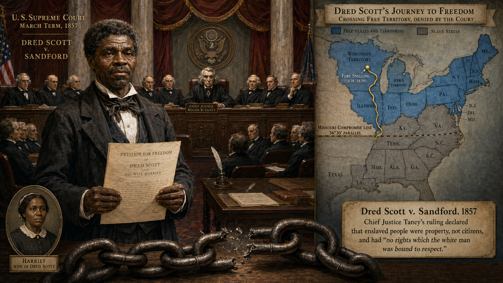

The **Dred Scott Decision** (Dred Scott v. Sandford, 1857) was the Supreme Court's attempt to resolve the slavery question definitively — and instead made conflict inevitable.

Dred Scott was an enslaved man who had lived with his enslaver in free states and free territories and argued that his residence in free territory had made him free. Chief Justice Roger Taney's majority opinion went far beyond the specific question: it ruled that Black Americans — free or enslaved — were not citizens and had no right to sue in federal court; that Congress had no constitutional authority to ban slavery from the territories (thus invalidating the Missouri Compromise's 36°30' line); and that slaveholders' property rights in enslaved people were constitutionally protected wherever they went.

The decision was a victory for Southern slaveholders and a catastrophe for the Republican Party, which had based its platform on limiting slavery to existing states. It also demonstrates what happens when an institution (the Supreme Court) attempts to resolve a political crisis that the political system has failed to solve — the institution's legitimacy is damaged alongside the unresolved crisis.

### Lincoln-Douglas Debates (1858) and John Brown's Raid (1859)

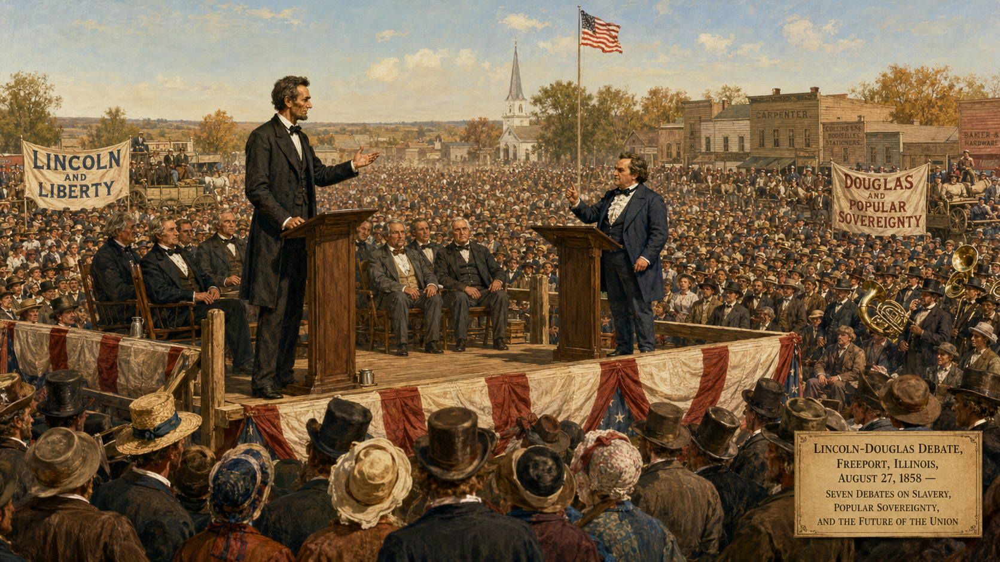

The **Lincoln-Douglas Debates** were seven debates during the Illinois Senate race of 1858 between Republican Abraham Lincoln and Democrat Stephen Douglas. Lincoln forced Douglas into the "Freeport Doctrine" — Douglas's admission that settlers could effectively exclude slavery by refusing to pass the local legislation needed to enforce it, regardless of what the Dred Scott decision said about Congress. This answer made Douglas acceptable to Northern Democrats but destroyed his support in the South, fracturing the Democratic Party.

**John Brown's Raid** on the federal arsenal at Harpers Ferry, Virginia (October 1859) was Brown's attempt to trigger a general slave uprising. He was captured within 36 hours, tried for treason, and executed. His raid terrified the South — not because it nearly succeeded (it didn't) but because it suggested that Northern antislavery sentiment was moving toward violent action. Brown's calm demeanor at his trial and his prediction that "the crimes of this guilty land: will never be purged away but with blood" made him a martyr for abolitionists and a monster for slaveholders.

!!! mascot-thinking "How did the slavery crisis escalate so fast?"
    
    Apply systems thinking to the 1850–1861 period: each attempt to resolve the slavery question through compromise (1850 Compromise, Kansas-Nebraska Act) produced a backlash that made the next crisis more intense — a classic reinforcing feedback loop driving escalation. The Fugitive Slave Act radicalized Northern opinion; Bleeding Kansas radicalized both sides; Dred Scott made Republican moderation impossible; John Brown's raid convinced the South that coexistence was impossible. Can you identify the balancing forces that might have broken this loop? Why didn't they?

### The Election of 1860 and Southern Secession

The **Election of 1860** was fought by four candidates: Lincoln (Republican), Douglas (Northern Democrat), John Breckinridge (Southern Democrat), and John Bell (Constitutional Union). The Democratic Party had split along sectional lines; Lincoln won an electoral majority without appearing on the ballot in most Southern states, receiving essentially no Southern votes.

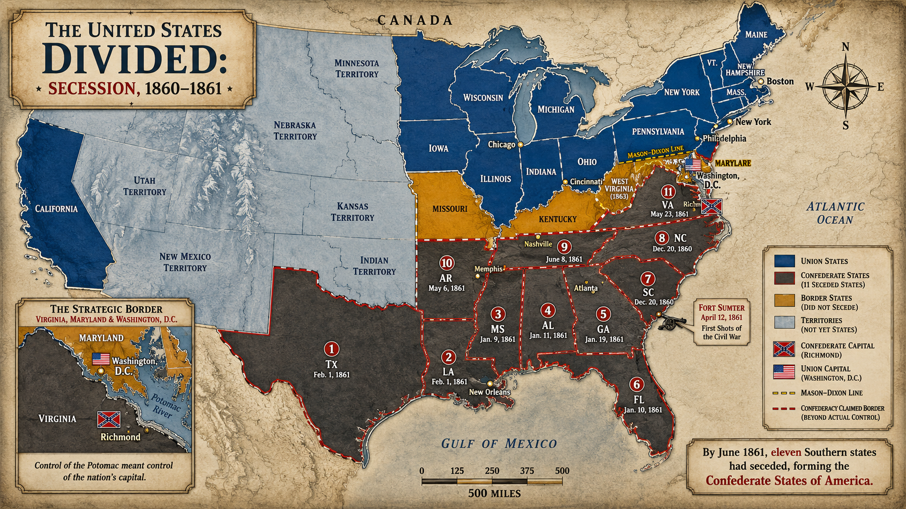

**Southern secession** began before Lincoln took office. South Carolina seceded in December 1860; six more Deep South states followed by February 1861. The seceding states cited the election of a Republican president as proof that the South's political position within the Union was untenable. Together they formed the **Confederate States of America**, with Jefferson Davis as President.

## Part 2: The War (1861–1865)

### Fort Sumter and the War Begins

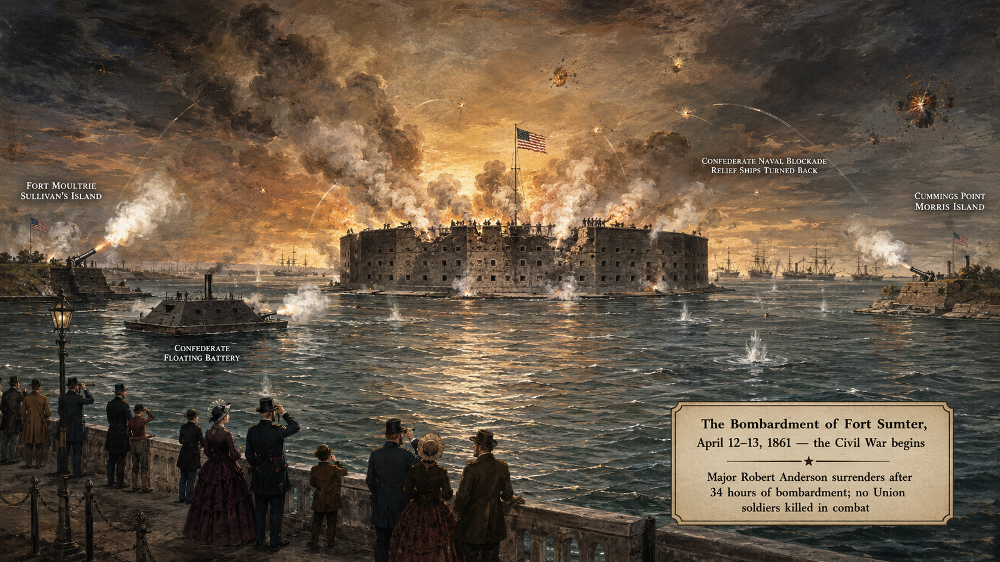

**Fort Sumter** was a federal fort in Charleston Harbor, South Carolina — now Confederate territory. When Lincoln announced he was resupplying the fort, Confederate forces bombarded it on April 12, 1861. The fort's surrender was the first military action of the Civil War. Lincoln's call for 75,000 volunteers to suppress the rebellion drove four additional Upper South states (Virginia, North Carolina, Tennessee, Arkansas) to secede.

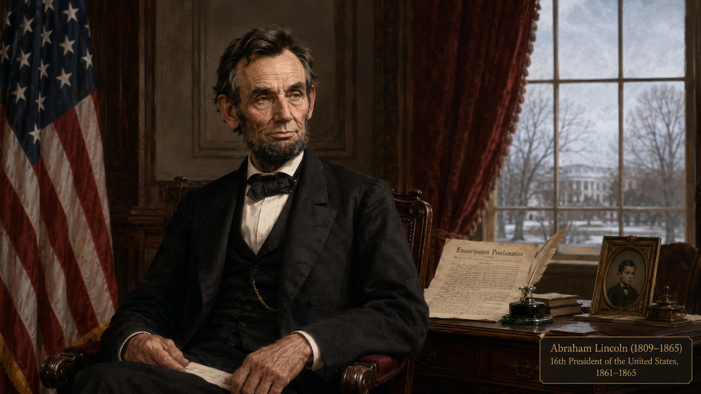

**Abraham Lincoln** was the Union's wartime leader. He had almost no military experience and faced an enormous military, political, and logistical challenge: fighting a war to restore the Union without alienating the border slave states (Missouri, Kentucky, Maryland, Delaware) that remained in the Union, building public support in the North for a long and costly conflict, and managing a coalition of political factions with very different ideas about war aims.

Lincoln's greatness as a war leader lay in his political intelligence: his ability to hold competing factions together, adapt his policies as conditions changed, and communicate with the public in language of extraordinary clarity and moral force.

### Military Strategy: The Anaconda Plan and Total War

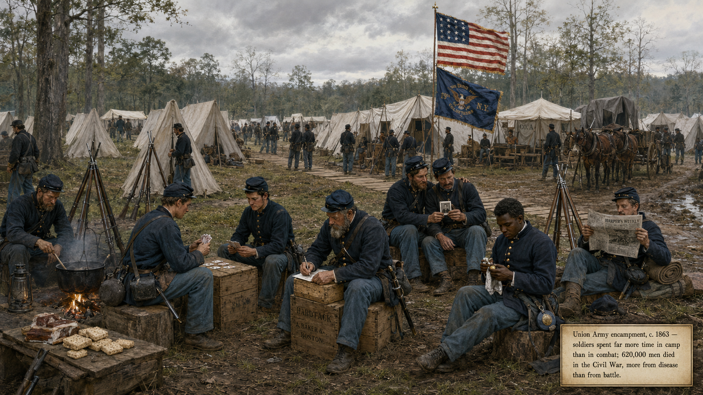

The Union's initial strategy was the **Anaconda Plan**, proposed by General Winfield Scott: blockade the Confederate coastline, control the Mississippi River to divide the Confederacy, and gradually squeeze the South into submission like a snake suffocating its prey. The plan was mocked in the press as too slow — the prevailing view was that the war would be over in 90 days — but its strategic logic proved correct over four years.

**Total war strategy** — the deliberate targeting of the enemy's economic and civilian infrastructure, not just its armies — emerged as the war progressed and quick victory proved impossible. General William Sherman's March to the Sea (1864) through Georgia was the most famous example: Sherman's army cut a 60-mile-wide swath of destruction through the Confederate heartland, destroying railroads, farms, mills, and civilian property to break Confederate morale and destroy the economic base that sustained the Confederate Army.

Total war was brutal, and Sherman defended it: "War is cruelty, and you cannot refine it." It was also effective. Modern historians debate whether Sherman's devastation shortened the war (by destroying Confederate will to fight) or simply added to its misery without decisive strategic effect.

#### Diagram: Civil War Battles and Strategy Map

<iframe src="../../sims/civil-war-strategy-map/main.html" width="100%" height="520px" scrolling="no"></iframe>

Civil War Strategy Map — Interactive Battles and Campaigns

Type: map
**sim-id:** civil-war-strategy-map 
**Library:** p5.js 
**Status:** Specified

Purpose: Allow students to explore the geographic logic of Civil War strategy, trace major campaigns and battles, and understand how geography shaped Union and Confederate military choices.

Bloom Level: Analyze (L4)
Bloom Verb: Examine

Learning Objective: Students examine how geography shaped Civil War military strategy, explaining the Anaconda Plan's logic and the significance of at least two major battles.

Canvas layout:
- Responsive width; height approximately 520px
- Simplified map of the eastern United States divided into Union (light blue) and Confederate (light red) regions at the war's start
- Union naval blockade shown as a dotted blue line along the Confederate coast
- Mississippi River control shown as a blue line
- Battle sites marked as clickable stars

Key battles/locations to mark:
- Fort Sumter, SC (1861) — war begins
- Bull Run, VA (1861 and 1862) — Confederate victories
- Shiloh, TN (1862) — bloody Union victory in the West
- Antietam, MD (1862) — bloodiest single day; Lincoln uses to announce Emancipation Proclamation
- Vicksburg, MS (1863) — Union controls the Mississippi
- Gettysburg, PA (1863) — turning point in the East
- Atlanta, GA (1864) — Sherman's capture; opens March to the Sea
- Appomattox, VA (1865) — Lee surrenders

Clicking a battle shows:
- Date and outcome
- Casualties (Union and Confederate)
- Strategic significance
- Connection to a key event (e.g., Antietam → Emancipation Proclamation timing)

Strategy overlays (toggleable):
- Anaconda Plan (naval blockade + Mississippi control)
- Eastern Theater campaigns (arrows showing Lee's invasion attempts north)
- Western Theater campaigns (Grant's campaign to control the Mississippi)
- Sherman's March (1864 arrow through Georgia)

Color scheme: Union blue / Confederate gray; battle stars colored by outcome (gold = Union win, red = Confederate win, white = draw).

Responsive behavior: Map scales with canvas; clickable areas scale proportionally.

Implementation: p5.js

### The Battle of Antietam and the Emancipation Proclamation

The **Battle of Antietam** (September 17, 1862) was the bloodiest single day in American military history: approximately 23,000 casualties in 12 hours. It was a tactical draw but a strategic Union victory — Lee's Army of Northern Virginia retreated south, ending the Confederate invasion of Maryland.

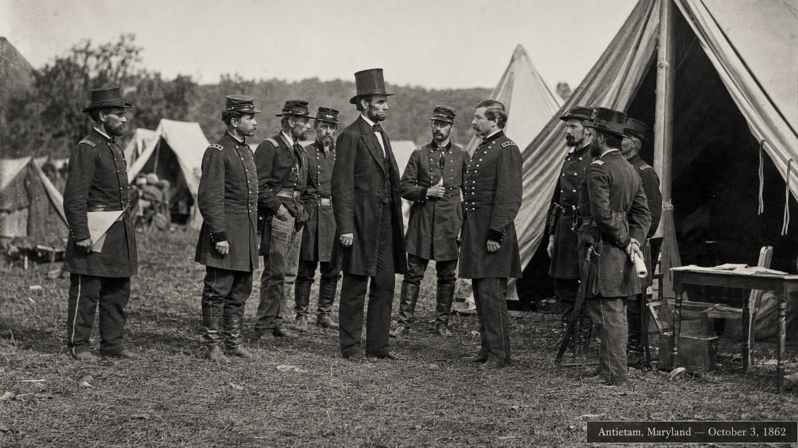

Lincoln had been waiting for a Union military success to announce a major policy change. Five days after Antietam, he issued the preliminary **Emancipation Proclamation**; the final version took effect January 1, 1863.

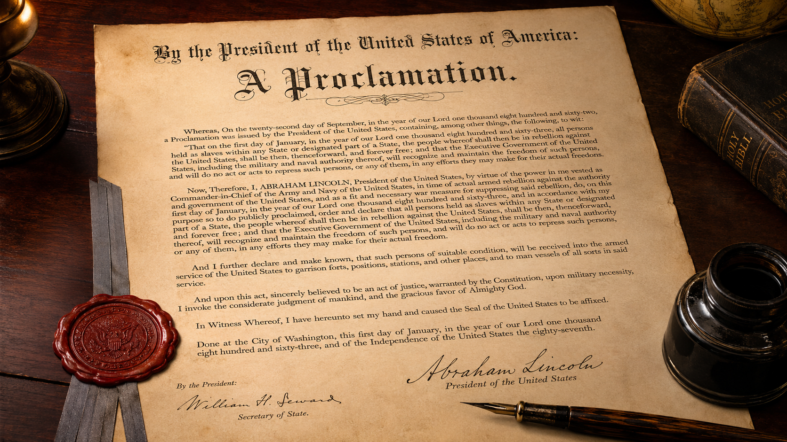

The **Emancipation Proclamation** declared that all enslaved people in Confederate states in rebellion were "forever free." It did not free enslaved people in the border states (where Lincoln needed their loyalty) or in Confederate areas already under Union control (a logical inconsistency that critics noted immediately). As a legal document, it freed no one on the day it was issued — Union forces had to advance for it to take effect.

But as a political and moral act, it was transformative. It redefined the war's purpose: the Union was no longer fighting only to restore the old nation but to create a new one without slavery. It prevented Britain and France (both of which had abolished slavery decades earlier) from recognizing the Confederacy — no European government could now support the South without appearing to support slavery. And it authorized the enlistment of Black men in the Union Army; by the war's end, nearly 180,000 Black soldiers had served.

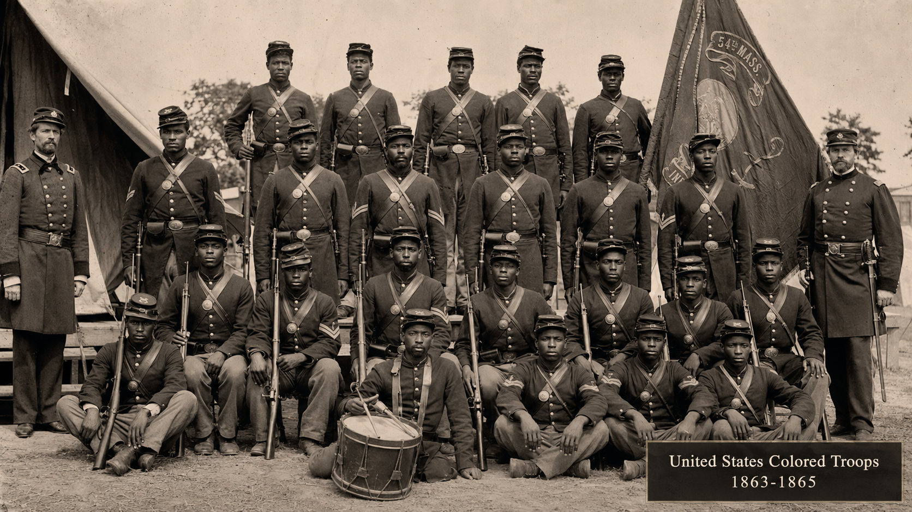

### The Battle of Gettysburg (July 1–3, 1863)

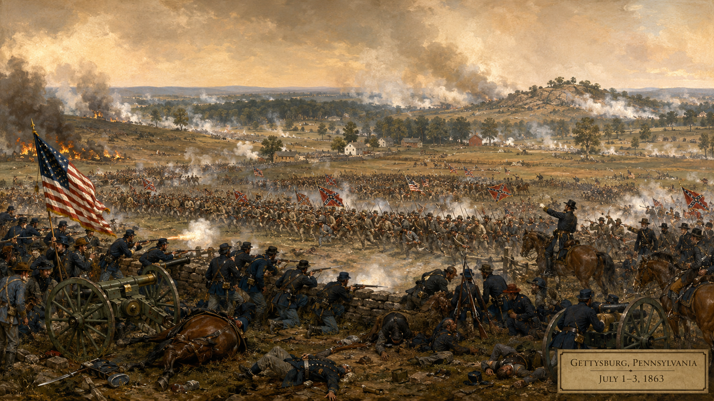

The **Battle of Gettysburg** was the war's largest battle and its most consequential turning point in the East. Confederate General Lee, seeking a decisive victory on Northern soil that might force a negotiated peace, invaded Pennsylvania with 75,000 troops. In three days of fighting around the small Pennsylvania town, Lee lost approximately one-third of his army — 28,000 casualties — including Pickett's Charge, a frontal assault on a fortified Union position that became the symbol of Confederate futility.

Lee retreated south and never again mounted a major offensive into Union territory. Combined with Grant's capture of Vicksburg on July 4, 1863 — giving the Union control of the Mississippi River and splitting the Confederacy — Gettysburg marked the point after which Southern military victory became essentially impossible.

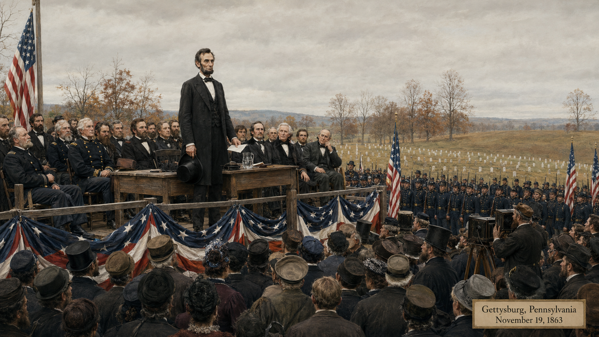

Lincoln's Gettysburg Address (November 1863), delivered at the battlefield's dedication as a military cemetery, reinterpreted the war's meaning in 272 words: the war was a test of whether democratic government could survive, and the Union dead had given their lives so that democratic government "shall not perish from the earth."

!!! mascot-warning "The myth of the 'reluctant emancipator'"
    
    A persistent myth portrays Lincoln as a reluctant emancipator who freed enslaved people only as a military tactic, not from moral conviction. Apply sourcing to this claim: read Lincoln's private letters, his speeches from the 1850s, and his second inaugural address alongside the Emancipation Proclamation. What you find is a man whose moral views on slavery evolved, who was politically constrained, and who ultimately acted from both moral conviction and strategic necessity simultaneously. The myth of pure political cynicism, like the myth of pure moral heroism, misses the complexity. Historians must hold both dimensions simultaneously.

## Summary

The Civil War was the product of irreconcilable conflict over slavery — not states' rights in the abstract but the specific right of slaveholders to hold human beings as property and to expand that system into new territories. The evidence for this is in the Confederate founding documents themselves; the "states' rights" framing is a postwar construction documented in Chapter 9.

The war's military arc moved from Union disaster (Bull Run, 1861) to strategic initiative (Shiloh, Antietam, 1862) to turning point (Gettysburg, Vicksburg, 1863) to total war victory (Atlanta, Appomattox, 1864–1865). Lincoln's Emancipation Proclamation transformed the war's moral stakes and its international dimensions. The service of nearly 180,000 Black soldiers helped make Union victory possible.

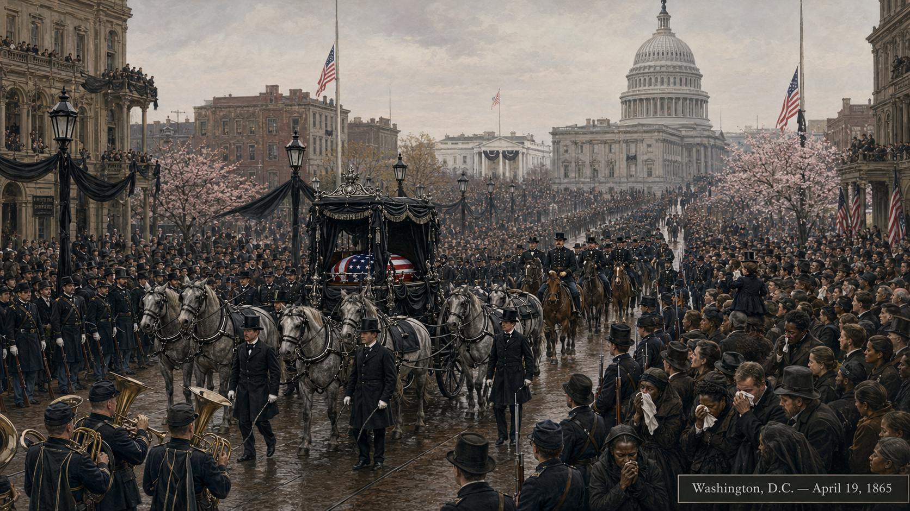

The war killed approximately 620,000 soldiers — more than all other American wars combined through Vietnam — and destroyed the Southern plantation economy. What came next — Reconstruction — was the question of what the war's resolution would actually mean for the four million people freed from slavery.

??? question "Knowledge Check 1 — Click to reveal"
    **Question:** Apply the concept of bias in historical sources to the "states' rights" interpretation of Civil War causes. Who produced this interpretation, when, and for what purpose?

    **Answer:** The "states' rights" interpretation — the claim that the Civil War was primarily about constitutional principle rather than slavery — was largely constructed *after* the war by Confederate veterans, sympathizers, and organizations like the United Daughters of the Confederacy. Its peak influence came in the late 19th and early 20th centuries, as Southern states implemented Jim Crow segregation and needed a narrative that did not center slavery. It was institutionalized in textbooks, monuments, and school curricula across the South. The bias in this interpretation is its selective use of sources: it relies on constitutional arguments made during the war while ignoring the secession declarations, Confederate founding documents, and wartime speeches that explicitly center slavery. Sourcing the "states' rights" interpretation reveals it as motivated historical revisionism.

??? question "Knowledge Check 2 — Click to reveal"
    **Question:** The Emancipation Proclamation freed no enslaved people in states loyal to the Union. Critics called it an empty gesture. Apply historical contextualization to evaluate this criticism.

    **Answer:** The criticism misunderstands the Proclamation's purpose within its context. Lincoln could not legally free enslaved people in loyal border states under his Commander-in-Chief war powers — he could only act against enemy (Confederate) property, which is how the Proclamation was legally framed. Contextualizing it within the political constraints of 1862 (border state loyalty was essential, abolitionist Republicans and conservative Democrats both needed to be kept in the coalition), the international dimensions (preventing British and French recognition of the Confederacy), and the military context (authorizing Black enlistment) reveals it as a carefully calibrated act that accomplished everything it could accomplish under those constraints. The 13th Amendment (1865) is what legally ended slavery everywhere — the Proclamation was the political and moral bridge that made the Amendment possible.

!!! mascot-celebration "Chapter 8 Complete!"
    
    You've just navigated the central crisis of American history — the crisis that determined whether the republic would survive, whether slavery would endure, and whether the Declaration of Independence's promises could be made real. The Civil War killed 620,000 people and destroyed the Southern plantation economy. What it built in slavery's place — and what it failed to build — is the subject of Chapter 9: Reconstruction.

[See Annotated References](./references.md)
