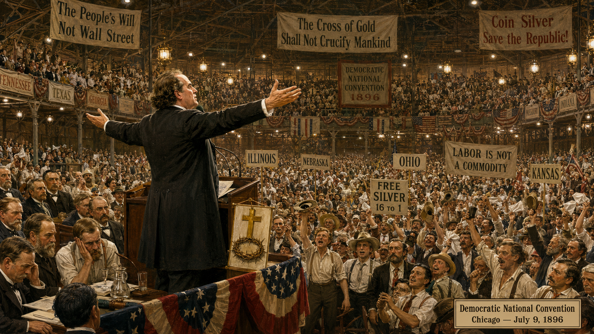
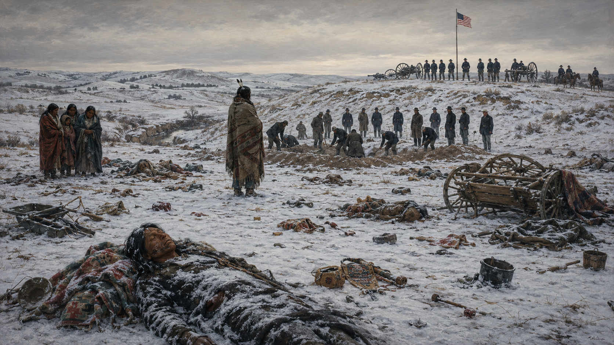

# Populism and the Closing of the Frontier (1880–1900)

## Summary

This chapter covers the political machines and Gilded Age corruption that galvanized agrarian reformers into the Populist movement, William Jennings Bryan's cross-of-gold campaign, the Native American Wars and Dawes Act, and the Ghost Dance movement — all culminating in the Census Bureau's 1890 declaration that the frontier was closed.

## Concepts Covered

This chapter covers the following 13 concepts from the learning graph:

1. Tammany Hall
2. Populist Movement
3. William Jennings Bryan
4. Farmers' Alliance
5. Gold Standard Debate
6. Gilded Age Politics
7. Civil Service Reform
8. Pendleton Act
9. Native American Wars
10. Battle of Little Bighorn
11. Dawes Act
12. Ghost Dance Movement
13. Closing of the Frontier

## Prerequisites

This chapter builds on concepts from:
- [Chapter 10: The Gilded Age: Industrialization and Labor](../10-gilded-age-industry/index.md)

---

!!! mascot-welcome "The revolt of the countryside"
    
    Welcome to Chapter 11! While industrial workers in the cities organized into unions, American farmers faced their own economic crisis — falling crop prices, rising railroad freight rates, and crushing debt. Their political movement, Populism, came closer to fundamentally challenging industrial capitalism than anything that came before it. Meanwhile, the American West — the frontier that had defined American identity for a century — was being closed, its Indigenous peoples subjected to the final wave of dispossession. Let's investigate the evidence!

## The Agricultural Crisis and Gilded Age Politics

### Gilded Age Politics: Corruption and Machines

**Gilded Age politics** was defined by a combination of intense party competition and pervasive corruption. Republicans and Democrats were evenly matched nationally, which paradoxically produced weak governance — neither party could afford to alienate its coalition by pursuing meaningful reform.

Political machines dominated urban politics. **Tammany Hall** — the Democratic Party organization that controlled New York City politics — is the most famous example. Led by Boss William Tweed (until his imprisonment in 1871) and later by Richard Croker and Charles Murphy, Tammany controlled city contracts, judicial appointments, and police, operating through a network of ward bosses who traded services for votes. The scale of Tammany's corruption was extraordinary: Tweed's ring is estimated to have stolen between $30 million and $200 million from city contracts in just a few years.

Yet as noted in Chapter 10, machines served real functions: they provided jobs, legal assistance, and social services to immigrant communities that formal government largely ignored. Reformers who attacked machines without addressing the underlying needs they served often found their "clean government" replacements less responsive to ordinary citizens than the corrupt originals had been.

### Civil Service Reform and the Pendleton Act

The assassination of President James Garfield in 1881 by a disappointed office-seeker — a man who felt he deserved a government job for his services to the Republican Party — galvanized public support for **civil service reform**. The **Pendleton Civil Service Reform Act** (1883) created a merit-based civil service for a portion of federal jobs (initially about 10 percent), filled by competitive examination rather than political appointment. Over subsequent decades, the proportion of merit positions expanded until political patronage was largely limited to cabinet and senior positions.

The Pendleton Act is a good example of balancing feedback: the spoils system (a reinforcing loop of political loyalty → jobs → more political loyalty) had grown so corrupt that it produced its own correction. Garfield's assassination was the crisis that forced the correction.

### The Farmers' Alliance and Its Grievances

American farmers in the 1880s faced a genuine economic crisis that was structural, not the result of personal failure. Crop prices fell steadily: the price of wheat dropped from $1.19 per bushel in 1881 to $0.49 by 1894; cotton prices fell similarly. Meanwhile, costs remained high or increased: railroad freight rates (often set by regional monopolies), interest on farm loans, and prices for manufactured goods the farmers needed to buy.

The underlying cause was a currency squeeze. The United States had been on a tight money supply (gold standard) since the Civil War. As the economy grew, the fixed money supply made each dollar more valuable — meaning that debt taken out in cheaper dollars had to be repaid in more expensive ones. Farmers who borrowed to plant a crop paid it back in dollars that were worth more than the dollars they had borrowed.

The **Farmers' Alliance**, founded in the late 1870s and reaching 1–3 million members by 1890, organized farmers into cooperative purchasing and marketing arrangements designed to reduce dependence on middlemen (railroads, grain elevator operators, banks). The Alliance was one of the largest mass organizations in American history and developed an elaborate analysis of the economic system that connected farmers' problems to broader structural conditions.

## Part 1: The Populist Movement

### From Alliance to Party: The People's Party

When the Farmers' Alliance's economic cooperatives proved unable to solve farmers' structural problems — because they couldn't access the credit needed to operate at scale — Alliance leaders concluded that political action was necessary. In 1892 they formed the **Populist Movement** (People's Party).

The People's Party's platform was one of the most radical ever put forward by a mainstream American political party. Its 1892 Omaha Platform called for:

- Government ownership of railroads and telegraphs
- A graduated income tax (taxing higher incomes at higher rates)
- Direct election of U.S. senators (then chosen by state legislatures)
- The secret ballot
- A flexible currency supply (opposed to the gold standard)
- A "subtreasury" system allowing farmers to store crops and borrow against them at low interest rates

In 1892, the People's Party received over a million popular votes and 22 electoral votes — an extraordinary showing for a third party. Many of its demands seemed radical in 1892; most were eventually enacted, through the Progressive Era and New Deal reforms, by 1940.

### William Jennings Bryan and the Gold Standard Debate

The **Gold Standard Debate** was the central economic policy conflict of the 1890s. The gold standard — backing currency only with gold reserves — kept the money supply tight and stable but also kept it insufficient for a growing economy. Advocates of "free silver" (minting silver at a ratio of 16:1 to gold) argued that expanding the money supply would raise crop prices, reduce debt burdens, and stimulate economic growth.

**William Jennings Bryan** was a Democratic congressman from Nebraska who electrified the 1896 Democratic National Convention with his "Cross of Gold" speech, denouncing the gold standard in language that framed the debate as a moral and class conflict:

> "You shall not press down upon the brow of labor this crown of thorns, you shall not crucify mankind upon a cross of gold."

Bryan won the Democratic nomination and the endorsement of the People's Party — effectively merging Populism with the Democratic Party. The Republicans nominated William McKinley on a pro-gold platform, funded by Mark Hanna with unprecedented corporate donations. McKinley won decisively.

Bryan's defeat ended Populism as an independent political force. The People's Party dissolved into the Democratic Party. The gold standard remained until Franklin Roosevelt abandoned it during the Great Depression. But Populism's policy agenda — graduated income tax, direct election of senators, antitrust regulation, railroad regulation — was implemented piecemeal through the Progressive Era.

!!! mascot-warning "Populism as a word to handle carefully"
    
    The word "populism" is used very loosely in contemporary political discourse — applied to movements across the political spectrum, from the original 1890s People's Party to 20th-century fascism to contemporary right-wing nationalism. When you encounter the word in a contemporary context, apply sourcing: who is using it, how are they defining it, and is the definition consistent with the historical movement it invokes? The original Populism was a specific agrarian reform movement with a specific economic analysis. Contemporary uses often share only the rhetoric of "the people vs. the elite" without sharing the policy content.

#### Diagram: Populist Policy Platform — Then and Now

<iframe src="../../sims/populist-platform-tracker/main.html" width="100%" height="480px" scrolling="no"></iframe>

Populist Platform Tracker — Which Demands Were Eventually Enacted?

Type: infographic
**sim-id:** populist-platform-tracker 
**Library:** p5.js 
**Status:** Specified

Purpose: Allow students to explore the 1892 People's Party platform demands and track which were eventually enacted into law, when, and under what political conditions — illustrating how "radical" reform ideas move from the margins to the mainstream.

Bloom Level: Analyze (L4)
Bloom Verb: Examine

Learning Objective: Students examine how political demands that seem radical in one era become mainstream in another, and identify the political conditions that enabled or blocked the adoption of Populist demands.

Canvas layout:
- Responsive width; height approximately 480px
- Left column: eight Populist platform demands from the 1892 Omaha Platform, each as a clickable card
- Right side: when a card is clicked, a detail panel shows: the specific demand, whether it was enacted, when, and under what president/law — or why it was not enacted

Platform demand cards:
1. Government ownership of railroads → Partly enacted (ICC strengthened; railroads nationalized briefly in WWI) 
2. Graduated income tax → Enacted: 16th Amendment (1913)
3. Direct election of senators → Enacted: 17th Amendment (1913)
4. Secret ballot → Enacted: widely adopted by states 1890s–1910s
5. Flexible currency (silver) → Modified: gold standard abandoned 1933; Federal Reserve (1913) added flexibility
6. Subtreasury system for farm loans → Partly enacted: Farm Credit Act (1933), Agricultural Adjustment Act
7. Eight-hour workday → Enacted: Fair Labor Standards Act (1938)
8. Postal savings banks → Enacted: Postal Savings System (1910, abolished 1967)

Each card shows a color-coded status badge: green = fully enacted, amber = partially enacted, red = not enacted.

Interactivity:
- Clicking a card shows the full detail panel with enactment year, the law/amendment name, and a 1-sentence note on why it took as long as it did
- "Timeline" button shows a simplified timeline of when each demand was enacted relative to 1892
- Filter buttons: "Enacted," "Partial," "Not Enacted"

Color scheme: Green/amber/red status badges; gold card borders; white panels.

Responsive behavior: Cards stack in 2 columns on narrow canvas.

Implementation: p5.js

## Part 2: The Final Closing of the Frontier

### Native American Wars

The decades after the Civil War saw the final military campaigns of what are called the **Native American Wars** — the sustained armed conflict between the U.S. Army and Indigenous nations of the Great Plains and Southwest as American settlement expanded.

The context is important: the Plains tribes (Sioux, Cheyenne, Comanche, Apache, and others) had developed sophisticated cultures organized around the buffalo herds of the central Great Plains. They were not pre-modern primitive peoples — they had complex political structures, extensive trade networks, and military capabilities that initially made them formidable adversaries. What defeated them in the long run was not superior tactics but the destruction of the bison herds (an ecological catastrophe driven by commercial hunting) and the U.S. government's policy of systematic treaty violation.

The **Battle of Little Bighorn** (June 1876) was the high-water mark of Native military resistance. Lakota Sioux, Cheyenne, and Arapaho warriors under Crazy Horse and Sitting Bull annihilated Lieutenant Colonel George Armstrong Custer's 7th Cavalry — 268 Americans killed in one afternoon. The stunning defeat shocked the nation and produced a massive military response. By 1877, the main Sioux resistance had collapsed; Chief Joseph's Nez Perce and Geronimo's Apache fought on until 1877 and 1886 respectively.

The wars ended not because the U.S. Army finally defeated Native military resistance on its own terms, but because the material basis of Plains life — the bison — had been systematically destroyed. An estimated 30–60 million bison had roamed the Plains in 1800; by 1900, fewer than 1,000 remained.

### The Dawes Act (1887)

The **Dawes Act** (1887) represented a new strategy for dealing with Indigenous peoples: cultural assimilation rather than military defeat. It broke up tribally held reservation lands into individual allotments of 160 acres per household, with the remaining "surplus" land to be sold to white settlers. The theory was that private land ownership would transform Indigenous peoples into self-sufficient farmers and assimilate them into American society.

In practice, the Dawes Act was a disaster for Indigenous communities — one of the clearest examples in American history of an unintended consequence that was arguably predictable. Native peoples lost roughly two-thirds of their remaining land — about 90 million acres — through allotment sales. The individually owned allotments proved too small and often on unsuitable land for viable farming. The destruction of tribal land ownership also destroyed tribal governance structures, cultural institutions, and social support systems.

Historians debate whether the Dawes Act's devastating consequences were truly "unintended" or whether they were understood by its architects but deemed acceptable, or even desirable, as a means of completing dispossession. The debate itself illustrates the importance of examining whose interests a policy served when evaluating claims about intent.

### The Ghost Dance Movement and the Closing of the Frontier

The **Ghost Dance Movement** was a spiritual revival that swept through Native communities across the Great Plains in 1889–1890, led by the Paiute prophet Wovoka. The Ghost Dance promised that if Indigenous peoples performed the ritual correctly and lived righteously, the ancestors would return, the bison would be restored, and white settlers would be removed from Native lands. It spread rapidly across multiple nations as a response to dispossession, reservation confinement, and cultural destruction.

U.S. Army officials, alarmed by the movement's spread, moved to arrest Sitting Bull (who was killed in the process) and surrounded a band of Lakota at Wounded Knee Creek. On December 29, 1890, soldiers opened fire — in disputed circumstances — killing approximately 250–300 Lakota men, women, and children. The Wounded Knee Massacre is considered the final episode of the Indian Wars.

In 1890, the U.S. Census Bureau officially declared that the **closing of the frontier** had occurred — the contiguous line of settlement had finally connected, leaving no large unsettled area. The historian Frederick Jackson Turner, in his 1893 "Frontier Thesis," argued that the frontier had been the defining feature of American character — a safety valve for social tension and a crucible of democratic individualism. With the frontier closed, Turner wondered, what would sustain American democracy?

Turner's thesis has been extensively critiqued by later historians for romanticizing conquest and ignoring the violence done to Indigenous peoples. But it remains important as a historical document: it captures how many Americans of 1893 thought about the frontier, which helps explain why the closing of the frontier felt like a crisis requiring new outlets — and helps explain the imperial ambitions that drove the Spanish-American War in 1898.

!!! mascot-tip "The Dawes Act as a systems thinking case"
    
    The Dawes Act's advocates claimed it would help Native peoples by giving them private property and integrating them into American economic life. Apply second-order thinking: the first-order effect was breaking up tribal lands into individual allotments. The second-order effect was that individual allotments could be sold, lost to debt, or taken by fraud — which is exactly what happened to 90 million acres. The third-order effect was the destruction of tribal governance and cultural institutions that had been sustained by communal land ownership. Each order of effect moved further from the stated intention and further toward dispossession. When evaluating any policy that claims to "help" a disadvantaged group, asking what the second-order effects will be is essential critical thinking.

## Summary

The closing decades of the 19th century saw two parallel transformations. In the countryside, the Farmers' Alliance and the Populist Party mounted the most serious political challenge to industrial capitalism in American history, demanding government regulation of railroads, a graduated income tax, and a flexible money supply. Bryan's 1896 defeat ended Populism as an independent party but planted seeds that Progressive and New Deal reformers would harvest over the next four decades.

Simultaneously, the last phase of Indigenous dispossession completed the conquest of the continent. The Native American Wars, the destruction of the bison, the Dawes Act's systematic land loss, and the Ghost Dance's suppression at Wounded Knee marked the end of Indigenous sovereignty east of the Rocky Mountains as a practical reality. The closing of the frontier in 1890 ended one phase of American history and raised urgent questions about what would come next.

Those questions led to the Progressive Era, which is the subject of Chapter 12.

??? question "Knowledge Check 1 — Click to reveal"
    **Question:** Many of the Populist Party's 1892 "radical" demands were enacted by 1940. What does this pattern tell us about how political change works in American democracy?

    **Answer:** The pattern illustrates a recurring feature of American political change: ideas that appear radical (outside the mainstream consensus) in one generation become mainstream in the next, often after a major crisis makes the status quo untenable. Populist demands were initially rejected because they threatened established economic interests (railroads, banks, gold-standard creditors) with sufficient political power to block them. They were eventually enacted because: (1) the Progressive movement built broader public coalitions around regulation, (2) the Depression of 1893 and later the Great Depression made the costs of the unregulated system undeniable, and (3) each successful reform demonstrated that the system could survive regulation without collapsing. Political change in American democracy tends to be incremental, lagged, and crisis-driven rather than immediate and principled.

??? question "Knowledge Check 2 — Click to reveal"
    **Question:** The Dawes Act was described by its advocates as helping Native peoples by giving them private property. Apply misinformation detection: what sourcing and triangulation would you do to evaluate this claim?

    **Answer:** **Source the claim**: The claim came primarily from reformers who genuinely believed in cultural assimilation — they were not lying, but they were operating from a framework (Social Darwinism + Protestant individualism) that defined Indigenous communal land tenure as a deficiency to be corrected. **Triangulate**: Check the quantitative outcomes — Native landholding dropped from ~138 million acres in 1887 to ~52 million acres by 1934, a loss of 86 million acres directly attributable to allotment. Check the testimony of Indigenous communities — Native leaders consistently opposed the Dawes Act. Check the structural logic — an allotment of 160 acres given to a people with no capital, credit access, or farming equipment, on land often unsuitable for agriculture, could not produce the self-sufficiency it promised. The evidence strongly supports the conclusion that the Dawes Act's "help" narrative was sincere but wrong — and that it provided cover for what was effectively a policy of dispossession.

!!! mascot-celebration "Chapter 11 Complete!"
    
    You've just completed a chapter about endings: the ending of the frontier, the ending of meaningful Indigenous sovereignty east of the Rockies, and the ending of Populism as an independent political force. But you've also seen how the ideas don't die with the movements — Populist demands became the Progressive Era's legislative agenda. In Chapter 12, that transformation takes center stage.

[See Annotated References](./references.md)
