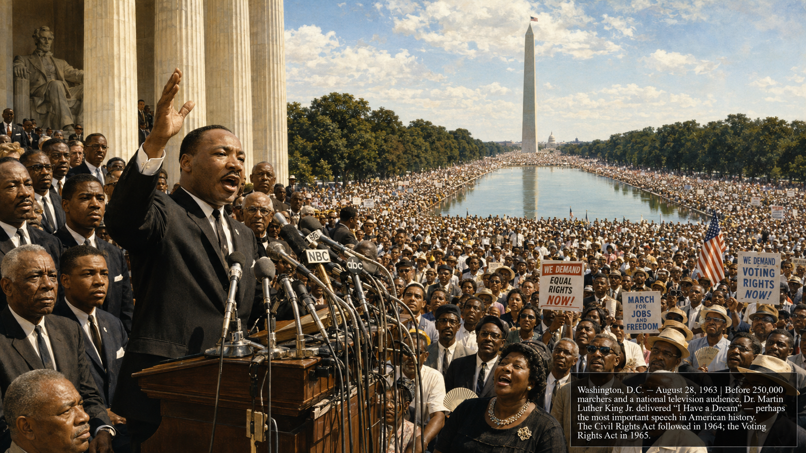

# Civil Rights and the Great Society (1954–1968)

## Summary

The decade from 1954 to 1965 produced the most significant expansion of legal equality in American history since Reconstruction — and the most ambitious domestic legislation since the New Deal. The Civil Rights Movement forced the nation to confront the gap between its stated ideals and its lived reality of racial segregation and disenfranchisement. The Great Society programs created Medicare, Medicaid, and the Immigration Act of 1965, reshaping American society in ways still felt today. Understanding both requires understanding the strategic choices activists made, the political calculations presidents faced, and the persistent tension between reform and resistance.

## Concepts Covered

This chapter covers the following 23 concepts from the learning graph:

1. Brown v. Board of Education
2. Montgomery Bus Boycott
3. Rosa Parks
4. Martin Luther King Jr.
5. Southern Christian Leadership Conference
6. Student Nonviolent Coordinating Committee
7. Sit-In Movement
8. Freedom Riders
9. Birmingham Campaign
10. March on Washington
11. Civil Rights Act of 1964
12. Voting Rights Act of 1965
13. Malcolm X
14. Black Power Movement
15. Fair Housing Act of 1968
16. Great Society Programs
17. Medicare and Medicaid
18. Lyndon B. Johnson
19. Immigration and Nationality Act 1965
20. Twenty-Fourth Amendment
21. Social Safety Net Development
22. Immigration Policy History
23. Desegregation History

## Prerequisites

This chapter builds on concepts from:
- [Chapter 16: The Early Cold War](../16-early-cold-war/index.md)

---

!!! mascot-welcome "The unfinished revolution"
    
    Welcome to Chapter 17! The Civil Rights Movement is often taught as a story that ended in triumph — and it did produce genuine triumphs: Brown v. Board, the Civil Rights Act, the Voting Rights Act. But it also produced fierce resistance, internal debates about strategy, and a reminder that legal equality is necessary but not sufficient for full equality. Understanding this movement requires the sourcing skills to examine who is telling the story, the systems thinking skills to trace how change actually happened, and the critical thinking skills to hold the complexity of both the movement's achievements and its unfinished work. Let's investigate the evidence!

## Part 1: The Legal Revolution

### Brown v. Board of Education

**Brown v. Board of Education** (1954) was the Supreme Court decision that declared racial segregation in public schools unconstitutional — reversing the "separate but equal" doctrine that *Plessy v. Ferguson* (1896) had established. The case was argued by NAACP attorneys Thurgood Marshall (who would later become the first Black Supreme Court Justice) and drew on both legal arguments and social science evidence (Kenneth and Mamie Clark's "doll studies" showing the psychological harm of segregation to Black children).

Chief Justice Earl Warren wrote a unanimous opinion holding that "separate educational facilities are inherently unequal" — because separation itself stigmatizes, regardless of whether physical facilities are equivalent. The decision was a legal earthquake.

**Desegregation history** proceeded far more slowly than the decision implied. The follow-up decision *Brown II* (1955) ordered desegregation "with all deliberate speed" — a phrase that Southern school districts interpreted as permission to delay indefinitely. In Little Rock, Arkansas (1957), Governor Orval Faubus used the National Guard to block Black students from entering Central High School; President Eisenhower was forced to send the 101st Airborne Division to enforce the court order. Public schools in many Southern states remained effectively segregated into the 1970s.

### Montgomery Bus Boycott and Rosa Parks

On December 1, 1955, **Rosa Parks** refused to give up her seat on a Montgomery, Alabama city bus to a white passenger — and was arrested for violating the city's segregation ordinance. Parks was not, as popular memory sometimes suggests, simply a tired seamstress who spontaneously refused to move. She was trained in civil rights organizing (she had attended the Highlander Folk School) and was secretary of the Montgomery NAACP. Her arrest was strategically selected as a test case.

The **Montgomery Bus Boycott** (December 1955–December 1956) was the organized Black community's response: 40,000 Black residents of Montgomery boycotted the city bus system for 381 days, walking miles to work rather than riding segregated buses, until the Supreme Court ruled that Montgomery's bus segregation was unconstitutional. The boycott was a demonstration of economic power — Black riders constituted approximately 75 percent of the bus system's ridership.

The boycott introduced **Martin Luther King Jr.** as the movement's preeminent voice. King, a 26-year-old Baptist minister, was chosen to lead the Montgomery Improvement Association in part because he was new to the city and had not yet accumulated enemies. His leadership combined tactical nonviolence with powerful oratory rooted in both the Black church tradition and Gandhian civil disobedience.

## Part 2: The Movement's Strategies

### King, SCLC, and Nonviolent Direct Action

**Martin Luther King Jr.** articulated the movement's central strategic insight: nonviolent direct action was not merely moral but tactical. Nonviolent protesters who were met with violent state or private response made the system's violence visible — to the American public, to international audiences embarrassing the United States in its Cold War competition for the loyalty of newly independent nations, and to Congress.

King's "Letter from Birmingham Jail" (April 1963) is the movement's philosophical masterpiece — a direct response to white clergy who called for patience and criticized demonstrations as "unwise and untimely." King argued that the "white moderate" who preferred order to justice was a greater obstacle to freedom than the outright segregationist.

The **Southern Christian Leadership Conference** (SCLC), founded by King and other Black ministers in 1957, organized direct action campaigns across the South, using the Black church network as its organizational infrastructure.

### SNCC, Sit-Ins, and Freedom Riders

**Student Nonviolent Coordinating Committee** (SNCC) emerged from the student-led sit-in movement and represented a more confrontational, grassroots style of organizing than the SCLC's ministerial leadership.

The **sit-in movement** began on February 1, 1960, when four Black college students sat at a "whites only" Woolworth's lunch counter in Greensboro, North Carolina, ordered coffee, and were refused service — but stayed. The sit-in spread to 54 cities within two months, with students training in nonviolent response to the verbal and physical abuse they would inevitably face. The sit-ins directly attacked one of the most visible and economically significant forms of daily segregation.

The **Freedom Riders** (May 1961) were interracial groups who rode interstate buses into the Deep South to test a Supreme Court ruling that segregation in interstate transportation facilities was unconstitutional. In Anniston, Alabama, their bus was firebombed; in Birmingham and Montgomery, they were beaten by mobs while local police did nothing. The Freedom Riders' courage — continuing despite violence — and the violence of their reception forced the Kennedy administration to act, leading to federal orders desegregating interstate transportation facilities.

!!! mascot-thinking "Strategic nonviolence and the Cold War"
    
    Apply the "America in the World" lens to the Civil Rights Movement. The Cold War gave civil rights activists unexpected leverage: every photograph of a police dog attacking a nonviolent protester, every image of Bull Connor's fire hoses on Birmingham demonstrators, appeared in international newspapers and was used by Soviet propaganda to embarrass the United States in its competition for the loyalty of newly decolonizing nations in Africa and Asia. American diplomats reported that racial incidents were damaging U.S. foreign relations. This is why Eisenhower sent troops to Little Rock (protecting U.S. international image) and why Kennedy framed the Civil Rights Act partly as a foreign policy necessity. The movement's effectiveness was partly a function of the Cold War context that made racial inequality internationally costly for the United States.

### Birmingham Campaign and March on Washington

The **Birmingham Campaign** (spring 1963) was the movement's most strategically decisive campaign. King and the SCLC chose Birmingham — the most aggressively segregated major city in the South, presided over by Police Commissioner Bull Connor — deliberately. Connor could be counted on to respond to nonviolent protest with the kind of violence that would force national attention.

Connor did not disappoint: fire hoses and police dogs used against peaceful protesters, including children (the "Children's Crusade" involved thousands of students from grade school through high school), produced images that shocked the nation and the world. The spectacle of state violence against nonviolent citizens — broadcast on television to millions — broke the political logjam. President Kennedy, who had been cautious about the Civil Rights Movement, announced he would propose comprehensive civil rights legislation.

The **March on Washington** (August 28, 1963) drew 250,000 people — the largest civil rights demonstration in American history to that point. King delivered the "I Have a Dream" speech, which articulated the movement's vision of racial equality in language drawn from the Declaration of Independence and the Black church tradition.

 The march demonstrated both the movement's organizational capacity and its mainstream appeal.

### Civil Rights Act of 1964 and Voting Rights Act of 1965

Following Kennedy's assassination (November 1963), President Lyndon Johnson used the moment of national grief to push civil rights legislation that Kennedy had proposed. The **Civil Rights Act of 1964** prohibited discrimination based on race, color, religion, sex, or national origin in employment and public accommodations. Title VII created the Equal Employment Opportunity Commission (EEOC) to enforce the employment provisions. The act was the most comprehensive civil rights legislation since Reconstruction.

The **Voting Rights Act of 1965** attacked the systematic disenfranchisement of Black voters in the South — the poll taxes, literacy tests, and physical intimidation that had kept Black voter registration rates extremely low despite the 15th Amendment. The **Twenty-Fourth Amendment** (1964) had already prohibited poll taxes in federal elections; the Voting Rights Act suspended literacy tests and authorized federal registrars in counties where discrimination was found. Black voter registration in the Deep South increased dramatically within years of the act's passage.

#### Diagram: Civil Rights Movement Timeline — Strategies and Legislative Outcomes

<iframe src="../../sims/civil-rights-timeline/main.html" width="100%" height="480px" scrolling="no"></iframe>

Civil Rights Movement Timeline — Interactive Strategies and Outcomes

Type: timeline
**sim-id:** civil-rights-timeline 
**Library:** p5.js 
**Status:** Specified

Purpose: Allow students to trace the Civil Rights Movement's key events, the strategic choices activists made at each stage, and the legislative outcomes those choices produced.

Bloom Level: Analyze (L4)
Bloom Verb: Trace

Learning Objective: Students trace the relationship between civil rights movement strategies (legal challenges, boycotts, sit-ins, direct action) and legislative outcomes, identifying which strategies proved most effective at each stage and why.

Canvas layout:
- Responsive width; height approximately 480px
- Horizontal timeline from 1954 to 1968
- Three tracks: Legal (top), Nonviolent Action (middle), Legislative (bottom)
- Color-coded by strategy type: blue = legal, gold = economic/boycott, red = direct action, green = legislation

Key events:
Legal: Brown v. Board (1954), Brown II (1955), Boynton v. Virginia (1960)
Nonviolent Action: Montgomery Boycott (1955–56), Greensboro Sit-In (1960), Freedom Riders (1961), Birmingham Campaign (1963), March on Washington (1963), Selma (1965)
Legislative: Civil Rights Act (1964), 24th Amendment (1964), Voting Rights Act (1965), Fair Housing Act (1968)

Each event clickable:
- What happened
- Strategic rationale
- Key figures involved
- Immediate response (government, public, media)
- Legislative outcome produced

Interactivity:
- "Strategy filter" buttons highlight only legal, economic, or direct action events
- "Cause-effect" mode draws arrows from movement events to their legislative outcomes
- Hovering shows year and 1-line description

Color scheme: Blue/gold/teal for strategy types; green for legislation.

## Part 3: Debates Within the Movement

### Malcolm X and the Limits of Integration

**Malcolm X** represented a powerful challenge to the Civil Rights Movement's integrationist strategy. A minister in the Nation of Islam and one of the most powerful orators of the 20th century, Malcolm X argued that integration into a white-dominated society that would never fully accept Black Americans was both a delusion and a form of self-degradation. His prescription: Black self-determination, Black economic self-sufficiency, and Black pride — and a willingness to defend Black communities by "any means necessary."

Malcolm X's critique of nonviolence — that it required Black people to absorb violence passively in hopes of winning white sympathy — resonated with communities that had experienced that violence without seeing their conditions meaningfully improve. His later evolution (after his break with the Nation of Islam and his pilgrimage to Mecca in 1964) toward a more inclusive vision was cut short by his assassination in February 1965.

The **Black Power Movement** emerged in the mid-1960s, drawing on Malcolm X's emphasis on Black self-determination and pride. When SNCC leader Stokely Carmichael shouted "Black Power!" at a 1966 rally — and asked the crowd "What do we want?" with the response "Black Power!" — the phrase captured a shift in strategy and tone: from integration and moral suasion toward self-determination and political power. Black Power was not a unified movement but a cluster of ideas and organizations that included the Black Panther Party, the Black Arts Movement, and the push for Black studies in universities.

### Fair Housing Act of 1968

The **Fair Housing Act** (1968) was the final major civil rights legislation of the era, prohibiting discrimination in the sale or rental of housing. It was passed just days after Martin Luther King Jr.'s assassination (April 4, 1968) in Memphis, Tennessee, where he had gone to support striking sanitation workers.

The Fair Housing Act was the most difficult of the major civil rights laws to enforce — housing discrimination was harder to document than segregated lunch counters, and the act's enforcement mechanisms were relatively weak. De facto residential segregation (maintained by private discrimination, "steering" by real estate agents, and the legacy of redlining) proved more durable than de jure (legally mandated) segregation. Understanding the difference between de jure and de facto discrimination is essential for understanding why the legal victories of the 1960s did not translate into full equality of outcome.

## Part 4: The Great Society

### Lyndon B. Johnson and the Great Society

**Lyndon B. Johnson** was, in some respects, the most consequential domestic president since FDR — and one of the most tragic figures in American political history. His legislative mastery produced the Great Society's remarkable expansion of the federal role in health care, education, and civil rights. His escalation of the Vietnam War destroyed his presidency and his historical reputation.

Johnson understood Congress in a way few presidents have — he had spent 24 years in the Senate, rising to Majority Leader, and knew personally every senator and most House members, understood their constituencies, their ambitions, and their pressure points. He used Kennedy's assassination to create political momentum for legislation that had been stalled, and he won the 1964 election in a landslide (61 percent) that gave him the Congressional majorities to pass an ambitious agenda.

**Great Society programs** extended the New Deal's social safety net significantly:

- **Elementary and Secondary Education Act** (1965): First significant federal aid to public education, channeled through low-income student counts
- **Higher Education Act** (1965): Created federal student loans and scholarships that made higher education accessible to millions
- **Economic Opportunity Act** (1964): Created the Office of Economic Opportunity ("War on Poverty") — including Job Corps, VISTA (domestic Peace Corps), Head Start, and Community Action Programs

### Medicare and Medicaid

**Medicare** (health insurance for Americans over 65) and **Medicaid** (health insurance for low-income Americans) were signed into law on July 30, 1965 — the most significant expansion of the social safety net since Social Security. They addressed the reality that elderly Americans (who often had no employer health insurance after retirement) and poor Americans faced medical costs that could be financially catastrophic or lead them to forgo necessary care.

Before passage, the American Medical Association spent $3 million opposing Medicare as "socialized medicine" — one of the largest lobbying campaigns in American history to that point. LBJ signed the bill in Independence, Missouri, in the presence of Harry Truman (who had proposed national health insurance in 1945 and been defeated).

**Social safety net development** from the New Deal through the Great Society created the basic structure of federal social programs that still exists: Social Security (1935), unemployment insurance (1935), AFDC/welfare (1935), housing assistance (1937), Food Stamps (1964), Medicare and Medicaid (1965). Each program reflected political compromises — Social Security excluded agricultural and domestic workers (disproportionately Black) at Southern Democrats' insistence; Medicare covered the elderly rather than all citizens because that was politically achievable.

### Immigration and Nationality Act of 1965

The **Immigration and Nationality Act of 1965** (also called the Hart-Celler Act) abolished the national-origins quota system that had governed American immigration since 1924, replacing it with a system that prioritized family reunification and skilled workers. It was passed as part of the Great Society's civil rights framework — the quota system was understood as racially discriminatory (it explicitly favored Northern and Western European immigrants over Southern and Eastern Europeans and banned most Asian immigration).

The Act's consequences were largely unanticipated by its sponsors. Senator Edward Kennedy promised: "The ethnic mix of this country will not be upset." In fact, the act produced a dramatic demographic transformation: **immigration policy history** shows that immigration from Latin America, Asia, and Africa increased enormously after 1965, while European immigration declined. By 2000, over half of immigrants came from Latin America and about a quarter from Asia — exactly opposite to the pre-1965 pattern.

This is a significant case in which a policy's actual outcomes diverged dramatically from its authors' predictions. Evaluating the divergence requires asking: were the authors wrong about the mechanisms, or did the mechanisms work as predicted but produce different demographic consequences than expected? (The family reunification preference, once applied to the small existing populations of Asian and Latin American immigrants, created chains of immigration that sponsors did not anticipate.)

!!! mascot-tip "De jure vs. de facto: the incomplete revolution"
    
    The Civil Rights Movement's legal victories eliminated de jure (legally mandated) segregation and discrimination. But de facto (in practice) discrimination — maintained through private choices, economic structures, and the accumulated disadvantages of generations of exclusion — proved far more durable. School segregation persists today not through legal mandate but through residential patterns shaped by the legacy of redlining and housing discrimination. Wealth gaps between Black and white Americans persist because legal equality does not restore the wealth that exclusion destroyed. Understanding the difference between de jure and de facto is not a partisan point — it is a basic analytical distinction that helps explain why legal victories do not automatically produce equal outcomes, and what additional policy interventions might (or might not) address the gap.

## Summary

The period from 1954 to 1968 produced the most significant expansion of legal equality since Reconstruction and the most ambitious domestic legislation since the New Deal. The Civil Rights Movement demonstrated that organized, strategic nonviolent action could overcome entrenched systems of legal oppression — by making the system's violence visible, by exploiting the Cold War's international context, and by building coalitions that included white allies without sacrificing the movement's Black leadership.

The Great Society extended the social safety net, made higher education accessible to millions, and removed the racially discriminatory quota system from immigration — with demographic consequences that its architects did not anticipate. Together, the civil rights legislation and the Great Society programs represent the high-water mark of liberal reform in American history, and they established the social policy baseline that subsequent decades would debate, extend, and partially roll back.

??? question "Knowledge Check 1 — Click to reveal"
    **Question:** Apply the concept of strategic nonviolence to the Birmingham Campaign. Why did King choose Birmingham, and what does his choice reveal about the movement's understanding of how political change works?

    **Answer:** King chose Birmingham deliberately because Bull Connor's aggressive, violent response to nonviolent protest could be predicted reliably. The strategic insight: nonviolent direct action works not primarily by converting opponents (segregationists were not converted) but by making the system's violence visible to audiences — the national press, television viewers, international observers, and Congress members — who had previously been insulated from it or had chosen to ignore it. Birmingham's fire hoses and police dogs created images that could not be ignored. This reveals a sophisticated understanding of political change: in a democracy with mass media, policy change requires moving public opinion, which requires making abstract injustice concrete and visceral. The movement's choice of Birmingham was not reckless provocation but calculated exposure of a system that depended on its violence remaining invisible to most Americans.

??? question "Knowledge Check 2 — Click to reveal"
    **Question:** The Immigration and Nationality Act of 1965 produced demographic consequences its sponsors did not predict. Apply second-order thinking to explain how the family reunification preference mechanism produced unexpected demographic outcomes.

    **Answer:** First-order effect: the family reunification preference allows immigrants already in the United States to sponsor family members for immigration. Second-order effect: the pre-1965 immigration population was composed primarily of European immigrants (those admitted under the old quota system). Family reunification chains from this population would have extended European immigration — which is what sponsors expected. But the Act also eliminated barriers to immigration from Asia and Latin America, creating new immigrant communities. Third-order effect: once Asian and Latin American immigrant communities reached meaningful size (through the small initial flows the Act permitted), their family reunification chains amplified — each immigrant could sponsor family members, who could in turn sponsor family members. The mechanism (family reunification) worked exactly as designed; what sponsors failed to predict was that removing Asian and Latin American immigration barriers would create the seed communities whose family chains would dominate subsequent immigration. This illustrates why second-order thinking is essential for policy design: the intended mechanism (family reunification) produced unintended demographic outcomes because sponsors did not trace its implications through all the affected population groups.

!!! mascot-celebration "Chapter 17 Complete!"
    
    You've navigated one of the most consequential chapters in American history — a period that transformed the legal landscape, extended the social safety net, and permanently changed the demographic trajectory of the United States. The Civil Rights Movement is a case study in how sustained, strategic organizing can overcome entrenched systems — and a reminder that legal equality and full equality of opportunity are not the same thing. In Chapter 18, the Great Society's optimism collides with Vietnam, Nixon, and the social movements that will reshape American politics for generations.

[See Annotated References](./references.md)
