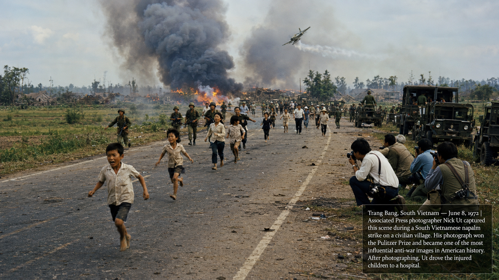

# Vietnam, Nixon, and Social Movements (1965–1975)

## Summary

The decade from 1965 to 1975 was one of the most turbulent in American history — a period in which the Vietnam War divided the country, the counterculture challenged mainstream values, and a cascade of social movements (second-wave feminism, the American Indian Movement, the farmworkers movement) extended the Civil Rights Movement's demand for equality and dignity to new constituencies. It ended with the only resignation of a U.S. president in history and the final American withdrawal from Vietnam. This chapter introduces the AP thematic lens of "America and Culture," which examines how cultural movements shape and are shaped by political and social change.

## Concepts Covered

This chapter covers the following 14 concepts from the learning graph:

1. Gulf of Tonkin Resolution
2. Vietnam War Escalation
3. Tet Offensive
4. Anti-War Movement
5. Kent State Shooting
6. Pentagon Papers
7. Nixon and Détente
8. Watergate Scandal
9. Counterculture Movement
10. Second-Wave Feminism
11. Roe v. Wade
12. American Indian Movement
13. César Chávez and Farmworkers
14. America and Culture

## Prerequisites

This chapter builds on concepts from:
- [Chapter 17: Civil Rights and the Great Society](../17-civil-rights-great-society/index.md)

---

!!! mascot-welcome "A decade that broke the consensus"
    
    Welcome to Chapter 18! The late 1960s and early 1970s shattered the postwar American consensus — the broad agreement on Cold War anti-Communism, the legitimacy of government institutions, and the social norms of gender and family that had characterized the 1950s. Vietnam was the detonator: a war that divided the country along lines of class, generation, and political allegiance, and that eroded trust in government that has never fully recovered. The social movements of the era — feminism, Indigenous rights, farmworker organizing — pushed the boundaries of American democracy in directions that still reverberate. Let's investigate the evidence!

## The AP Thematic Lens: America and Culture

**America and Culture** is an AP thematic lens that examines how artistic, intellectual, and social movements express and shape American values, beliefs, and identities. Culture is not merely entertainment or decoration — it is the medium through which societies process change, debate values, and construct collective identity.

The late 1960s and early 1970s are among the most culturally rich and contested periods in American history. Rock music became a political medium (Dylan, the Beatles' evolution, Woodstock). Film challenged censorship norms (*Bonnie and Clyde*, *Easy Rider*). Literature and journalism took on new forms (*Fear and Loathing in Las Vegas*, "New Journalism"). And the counterculture's challenge to mainstream norms — in dress, music, sexuality, drugs, and politics — was itself a form of political argument. Understanding the period requires reading its cultural products as historical evidence.

## Part 1: Vietnam

### Gulf of Tonkin Resolution

American involvement in Vietnam escalated through a series of steps, each justified by incremental logic, that produced a major land war in Asia — the outcome that strategic planners had consistently identified as the worst possible outcome.

The **Gulf of Tonkin Resolution** (August 7, 1964) was Congress's authorization for the president to use military force in Southeast Asia. It was passed after the Johnson administration reported that North Vietnamese torpedo boats had attacked U.S. destroyers in the Gulf of Tonkin on August 2 and again on August 4. The second attack almost certainly did not happen — later investigations revealed that the reported August 4 attack was based on misinterpretation of radar contacts in stormy seas. Secretary of Defense Robert McNamara later acknowledged the uncertainty about the August 4 incident.

The Gulf of Tonkin Resolution illustrates a pattern worth noting: in the immediate aftermath of an apparent attack on American forces, Congress gave the president nearly unlimited military authority — without the constitutional declaration of war that the Framers had designed as a check on executive power. The same pattern (incident → resolution → expanded presidential war powers) appeared in the Authorization for Use of Military Force (AUMF) passed after September 11, 2001.

### Vietnam War Escalation

**Vietnam War escalation** proceeded rapidly after the Gulf of Tonkin Resolution. Johnson sent the first combat troops (Marines) in March 1965; by 1968, 543,000 American troops were in Vietnam. The strategic theory was "graduated pressure" — increasing military force would convince North Vietnam and the Viet Cong that continued resistance was too costly. The theory proved wrong.

Vietnam was a profoundly mismatched war. The United States had overwhelming conventional military superiority — air power, artillery, mobility. The North Vietnamese and Viet Cong were fighting a protracted insurgency, using terrain, civilian population networks, and patience as their advantages. The U.S. military metric of "body count" (measuring success by enemy casualties) incentivized inflating numbers and discouraged the population-security approach that counterinsurgency doctrine recommended. The My Lai Massacre (March 1968, revealed publicly 1969) — in which U.S. soldiers killed between 347 and 504 unarmed South Vietnamese civilians — was the most publicized result of a strategy that depended on killing enemy combatants in an environment where distinguishing combatants from civilians was nearly impossible.

### Tet Offensive

The **Tet Offensive** (January 30–31, 1968) was a coordinated series of attacks by North Vietnamese and Viet Cong forces on more than 100 cities and towns across South Vietnam — including a dramatic assault on the U.S. Embassy compound in Saigon. It was launched during the Vietnamese New Year (Tet) cease-fire period.

Militarily, the Tet Offensive was a North Vietnamese defeat: U.S. and South Vietnamese forces repulsed the attacks with heavy North Vietnamese casualties. Politically, it was a decisive American defeat. For years, the Johnson administration had been telling the public that the war was going well, that the enemy was being attrited, that victory was in sight. The Tet Offensive — televised into American living rooms — made those claims obviously false. Walter Cronkite, the most trusted television journalist in America, told his audience that the war appeared to be a "stalemate." Johnson reportedly said: "If I've lost Cronkite, I've lost Middle America." He announced he would not seek re-election.

!!! mascot-thinking "Tet and the credibility gap"
    
    The **credibility gap** — the growing distance between what the government said was happening in Vietnam and what journalists and ordinary citizens could observe — is one of the most important political concepts of the era. Apply sourcing: the Johnson administration had access to classified intelligence about the war's progress; journalists in the field had access to what they could observe; the public had access to what the government and press chose to tell them. When these three information streams diverged dramatically at Tet, public trust collapsed — not just in Johnson's Vietnam policy but in government institutions more broadly. That erosion of trust is a defining feature of American political culture from 1968 to the present. Tracking the credibility gap requires lateral reading: comparing official statements with contemporaneous reporting, internal documents (like the Pentagon Papers), and later historical analysis.

### Anti-War Movement and Kent State

The **anti-war movement** grew from small campus protests in 1965 (the first "teach-in" was at the University of Michigan in March 1965) to a mass political movement that included students, veterans, clergy, civil rights leaders, and eventually a majority of the American public. Demonstrations drew hundreds of thousands: the March on the Pentagon (1967), the 1969 Moratorium (15 million participants in events across the country).

On May 4, 1970, the **Kent State shooting** occurred: Ohio National Guard troops opened fire on students protesting Nixon's invasion of Cambodia, killing four students and wounding nine. The Pulitzer Prize-winning photograph of Mary Ann Vecchio kneeling over the body of Jeffrey Miller became one of the most iconic images of the era. The killings triggered a national student strike and provoked the most widespread campus protests in American history.

### Pentagon Papers

The **Pentagon Papers** — formally the "History of U.S. Decision-Making in Vietnam, 1945–68" — were a top-secret Defense Department study commissioned by Secretary McNamara and compiled by analysts who had access to classified documents. Daniel Ellsberg, a military analyst who had worked on the study, leaked it to the *New York Times* in 1971. The Nixon administration sought a court injunction to prevent publication on national security grounds.

The Supreme Court, in *New York Times Co. v. United States* (1971), ruled 6-3 that the government had not met the burden for prior restraint — the government could not prevent publication of information simply because it was embarrassing. The Pentagon Papers revealed that the Johnson administration had systematically deceived Congress and the public about the war's progress and prospects — confirming the credibility gap with documentary evidence.

## Part 2: Nixon — Détente and Watergate

### Nixon and Détente

**Richard Nixon** was, paradoxically, both the architect of one of the most significant foreign policy shifts in Cold War history and the president who resigned in disgrace. With National Security Advisor Henry Kissinger, Nixon pursued **détente** — a relaxation of Cold War tensions through engagement with the Soviet Union and, most dramatically, China.

Nixon's opening to China (1972) was a geopolitical masterstroke: by normalizing relations with Communist China, the United States introduced a new variable into the U.S.-Soviet competition. The Soviet Union, alarmed by Chinese-American rapprochement, became more interested in its own détente with the United States. Nixon's historic visit to China in February 1972, and his summit with Soviet leader Leonid Brezhnev, produced the Strategic Arms Limitation Talks (SALT I) — the first nuclear arms control agreement of the Cold War.

Nixon's foreign policy achievements were real and significant. They were also pursued through methods that bypassed democratic accountability — secret diplomacy, secret bombing campaigns (Cambodia), wiretapping of journalists and administration officials who Kissinger and Nixon suspected of leaking. The same methods that produced foreign policy successes contributed directly to the Watergate scandal.

### Watergate Scandal

**Watergate** began with a "third-rate burglary" — the June 17, 1972 break-in at the Democratic National Committee headquarters in the Watergate complex in Washington by operatives connected to Nixon's re-election campaign. The administration's subsequent cover-up — paying hush money to the burglars, destroying evidence, lying to investigators — was the constitutional crisis.

The cover-up unraveled through the work of two *Washington Post* reporters (Bob Woodward and Carl Bernstein, guided by the anonymous source "Deep Throat" — later revealed as FBI Associate Director Mark Felt), a Senate select committee (whose televised hearings revealed the White House tape recording system), and the Supreme Court (which unanimously ruled that Nixon had to surrender subpoenaed tapes).

The "smoking gun" tape revealed that Nixon had ordered the CIA to obstruct the FBI's investigation six days after the break-in — clear evidence of obstruction of justice and abuse of presidential power. Facing certain impeachment and conviction, Nixon resigned on August 9, 1974 — the only U.S. president to resign from office. Gerald Ford, who had replaced the also-resigned Spiro Agnew as vice president, became president and controversially pardoned Nixon.

Watergate's lasting significance: it established that no one, including the president, is above the law; it created the independent counsel mechanism; it strengthened congressional oversight; and it deepened the public distrust of government institutions that the Vietnam War had begun.

## Part 3: Social Movements of the Era

### Counterculture Movement

The **counterculture movement** of the mid-to-late 1960s was a cultural rebellion against what young people experienced as the conformism, materialism, and militarism of mainstream American society. It expressed itself through music (the San Francisco sound, Woodstock 1969), communal living experiments, drug use (particularly marijuana and LSD, which adherents believed produced expanded consciousness), and challenges to traditional sexual norms.

Applying the "America and Culture" lens: the counterculture was a cultural argument about values — an assertion that the American Dream's promise of material success in a suburban house was not sufficient as a life goal. It challenged the military-industrial complex, racial segregation, gender roles, and Cold War militarism simultaneously. Its political effectiveness was limited (Nixon won the 1968 and 1972 elections decisively) but its cultural influence was enormous — it permanently changed American music, film, fashion, sexual norms, and attitudes toward authority.

### Second-Wave Feminism and Roe v. Wade

**Second-wave feminism** (distinguishing it from the first wave, which focused primarily on suffrage) addressed discrimination in employment, education, and law, and challenged the social expectation that women's primary role was domestic. Betty Friedan's *The Feminine Mystique* (1963) named "the problem that has no name" — the dissatisfaction of educated middle-class women confined to domestic roles. The National Organization for Women (NOW, founded 1966) pursued legislative and legal change.

The women's movement achieved significant legislative victories: the Equal Pay Act (1963), Title VII of the Civil Rights Act (1964, prohibiting sex discrimination in employment), Title IX (1972, prohibiting sex discrimination in federally funded education). These legal changes transformed women's participation in education and professional employment.

**Roe v. Wade** (1973) was the Supreme Court decision establishing that women had a constitutional right to abortion, grounded in a right to privacy derived from the Due Process Clause. The decision divided the country along lines that have not closed in the 50+ years since. It was overturned by *Dobbs v. Jackson Women's Health Organization* (2022), returning abortion regulation to individual states.

### American Indian Movement

The **American Indian Movement** (AIM, founded 1968) emerged from the same era of social movement organizing and applied similar tactics — direct action, legal challenges, occupation — to Indigenous peoples' claims. AIM's most dramatic action was the occupation of Wounded Knee (1973) — the site of the 1890 massacre — for 71 days, demanding treaty rights and government accountability for conditions on the Pine Ridge Reservation.

AIM drew attention to issues that mainstream America had largely ignored: extreme poverty on reservations, violation of treaty rights, high rates of suicide and substance abuse, and systematic discrimination in the justice system. The **Indian Self-Determination and Education Assistance Act** (1975) partially addressed AIM's demands by giving tribal governments more control over federal programs.

### César Chávez and Farmworkers

**César Chávez** and **Dolores Huerta** co-founded the United Farm Workers (UFW) and organized California agricultural workers — predominantly Mexican American and Filipino American — who had been excluded from the protections of the National Labor Relations Act (which covered industrial but not agricultural workers). The UFW used a combination of strikes, boycotts (the grape boycott of 1965–1970 was the most successful consumer boycott in American history), and nonviolent direct action in the tradition of the Civil Rights Movement.

Chávez drew explicitly on Martin Luther King Jr.'s nonviolent philosophy and Catholic social teaching. His use of fasting as a moral and political statement — resonating with the Catholic tradition of his largely Mexican American constituency — connected labor organizing to spiritual discipline in ways that gave the movement a distinctive character.

#### Diagram: Social Movements of the 1960s–70s — Strategies and Outcomes

<iframe src="../../sims/social-movements-comparison/main.html" width="100%" height="480px" scrolling="no"></iframe>

Social Movements Comparison — Strategies, Constituencies, and Outcomes

Type: comparison
**sim-id:** social-movements-comparison 
**Library:** p5.js 
**Status:** Specified

Purpose: Allow students to compare the social movements of the late 1960s and early 1970s — Civil Rights, Anti-War, Second-Wave Feminism, AIM, and the Farmworkers Movement — across their constituencies, strategies, and legislative/cultural outcomes.

Bloom Level: Analyze (L4)
Bloom Verb: Compare

Learning Objective: Students compare the strategies, constituencies, and outcomes of the major social movements of the 1965–1975 period, identifying similarities (nonviolent direct action, legal challenges, coalition-building) and differences (constituency, target, level of legislative success).

Canvas layout:
- Responsive width; height approximately 480px
- Five movement cards in a row: Civil Rights, Anti-War, Feminism, AIM, Farmworkers
- Each card shows: constituency, primary strategy, main legislative victories, cultural impact
- Click to expand into full comparison matrix

Comparison dimensions:
- Constituency (who was organizing)
- Target of change (what they were fighting for)
- Primary strategy (nonviolent direct action / legal / boycott / electoral)
- Key organization(s)
- Key leader(s)
- Legislative victories achieved
- Cultural impact
- Limitations or setbacks

Interactivity:
- "Strategy filter" highlights all movements using a selected strategy
- "Outcome filter" separates legislative victories from cultural impact
- Side-by-side view: select any two movements for detailed comparison

Color scheme: Each movement has a distinct color; strategy types color-coded in the comparison matrix.

## Summary

The decade from 1965 to 1975 produced one of the deepest political and cultural crises in American history. Vietnam eroded public trust in government institutions — a trust erosion that Vietnam and Watergate together produced and that has defined American political culture ever since. The counterculture and social movements challenged the boundaries of American democracy, expanding it in some directions (women's rights, Indigenous rights, farmworker organizing) while producing backlash in others.

The "America and Culture" lens reveals that the political upheaval of this era was inseparable from cultural transformation: the music, film, literature, and lifestyle choices of the counterculture were not decorations on the political drama but participants in it, shaping how Americans understood what was at stake in Vietnam, in the Civil Rights Movement, and in the emerging social movements.

Nixon's foreign policy achievements (détente, China opening) demonstrated that significant diplomatic progress was possible even at the height of domestic division — while Watergate demonstrated that the rule of law would survive even a president's abuse of power. Both lessons have proven durable.

??? question "Knowledge Check 1 — Click to reveal"
    **Question:** Apply the credibility gap concept to the Tet Offensive's political impact. Why did a military defeat for North Vietnam produce a political defeat for the United States?

    **Answer:** The Tet Offensive's political impact came from the gap between official statements and observable reality. For years, the Johnson administration had used "body count" metrics, pacification progress reports, and optimistic assessments from military commanders to argue that the war was being won. The Tet Offensive — North Vietnamese forces attacking over 100 cities simultaneously, including the U.S. Embassy compound in Saigon — made the official narrative obviously false in a way that television made visible to millions of Americans. The credibility gap worked in two directions: it discredited the specific claims about Vietnam's progress, and it undermined the public's willingness to trust official government statements more broadly. The political defeat came not from the military engagement itself (which the U.S. won) but from the revelation of systematic deception — a revelation that changed what the public was willing to believe about the war. This illustrates why credibility is a strategic resource: once lost, it is extraordinarily difficult to recover.

??? question "Knowledge Check 2 — Click to reveal"
    **Question:** Apply the "America and Culture" thematic lens to explain how the counterculture was both a cultural and a political movement. What was it arguing for, and why did its cultural forms matter?

    **Answer:** The counterculture made cultural argument through form: long hair on men violated gender norms that the movement associated with military conformism; communal living rejected the individualist suburban ideal; rock music (particularly its volume, rhythm, and lyrical content) challenged the commercial, polished aesthetic of mainstream culture. Each cultural choice was implicitly or explicitly a political statement. The counterculture was arguing that the dominant culture's values — conformity, material success, Cold War militarism, deference to authority — were hollow and destructive. Its forms mattered because they were the argument's medium: you couldn't adopt the counterculture's lifestyle without also adopting, to some degree, its critique of mainstream values. The "America and Culture" lens reveals that political arguments in democratic societies are rarely made only through formal political channels — they are made through the culture: music, dress, film, lifestyle. Understanding what the counterculture was arguing requires reading its cultural products as historical evidence, not merely as entertainment.

!!! mascot-celebration "Chapter 18 Complete!"
    
    You've navigated one of the most turbulent decades in American history — Vietnam's slow-motion catastrophe, the political earthquake of Watergate, and the flowering of social movements that expanded American democracy's promises to new constituencies. The credibility gap opened by Vietnam and widened by Watergate is part of American political DNA today. The social movements that emerged from this era — feminism, Indigenous rights, farmworker organizing — permanently changed American law and culture. In Chapter 19, a conservative backlash reshapes American politics, and the world order faces new challenges from terrorism to the end of the Cold War.

[See Annotated References](./references.md)
