# Chapter Images

A gallery of all chapter images used throughout the U.S. History textbook, ordered by historical period.

-   **[01 Indigenous Nations Map](01-indigenous-nations-map.png)**

    ---

    [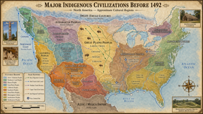](01-indigenous-nations-map.png)

    A detailed cartographic map of the major Indigenous nations and cultural regions across North America before European contact in 1492.

-   **[02 Cliff Dwellings](02-cliff-dwellings.png)**

    ---

    [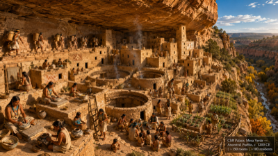](02-cliff-dwellings.png)

    Ancestral Pueblo cliff dwellings at Mesa Verde, Colorado, built between 600 and 1300 CE as sophisticated multi-story stone communities.

-   **[03 Columbus Landing](03-columbus.png)**

    ---

    [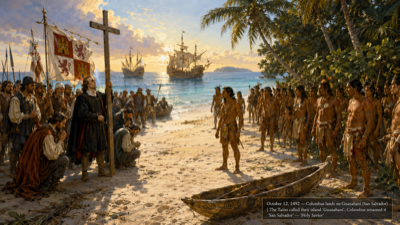](03-columbus.png)

    Christopher Columbus and his crew landing on the island of Guanahani (San Salvador) on October 12, 1492, the moment of first contact between Europe and the Americas.

-   **[04 Columbian Exchange Map](04-columbian-exchange-map.png)**

    ---

    [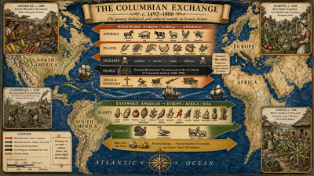](04-columbian-exchange-map.png)

    A map illustrating the Columbian Exchange — the transfer of plants, animals, diseases, and ideas between the Old and New Worlds after 1492.

-   **[05 Cortés Meets Moctezuma](05-cortes-montezuma.png)**

    ---

    [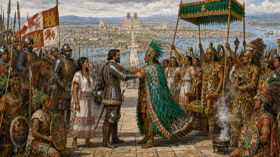](05-cortes-montezuma.png)

    The historic meeting between Spanish conquistador Hernán Cortés and Aztec Emperor Moctezuma II in Tenochtitlan in November 1519.

-   **[06 Jamestown Settlement](06-jamestown-settlement.png)**

    ---

    [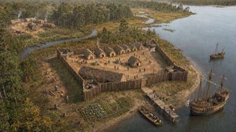](06-jamestown-settlement.png)

    Aerial reconstruction of the Jamestown fort circa 1607–1610, England's first permanent European settlement in North America.

-   **[07 Mayflower Painting](07-mayflower-painting.png)**

    ---

    [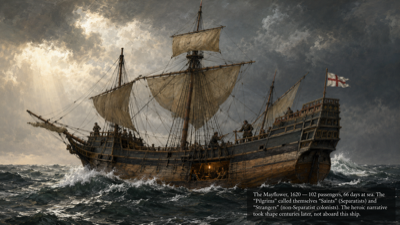](07-mayflower-painting.png)

    The Mayflower ship carrying Separatist Pilgrims across the Atlantic Ocean to Plymouth, Massachusetts in 1620.

-   **[08 Mayflower Compact](08-mayflower-compact.png)**

    ---

    [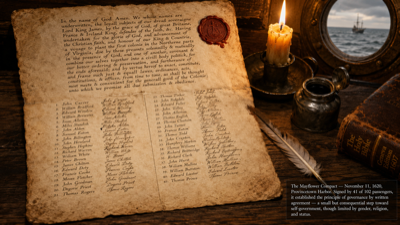](08-mayflower-compact.png)

    The signing of the Mayflower Compact aboard ship in 1620, one of the earliest examples of self-governance in colonial America.

-   **[09 First Thanksgiving](09-first-thanksgiving.png)**

    ---

    [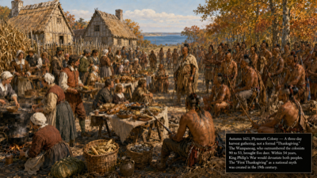](09-first-thanksgiving.png)

    The 1621 harvest gathering at Plymouth Colony between Wampanoag people and Separatist colonists, correcting common myths about the event.

-   **[10 Thirteen Colonies Map](10-thirteen-colonies-map.png)**

    ---

    [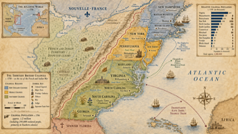](10-thirteen-colonies-map.png)

    A map of the thirteen British colonies established along North America's eastern seaboard between 1607 and 1733.

-   **[11 Slave Ship Brookes](11-slave-ship-brookes.png)**

    ---

    [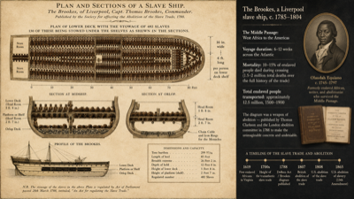](11-slave-ship-brookes.png)

    The infamous diagram of the slave ship Brookes showing the inhumane conditions endured by enslaved Africans during the Middle Passage.

-   **[12 Olaudah Equiano](12-olaudah-equiano.png)**

    ---

    [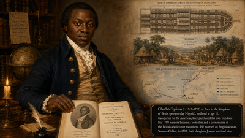](12-olaudah-equiano.png)

    Portrait of Olaudah Equiano, a formerly enslaved African who wrote a landmark narrative of his experiences, published in 1789.

-   **[13 Join or Die Cartoon](13-join-or-die-cartoon.png)**

    ---

    [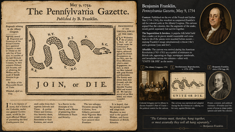](13-join-or-die-cartoon.png)

    Benjamin Franklin's 1754 "Join, or Die" political cartoon depicting a severed snake representing the disunited American colonies.

-   **[14 Boston Massacre](14-boston-massacre.png)**

    ---

    [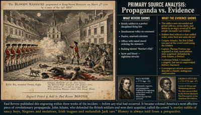](14-boston-massacre.png)

    The Boston Massacre of March 5, 1770, when British soldiers fired into a crowd of colonists, killing five people and inflaming colonial resistance.

-   **[15 Boston Tea Party](15-boston-tea-party.png)**

    ---

    [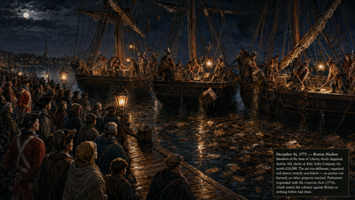](15-boston-tea-party.png)

    The Boston Tea Party of December 16, 1773, when colonists dumped 342 chests of British tea into Boston Harbor to protest taxation without representation.

-   **[16 Liberty Bell](16-liberty-bell.png)**

    ---

    [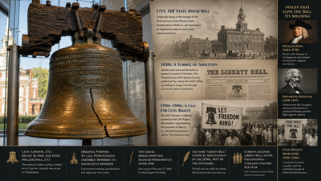](16-liberty-bell.png)

    The Liberty Bell, the iconic symbol of American independence and freedom located in Philadelphia, Pennsylvania.

-   **[17 Patrick Henry Speech](17-patrick-henry-speech.png)**

    ---

    [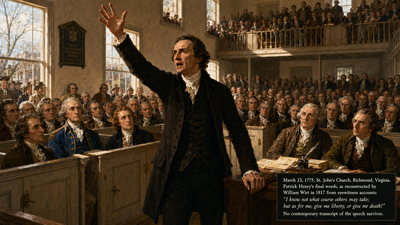](17-patrick-henry-speech.png)

    Patrick Henry delivering his famous "Give me liberty, or give me death!" speech to the Virginia Convention in March 1775.

-   **[18 Washington Crossing the Delaware](18-washington-crossing-delaware.png)**

    ---

    [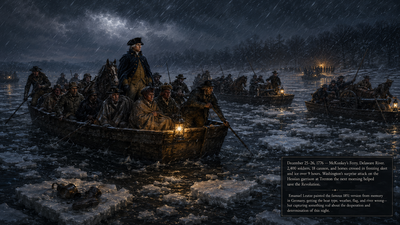](18-washington-crossing-delaware.png)

    George Washington's daring crossing of the Delaware River on the night of December 25–26, 1776, before the surprise attack at the Battle of Trenton.

-   **[19 Declaration of Independence](19-declaration-of-independence.png)**

    ---

    [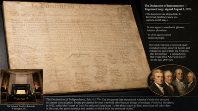](19-declaration-of-independence.png)

    The Declaration of Independence, adopted by the Continental Congress on July 4, 1776, asserting the colonies' separation from Britain.

-   **[20 Signing the Declaration](20-signing-declaration.png)**

    ---

    [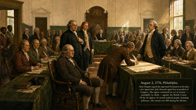](20-signing-declaration.png)

    Members of the Second Continental Congress signing the Declaration of Independence in Philadelphia's Independence Hall in 1776.

-   **[21 Valley Forge](21-valley-forge.png)**

    ---

    [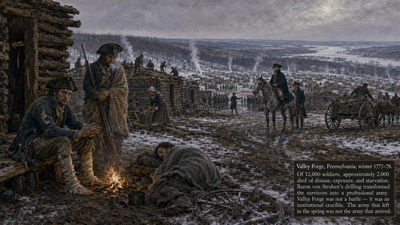](21-valley-forge.png)

    The Continental Army enduring the brutal winter encampment at Valley Forge, Pennsylvania, from December 1777 to June 1778.

-   **[22 Battle of Yorktown](22-battle-yorktown.png)**

    ---

    [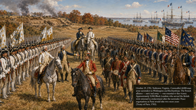](22-battle-yorktown.png)

    The Siege of Yorktown in 1781, the decisive final campaign of the American Revolutionary War that secured independence.

-   **[23 Articles of Confederation](23-articles-of-confederation.png)**

    ---

    [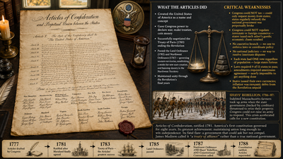](23-articles-of-confederation.png)

    The Articles of Confederation, America's first national constitution, which proved too weak and was replaced by the U.S. Constitution.

-   **[24 Constitutional Convention](24-constitutional-convention.png)**

    ---

    [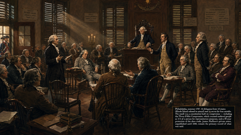](24-constitutional-convention.png)

    Delegates gathering at the Constitutional Convention in Philadelphia in 1787 to draft a new framework of government for the United States.

-   **[25 U.S. Constitution](25-us-constitution.png)**

    ---

    [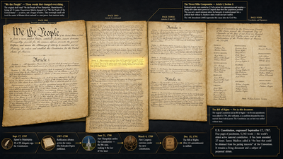](25-us-constitution.png)

    The United States Constitution, drafted in 1787 and ratified in 1788, establishing the enduring framework of American government.

-   **[26 James Madison Portrait](26-james-madison-portrait.png)**

    ---

    [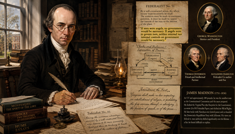](26-james-madison-portrait.png)

    Portrait of James Madison, the "Father of the Constitution" and fourth President of the United States.

-   **[27 Federalist Papers](27-federalist-papers.png)**

    ---

    [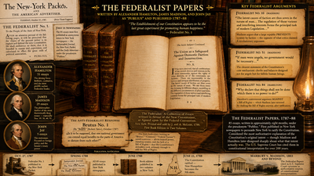](27-federalist-papers.png)

    The Federalist Papers, 85 essays by Hamilton, Madison, and Jay advocating ratification of the Constitution and explaining its principles.

-   **[28 Bill of Rights](28-bill-of-rights.png)**

    ---

    [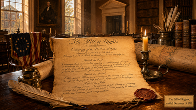](28-bill-of-rights.png)

    The Bill of Rights — the first ten amendments to the Constitution, ratified in 1791 to protect individual liberties from federal overreach.

-   **[29 Washington Portrait](29-washington-portrait.png)**

    ---

    [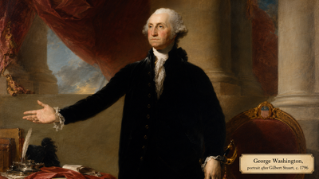](29-washington-portrait.png)

    Portrait of George Washington, commander of the Continental Army, presiding officer of the Constitutional Convention, and first President of the United States.

-   **[30 Louisiana Purchase Map](30-louisiana-purchase-map.png)**

    ---

    [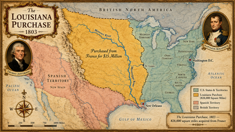](30-louisiana-purchase-map.png)

    A map showing the Louisiana Purchase of 1803, in which the United States acquired 828,000 square miles from France, doubling the nation's size.

-   **[31 Lewis and Clark Expedition](31-lewis-clark-expedition.png)**

    ---

    [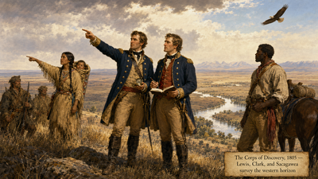](31-lewis-clark-expedition.png)

    The Lewis and Clark Expedition (1804–1806) exploring the western territories acquired through the Louisiana Purchase and reaching the Pacific Coast.

-   **[32 Sacagawea Portrait](32-sacagawea-portrait.png)**

    ---

    [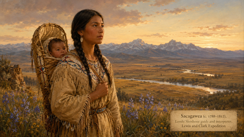](32-sacagawea-portrait.png)

    Portrait of Sacagawea, the Shoshone woman who served as guide, interpreter, and diplomatic asset for the Lewis and Clark Expedition.

-   **[33 Battle of New Orleans](33-battle-new-orleans.png)**

    ---

    [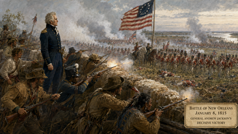](33-battle-new-orleans.png)

    The Battle of New Orleans in January 1815, Andrew Jackson's decisive victory and the final major battle of the War of 1812.

-   **[34 Monroe Doctrine](34-monroe-doctrine.png)**

    ---

    [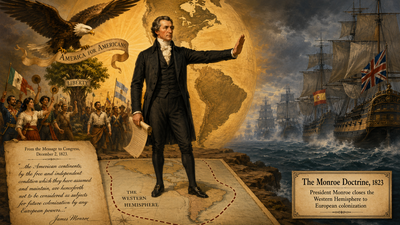](34-monroe-doctrine.png)

    President James Monroe announcing the Monroe Doctrine in 1823, declaring the Western Hemisphere closed to further European colonization or interference.

-   **[35 Andrew Jackson Portrait](35-andrew-jackson-portrait.png)**

    ---

    [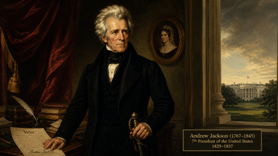](35-andrew-jackson-portrait.png)

    Portrait of Andrew Jackson, the seventh President of the United States and controversial champion of "Jacksonian Democracy" and westward expansion.

-   **[36 Trail of Tears](36-trail-of-tears.png)**

    ---

    [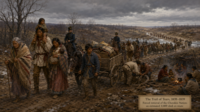](36-trail-of-tears.png)

    The forced removal of the Cherokee and other Indigenous nations from their homelands in the 1830s along the deadly Trail of Tears.

-   **[37 Oregon Trail Map](37-oregon-trail-map.png)**

    ---

    [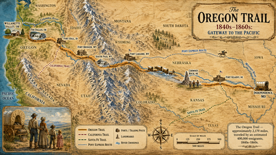](37-oregon-trail-map.png)

    A map of the Oregon Trail, the 2,000-mile emigrant route used by hundreds of thousands of settlers heading to the Pacific Northwest in the 1840s–1860s.

-   **[38 American Progress](38-american-progress.png)**

    ---

    [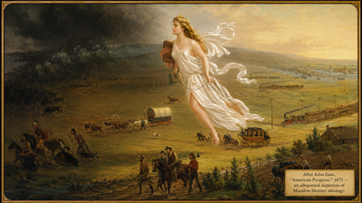](38-american-progress.png)

    John Gast's allegorical painting "American Progress" (1872) depicting the concept of Manifest Destiny as a heavenly figure leading settlers westward.

-   **[39 The Alamo](39-the-alamo.png)**

    ---

    [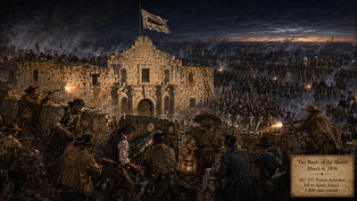](39-the-alamo.png)

    The Battle of the Alamo in February–March 1836, where a small band of Texas defenders held out against a larger Mexican army for thirteen days.

-   **[40 Mexican-American War](40-mexican-american-war.png)**

    ---

    [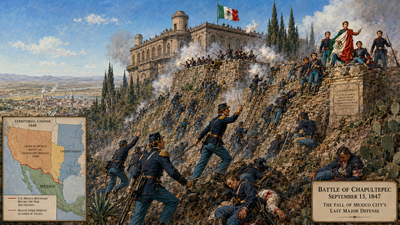](40-mexican-american-war.png)

    The Mexican-American War (1846–1848), which resulted in the United States acquiring the vast Southwest and California from Mexico.

-   **[41 Frederick Douglass](41-frederick-douglass.png)**

    ---

    [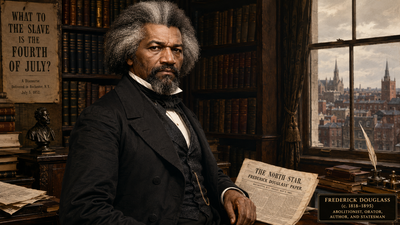](41-frederick-douglass.png)

    Portrait of Frederick Douglass, formerly enslaved abolitionist, orator, and author whose narrative became a landmark anti-slavery text.

-   **[42 Harriet Tubman](42-harriet-tubman.png)**

    ---

    [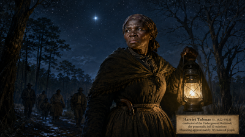](42-harriet-tubman.png)

    Portrait of Harriet Tubman, abolitionist who escaped slavery and conducted approximately thirteen rescue missions on the Underground Railroad.

-   **[43 Underground Railroad](43-underground-railroad.png)**

    ---

    [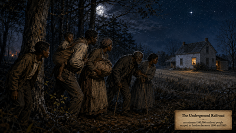](43-underground-railroad.png)

    The Underground Railroad — the clandestine network of routes, safe houses, and conductors who helped enslaved people escape to freedom.

-   **[44 Seneca Falls Convention](44-seneca-falls.png)**

    ---

    [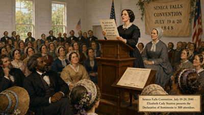](44-seneca-falls.png)

    The Seneca Falls Convention of July 1848, the first women's rights convention in the United States, which produced the Declaration of Sentiments.

-   **[45 Sojourner Truth](45-sojourner-truth.png)**

    ---

    [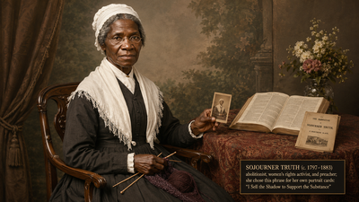](45-sojourner-truth.png)

    Portrait of Sojourner Truth, formerly enslaved abolitionist and women's rights activist famous for her 1851 "Ain't I a Woman?" speech.

-   **[46 Dred Scott](46-dred-scott.png)**

    ---

    [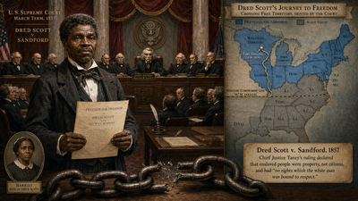](46-dred-scott.png)

    Dred Scott, whose 1857 Supreme Court case ruled that African Americans were not citizens and intensified the national crisis over slavery.

-   **[47 Lincoln-Douglas Debates](47-lincoln-douglas-debate.png)**

    ---

    [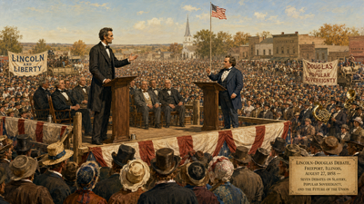](47-lincoln-douglas-debate.png)

    The Lincoln-Douglas debates of 1858, seven pivotal public debates on slavery in the territories that brought Abraham Lincoln to national attention.

-   **[48 Lincoln Portrait](48-lincoln-portrait.png)**

    ---

    [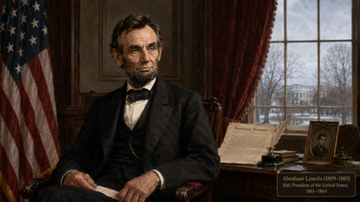](48-lincoln-portrait.png)

    Portrait of Abraham Lincoln, the sixteenth President of the United States, who led the nation through the Civil War and issued the Emancipation Proclamation.

-   **[49 Seceding States Map](49-seceding-states-map.png)**

    ---

    [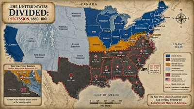](49-seceding-states-map.png)

    A map showing the eleven Southern states that seceded from the Union between 1860 and 1861 to form the Confederate States of America.

-   **[50 Fort Sumter](50-fort-sumter.png)**

    ---

    [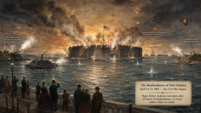](50-fort-sumter.png)

    The Confederate bombardment of Fort Sumter in Charleston Harbor beginning April 12, 1861 — the first battle of the Civil War.

-   **[51 Civil War Camp](51-civil-war-camp.png)**

    ---

    

    A Union Army encampment during the Civil War, depicting the daily life, hardships, and camaraderie of soldiers in the field.

-   **[52 Battle of Gettysburg](52-battle-gettysburg.png)**

    ---

    

    The Battle of Gettysburg in July 1863, the bloodiest battle of the Civil War with over 50,000 casualties and a critical turning point of the conflict.

-   **[53 Gettysburg Address](53-gettysburg-address.png)**

    ---

    

    Abraham Lincoln delivering the Gettysburg Address on November 19, 1863, redefining the Civil War as a struggle for equality and national unity.

-   **[54 Emancipation Proclamation](54-emancipation-proclamation.png)**

    ---

    

    The Emancipation Proclamation, issued by President Lincoln on January 1, 1863, declaring enslaved people in Confederate states to be forever free.

-   **[55 Black Union Soldiers](55-black-union-soldiers.png)**

    ---

    

    African American soldiers of the United States Colored Troops, who served with distinction in the Civil War and fought for both Union and freedom.

-   **[56 Lincoln at Antietam](56-lincoln-antietam.png)**

    ---

    

    President Lincoln meeting with General McClellan and officers at the Antietam battlefield in October 1862 following the war's bloodiest single day.

-   **[57 Lincoln Memorial](57-lincoln-memorial.png)**

    ---

    

    The Lincoln Memorial in Washington, D.C., the neoclassical monument completed in 1922 that has become a site of national reflection and protest.

-   **[58 Reconstruction Cartoon](58-reconstruction-cartoon.png)**

    ---

    

    A political cartoon depicting the contested politics of Reconstruction, the turbulent effort to rebuild the South and secure rights for freedpeople.

-   **[59 Freedmen's Bureau School](59-freedmens-bureau-school.md)**

    ---

    *Image coming soon.*

    A Freedmen's Bureau school during Reconstruction, where formerly enslaved people — of all ages — pursued education denied them under slavery.

-   **[60 Reconstruction Amendments](60-reconstruction-amendments.md)**

    ---

    *Image coming soon.*

    The Reconstruction Amendments — the 13th, 14th, and 15th Amendments — which abolished slavery, established citizenship, and guaranteed voting rights.

-   **[61 Transcontinental Railroad](61-promontory-point-railroad.md)**

    ---

    *Image coming soon.*

    The driving of the golden spike at Promontory Summit, Utah, on May 10, 1869, completing the First Transcontinental Railroad.

-   **[62 Andrew Carnegie](62-andrew-carnegie.md)**

    ---

    *Image coming soon.*

    Portrait of Andrew Carnegie, Scottish-American industrialist who built a steel empire and became a symbol of both Gilded Age wealth and philanthropy.

-   **[63 Rockefeller Portrait](63-rockefeller-portrait.md)**

    ---

    *Image coming soon.*

    Portrait of John D. Rockefeller, founder of Standard Oil and America's first billionaire, whose monopoly exemplified Gilded Age capitalism.

-   **[64 Ellis Island Immigrants](64-ellis-island-immigrants.md)**

    ---

    *Image coming soon.*

    Immigrants arriving at Ellis Island in New York Harbor, the main gateway through which over 12 million people entered the United States between 1892 and 1954.

-   **[65 Tenement Housing (Riis)](65-tenement-housing-riis.md)**

    ---

    *Image coming soon.*

    Tenement housing conditions in New York City's Lower East Side, as documented by reformer Jacob Riis in "How the Other Half Lives" (1890).

-   **[66 Statue of Liberty](66-statue-of-liberty.md)**

    ---

    *Image coming soon.*

    The Statue of Liberty in New York Harbor, a gift from France unveiled in 1886 as an enduring symbol of freedom and welcome to immigrants.

-   **[67 Boss Tweed Cartoon](67-boss-tweed-cartoon.md)**

    ---

    *Image coming soon.*

    Thomas Nast's biting political cartoons exposing the corruption of Boss Tweed and Tammany Hall's stranglehold on New York City politics.

-   **[68 Haymarket Affair](68-haymarket-affair.md)**

    ---

    *Image coming soon.*

    The Haymarket Affair of May 4, 1886, when a bomb exploded at a Chicago labor rally, killing police officers and setting back the labor movement.

-   **[69 Homestead Strike](69-homestead-strike.md)**

    ---

    *Image coming soon.*

    The Homestead Strike of 1892, a violent clash between Carnegie Steel and steelworkers at Homestead, Pennsylvania that crushed union organizing.

-   **[70 Wounded Knee](70-wounded-knee.md)**

    ---

    *Image coming soon.*

    The Wounded Knee Massacre of December 29, 1890, in which U.S. Army troops killed approximately 250 Lakota men, women, and children in South Dakota.

-   **[71 William Jennings Bryan](71-william-jennings-bryan.md)**

    ---

    *Image coming soon.*

    Portrait of William Jennings Bryan, the Populist Democratic orator famous for his 1896 "Cross of Gold" speech demanding relief for indebted farmers.

-   **[72 USS Maine Explosion](72-uss-maine-explosion.md)**

    ---

    *Image coming soon.*

    The mysterious explosion of the USS Maine in Havana Harbor on February 15, 1898, which became the rallying cry for the Spanish-American War.

-   **[73 Roosevelt's Rough Riders](73-roosevelt-rough-riders.md)**

    ---

    *Image coming soon.*

    Theodore Roosevelt and his Rough Riders at the Battle of San Juan Hill during the Spanish-American War in Cuba, 1898.

-   **[74 Panama Canal Construction](74-panama-canal-construction.md)**

    ---

    *Image coming soon.*

    Construction of the Panama Canal, the massive engineering project completed in 1914 that connected the Atlantic and Pacific Oceans.

-   **[75 Muckraker Cartoon](75-muckraker-cartoon.md)**

    ---

    *Image coming soon.*

    A political cartoon celebrating the Progressive Era muckraker journalists who exposed corruption, dangerous industries, and social inequality.

-   **[76 The Jungle Illustration](76-the-jungle-illustration.md)**

    ---

    *Image coming soon.*

    An illustration of conditions in Chicago's meatpacking industry as exposed by Upton Sinclair's shocking novel "The Jungle" (1906).

-   **[77 Suffragists Marching](77-suffragists-marching.md)**

    ---

    *Image coming soon.*

    Women's suffrage marchers demanding the right to vote, a decades-long campaign that culminated in the 19th Amendment's ratification in 1920.

-   **[78 WWI Trenches](78-wwi-trenches.md)**

    ---

    *Image coming soon.*

    Soldiers in the trenches of World War I, depicting the brutal stalemate and horrific conditions of trench warfare on the Western Front.

-   **[79 Uncle Sam Poster](79-uncle-sam-poster.md)**

    ---

    *Image coming soon.*

    The iconic "I Want YOU for U.S. Army" recruiting poster featuring Uncle Sam, painted by James Montgomery Flagg and first used in 1917.

-   **[80 Treaty of Versailles](80-treaty-versailles.md)**

    ---

    *Image coming soon.*

    The signing of the Treaty of Versailles on June 28, 1919, formally ending World War I and imposing punishing reparations on Germany.

-   **[81 Harlem Renaissance Jazz](81-harlem-renaissance-jazz.md)**

    ---

    *Image coming soon.*

    Jazz musicians and artists of the Harlem Renaissance, the vibrant African American cultural movement that transformed American music and arts in the 1920s.

-   **[82 1920s Flapper](82-1920s-flapper.md)**

    ---

    *Image coming soon.*

    A "flapper" of the 1920s Jazz Age, representing the dramatic shift in women's fashion, independence, and social norms after World War I.

-   **[83 Stock Market Crash 1929](83-stock-market-crash-1929.md)**

    ---

    *Image coming soon.*

    The stock market crash of October 1929, which wiped out fortunes overnight and triggered the Great Depression, the worst economic crisis in U.S. history.

-   **[84 Migrant Mother (Lange)](84-migrant-mother-lange.md)**

    ---

    *Image coming soon.*

    Dorothea Lange's iconic "Migrant Mother" photograph (1936), capturing the desperation of a pea-picker and her children during the Great Depression.

-   **[85 FDR Fireside Chat](85-fdr-fireside-chat.md)**

    ---

    *Image coming soon.*

    President Franklin D. Roosevelt delivering one of his "fireside chat" radio broadcasts, using the new medium to reassure Americans during the Depression.

-   **[86 New Deal WPA Workers](86-new-deal-wpa-workers.md)**

    ---

    *Image coming soon.*

    Works Progress Administration (WPA) workers building public infrastructure, one of FDR's New Deal programs that put millions of unemployed Americans to work.

-   **[87 Pearl Harbor](87-pearl-harbor.md)**

    ---

    *Image coming soon.*

    The Japanese surprise attack on the U.S. naval base at Pearl Harbor, Hawaii, on December 7, 1941 — "a date which will live in infamy."

-   **[88 Rosie the Riveter](88-rosie-the-riveter.md)**

    ---

    *Image coming soon.*

    "Rosie the Riveter," the iconic wartime symbol of the millions of American women who entered the industrial workforce while men served overseas.

-   **[89 D-Day Landing](89-d-day-landing.md)**

    ---

    *Image coming soon.*

    Allied troops landing on the beaches of Normandy, France, on June 6, 1944 — the largest seaborne invasion in history and a turning point in World War II.

-   **[90 Iwo Jima Flag Raising](90-iwo-jima-flag.md)**

    ---

    *Image coming soon.*

    Joe Rosenthal's photograph of Marines raising the American flag on Mount Suribachi at Iwo Jima, February 23, 1945 — one of the war's defining images.

-   **[91 Holocaust Liberation](91-holocaust-liberation.md)**

    ---

    *Image coming soon.*

    American soldiers liberating survivors from Nazi concentration camps in spring 1945, confronting the full horror of the Holocaust.

-   **[92 Hiroshima Mushroom Cloud](92-hiroshima-mushroom-cloud.md)**

    ---

    *Image coming soon.*

    The mushroom cloud over Hiroshima, Japan, following the dropping of the first atomic bomb on August 6, 1945, ushering in the nuclear age.

-   **[93 United Nations Founding](93-united-nations-founding.md)**

    ---

    *Image coming soon.*

    Delegates at the 1945 San Francisco conference that established the United Nations, the international organization created to prevent future world wars.

-   **[94 Berlin Airlift](94-berlin-airlift.md)**

    ---

    *Image coming soon.*

    The Berlin Airlift (1948–1949), in which Western Allied aircraft supplied West Berlin around the clock during the Soviet Union's ground blockade.

-   **[95 McCarthy Hearings](95-mccarthy-hearings.md)**

    ---

    *Image coming soon.*

    Senator Joseph McCarthy's anti-Communist hearings in the early 1950s, whose reckless accusations gave rise to the term "McCarthyism."

-   **[96 JFK Moon Speech](96-jfk-moon-speech.md)**

    ---

    *Image coming soon.*

    President John F. Kennedy delivering his "We choose to go to the Moon" speech at Rice University in 1962, launching America's space race ambitions.

-   **[97 Apollo 11 Moon Landing](97-apollo-11-moon-landing.md)**

    ---

    *Image coming soon.*

    The Apollo 11 Moon landing on July 20, 1969, fulfilling Kennedy's challenge as Neil Armstrong became the first human to walk on the lunar surface.

-   **[98 MLK "I Have a Dream" Speech](98-mlk-dream-speech.md)**

    ---

    *Image coming soon.*

    Dr. Martin Luther King Jr. delivering his "I Have a Dream" speech before 250,000 people at the March on Washington on August 28, 1963.

-   **[99 Vietnam Napalm Girl](99-vietnam-napalm-girl.md)**

    ---

    *Image coming soon.*

    Nick Ut's Pulitzer Prize-winning photograph of children fleeing a napalm attack in Vietnam (June 8, 1972), an image that galvanized anti-war sentiment.

-   **[100 Ground Zero Flag](100-ground-zero-flag.md)**

    ---

    *Image coming soon.*

    Firefighters raising the American flag amid the rubble of Ground Zero following the September 11, 2001 terrorist attacks on the World Trade Center.

