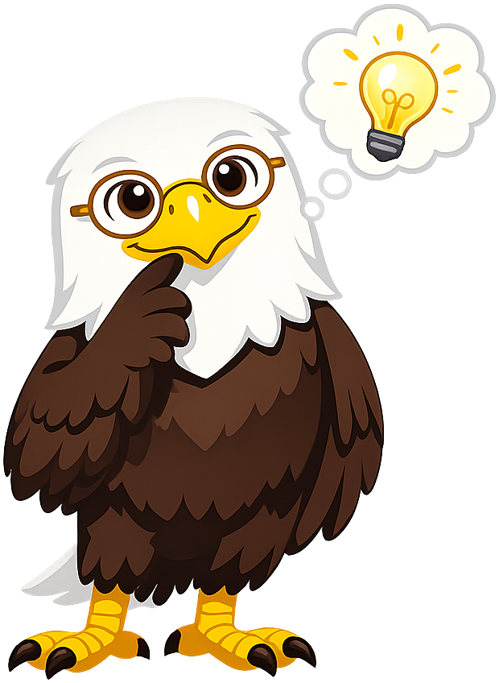
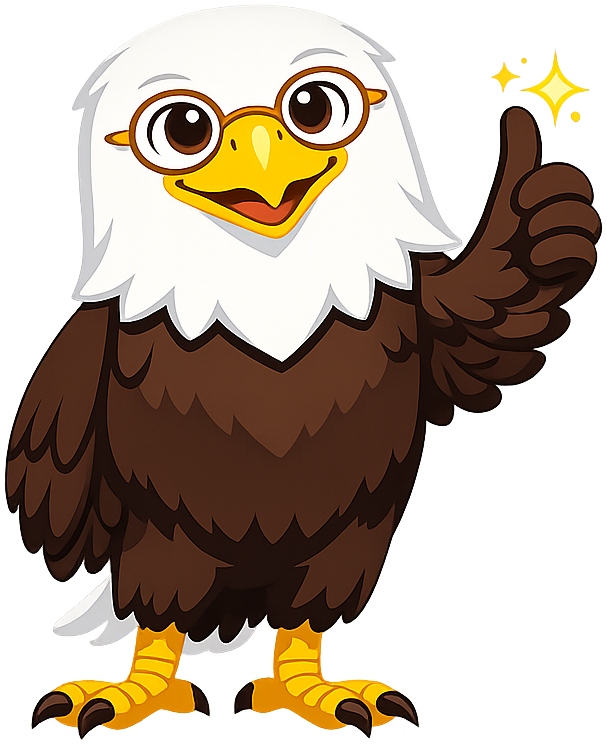

# Mascot Style Guide — Liberty the Bald Eagle

This page exercises every admonition style for Liberty, the U.S. History
pedagogical mascot. Use it to verify that images load, colors render correctly,
and text wraps cleanly around the floated images.

---

## Neutral

!!! mascot-neutral "A Note from Liberty"
    
    This is the neutral style — used for general sidebars, introductions, or
    any content that doesn't call for a specific emotional tone.

---

## Welcome

!!! mascot-welcome "Welcome to This Chapter!"
    
    Let's investigate the evidence! In this chapter we'll explore one of the
    most consequential periods in American history. Get ready to think
    critically, question assumptions, and draw your own conclusions.

---

## Thinking

!!! mascot-thinking "Key Insight"
    
    This is the thinking style — used for key concepts and moments that
    deserve deeper reflection. Notice how the evidence connects to broader
    themes across multiple historical periods.

---

## Tip

!!! mascot-tip "Liberty's Tip"
    
    This is the tip style — used for hints and helpful guidance. Always
    check the source date, author, and audience before accepting a historical
    claim at face value.

---

## Warning

!!! mascot-warning "Common Mistake"
    
    This is the warning style — used to alert students to common
    misconceptions or logical errors. Watch out for hindsight bias: just
    because an outcome seems obvious now doesn't mean it was predictable then.

---

## Encourage

!!! mascot-encourage "You Can Do This!"
    
    This is the encouraging style — used for difficult or dense content.
    Primary source analysis can feel challenging at first. That's completely
    normal. With practice you'll start reading historical documents like a
    detective.

---

## Celebration

!!! mascot-celebration "Great Work!"
    
    This is the celebration style — used at the end of major sections.
    You've just worked through one of the most complex chapters in this
    course. That takes real intellectual effort — well done!

---

## Image Border Debug View

The section below adds a red outline to each mascot image to verify
trim padding and sizing.

!!! mascot-neutral "Border Check — Neutral"
    
    Red outline shows the actual image bounding box. If you see large gaps
    between the outline and Liberty's body, run the trim-padding script.

!!! mascot-celebration "Border Check — Celebration"
    
    Verify that pale confetti elements are visible against the dark purple
    background. If not, the celebration PNG may need a darker background pass.

