# List of MicroSims for U.S. History

Interactive Micro Simulations to help students explore and understand key events, systems, and concepts in United States History.

-   **[AI in Warfare — From Semi-Autonomous to Fully Autonomous](./ai-warfare-spectrum/index.md)**

    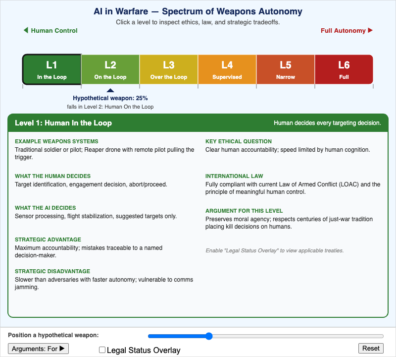

    Students assess the ethical and strategic implications of different levels of weapons autonomy, identify key decision points where human judgment matters, and evaluate arguments for and against autonomous targeting authority.

-   **[AP Thematic Lens — American Identity and Politics and Power](./ap-thematic-lenses-ch5/index.md)**

    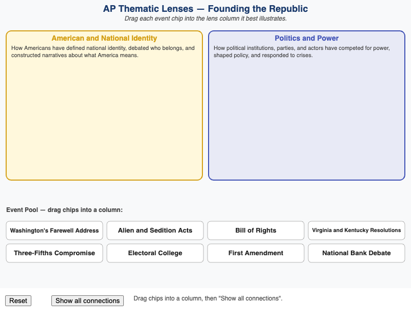

    Students classify events from the founding era under the appropriate AP thematic lens and explain why each event illustrates that theme.

-   **[Arms Race Dynamics — The Security Dilemma Loop](./arms-race-dynamics/index.md)**

    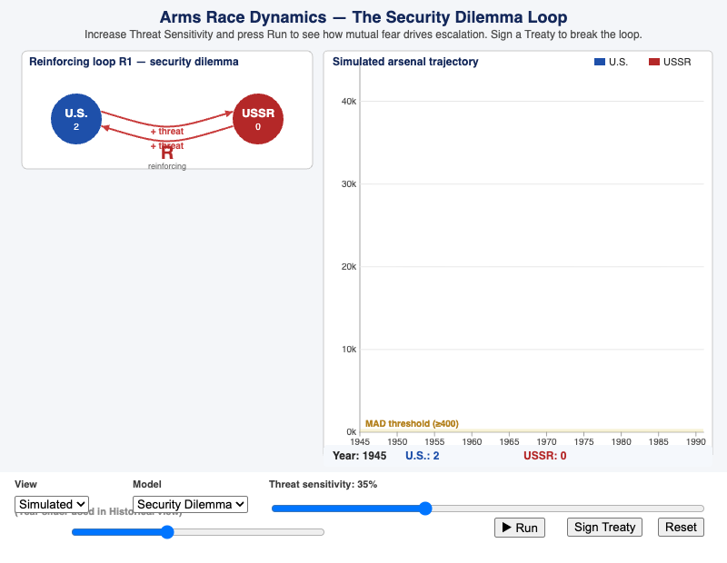

    Students model the security dilemma feedback loop that drives arms races, identify reinforcing loops at work, and evaluate what conditions could break the loop.

-   **[Causal Loop Diagram Builder — Industrial Era](./causal-loop-diagram-builder/index.md)**

    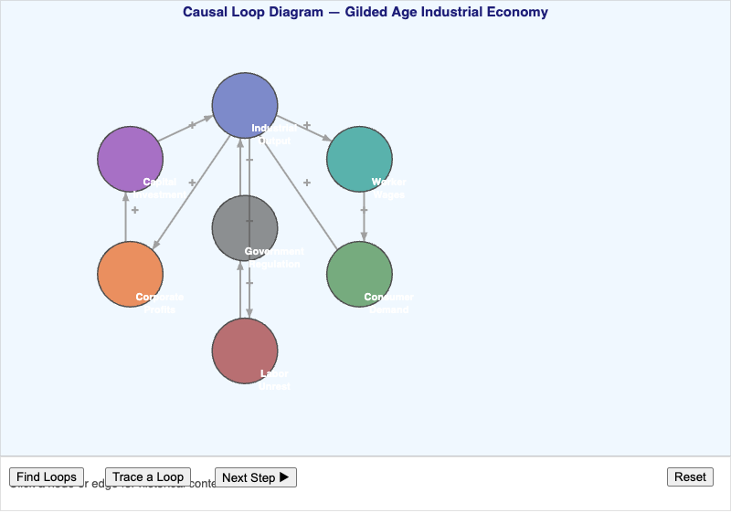

    Students examine how interconnected causal relationships in a historical system produce reinforcing or balancing feedback loops, and distinguish between the two loop types using evidence from the diagram.

-   **[Civil Rights Movement Timeline — Strategies and Legislative Outcomes](./civil-rights-timeline/index.md)**

    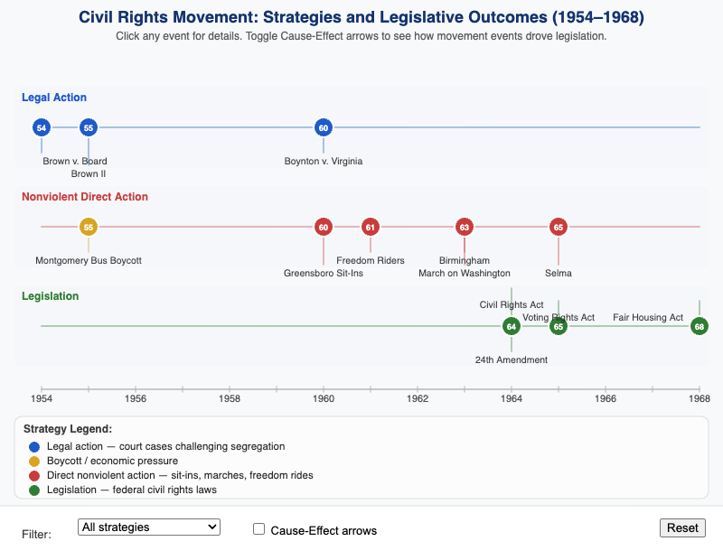

    Students trace the relationship between civil rights movement strategies and legislative outcomes, identifying which strategies proved most effective at each stage and why.

-   **[Civil War Battles and Strategy Map](./civil-war-strategy-map/index.md)**

    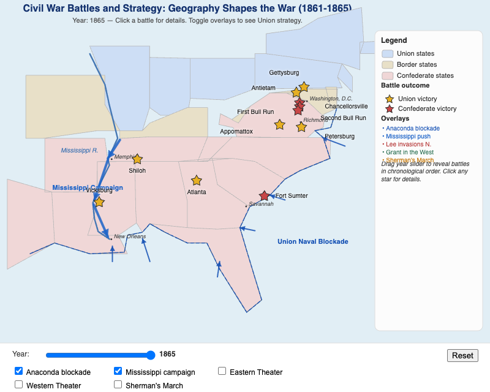

    Students examine how geography shaped Civil War military strategy, explaining the Anaconda Plan's logic and the significance of at least two major battles.

-   **[Cognitive Bias Identifier](./cognitive-bias-identifier/index.md)**

    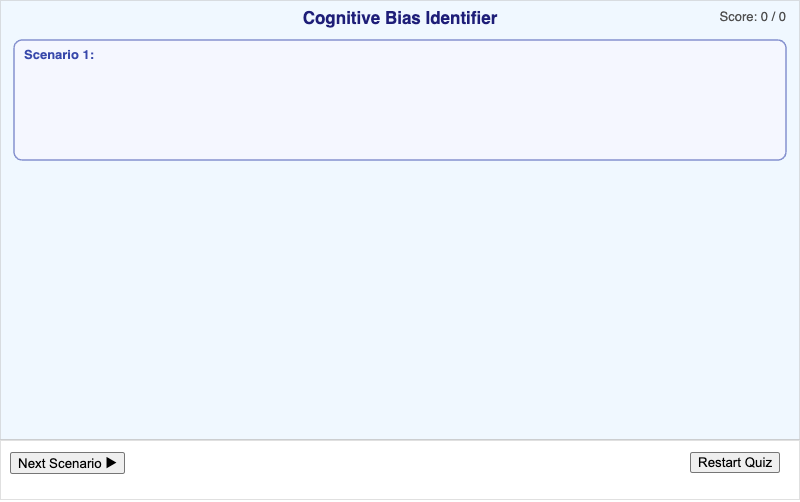

    Students identify confirmation bias, hindsight bias, the availability heuristic, in-group favoritism, and presentism in short historical scenario descriptions, and explain why the bias fits.

-   **[Colonial Resistance Timeline (1763–1775)](./colonial-resistance-timeline/index.md)**

    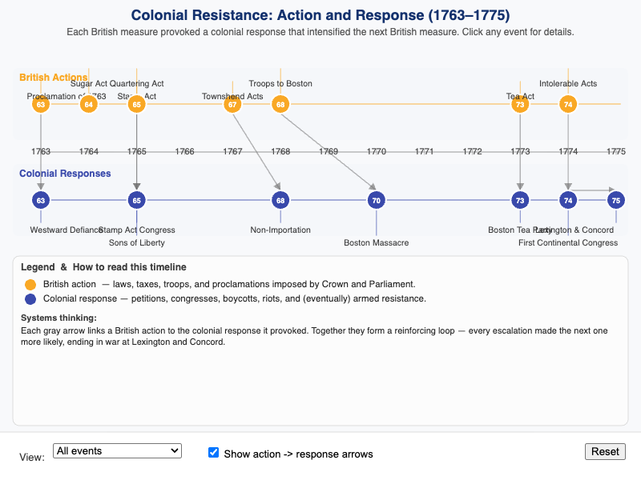

    Students examine the escalating cycle of British action and colonial response and identify how each British measure produced colonial resistance that intensified the next British measure.

-   **[Colonial Society Structure](./colonial-society-structure/index.md)**

    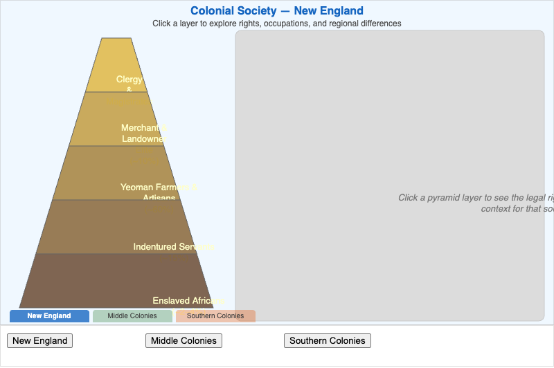

    Students describe the social structure of colonial America and explain how it differed between the New England, Middle, and Southern colony regions.

-   **[Constitutional Structure — Checks and Balances Explorer](./checks-and-balances-explorer/index.md)**

    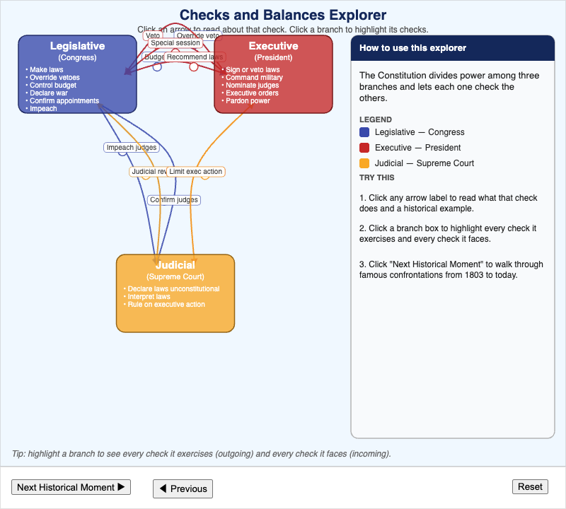

    Students explain how checks and balances distribute power among the three branches and give at least two examples of checks being exercised in American history.

-   **[Depression Causes — Interacting Feedback Loops](./depression-feedback-loops/index.md)**

    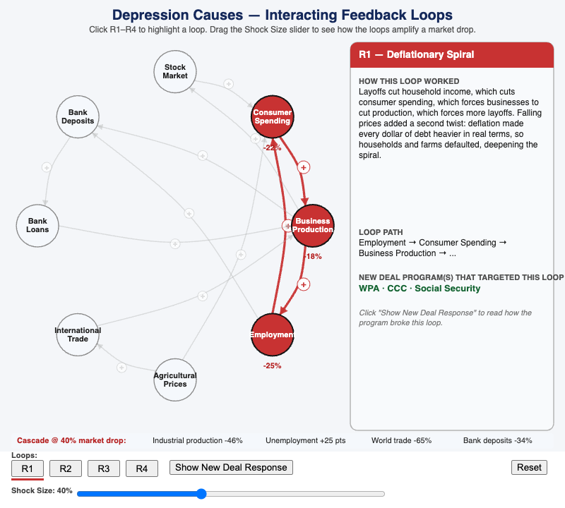

    Students diagram the reinforcing feedback loops that amplified the 1929 crash into a decade-long depression, identifying which loops the New Deal attempted to break and how.

-   **[European Exploration Timeline](./european-exploration-timeline/index.md)**

    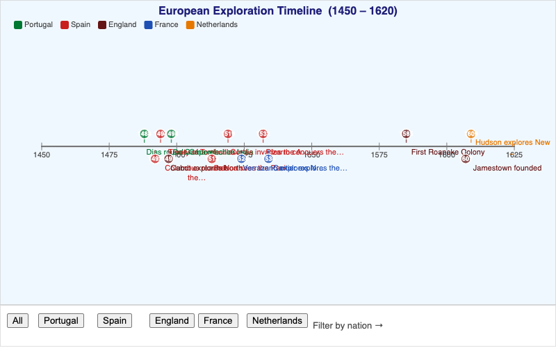

    Students recall the sequence of major European exploration events and the national powers behind them.

-   **[Four Historical Thinking Skills Explorer](./four-historical-thinking-skills/index.md)**

    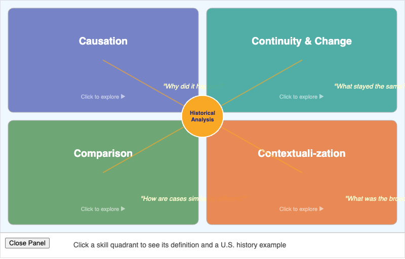

    Students explain what each of the four historical thinking skills means and give an example of how each applies to a historical scenario.

-   **[Four Progressive Era Amendments — Timeline and Context](./progressive-amendments-timeline/index.md)**

    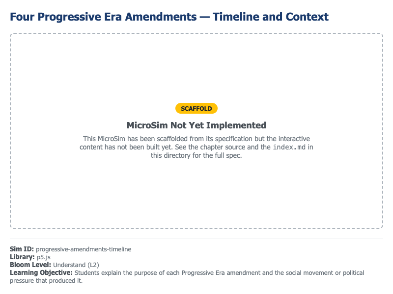

    Students explain the purpose of each Progressive Era amendment and the social movement or political pressure that produced it.

-   **[Gilded Age Inequality — Wealth Distribution Chart](./gilded-age-inequality/index.md)**

    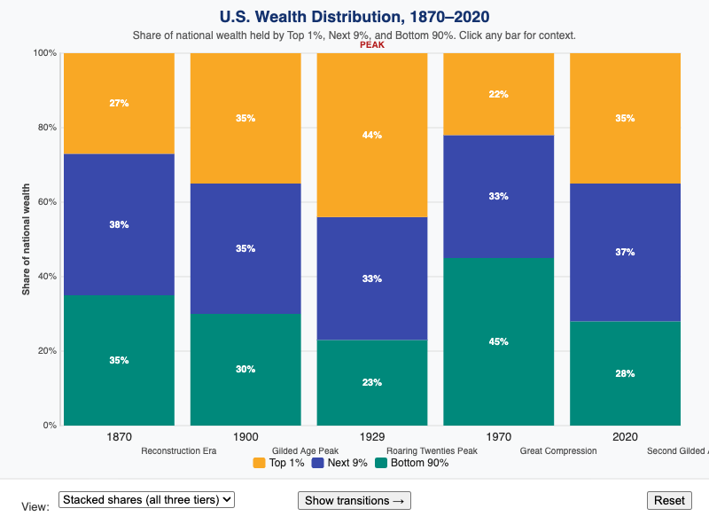

    Students compare wealth distribution across historical periods and explain how extreme inequality in the Gilded Age contributed to the rise of labor and reform movements.

-   **[Judicial Review — How It Works](./judicial-review-explainer/index.md)**

    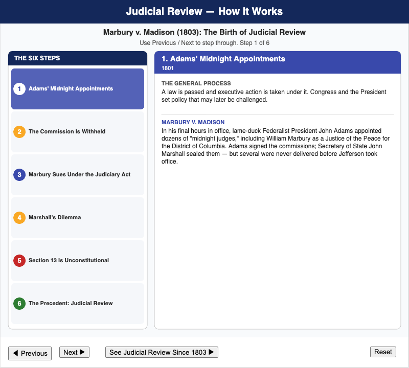

    Students explain the process of judicial review using Marbury v. Madison and describe why the power is significant for the balance of power among branches.

-   **[Learning Graph Viewer](./graph-viewer/index.md)**

    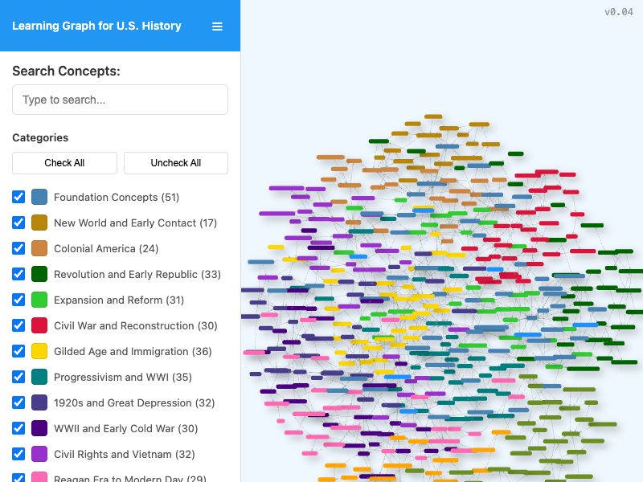

    Interactive network visualization of the 200 course concepts and their dependencies. Search, filter by category, and explore connections between ideas across all 21 chapters.

-   **[Misinformation Detection — Lost Cause Claims](./misinformation-detector/index.md)**

    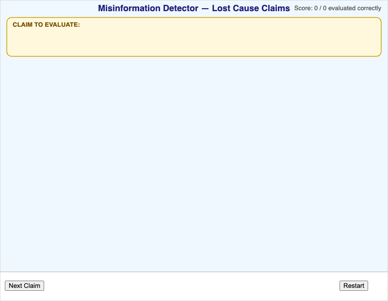

    Students assess historical claims using a structured misinformation detection framework, identifying which claims are supported by primary source evidence and which are contradicted by it.

-   **[New Deal Programs — What They Did and What Survived](./new-deal-programs/index.md)**

    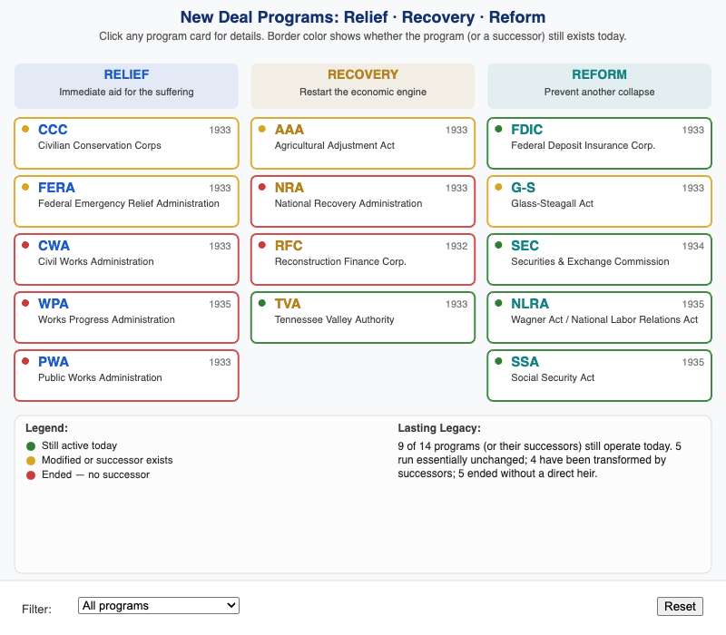

    Students categorize New Deal programs by purpose (relief, recovery, reform), identify the specific problem each addressed, and determine which programs still exist today.

-   **[Political Party Realignment — New Deal to Reagan Coalition](./party-realignment/index.md)**

    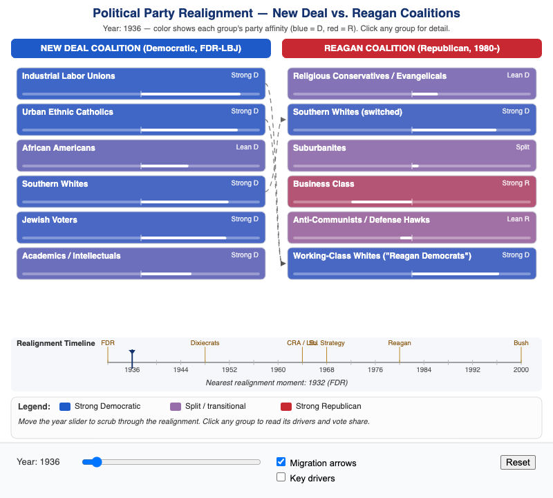

    Students map the demographic and geographic components of the New Deal and Reagan coalitions, identify the key groups that switched parties, and analyze what drove the realignment.

-   **[Political Polarization — A Historical and Contemporary Index](./polarization-index/index.md)**

    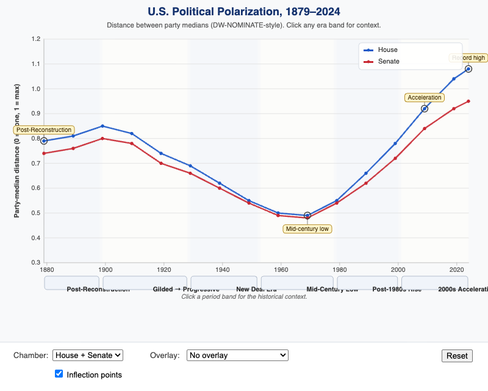

    Students interpret data on American political polarization over time, identify periods of greatest change, and evaluate competing explanations for increasing polarization.

-   **[Populist Policy Platform — Then and Now](./populist-platform-tracker/index.md)**

    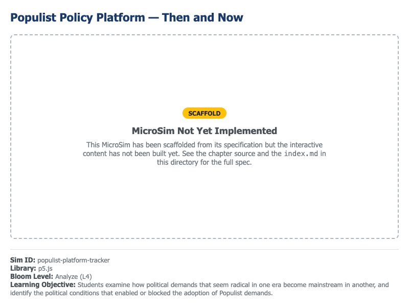

    Students examine how political demands that seem radical in one era become mainstream in another, and identify the conditions that enabled or blocked adoption of Populist demands.

-   **[Pre-Columbian Americas Interactive Map](./pre-columbian-americas-map/index.md)**

    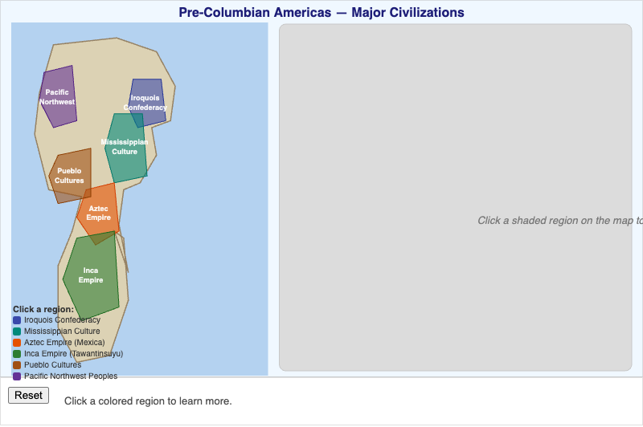

    Students identify the geographic locations of the Aztec Empire, Inca Empire, Mississippian Culture, and Iroquois Confederacy and recall one defining characteristic of each.

-   **[Primary Source Analysis](./primary-source-analyzer/index.md)**

    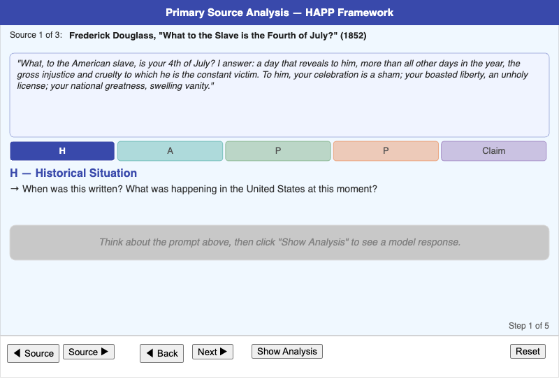

    Students use the HAPP framework to analyze a primary source excerpt by identifying historical situation, audience, purpose, and point of view, then construct a sourcing claim.

-   **[Reform Movement Network — 1830–1860](./reform-movement-network/index.md)**

    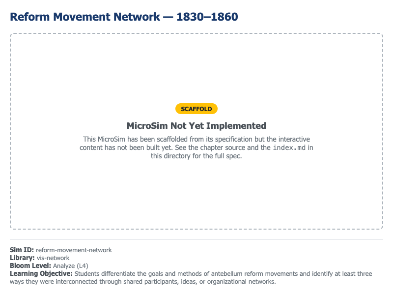

    Students differentiate the goals and methods of antebellum reform movements and identify at least three ways they were interconnected through shared participants, ideas, or organizational networks.

-   **[Revolutionary War Battles Map](./revolutionary-war-battles/index.md)**

    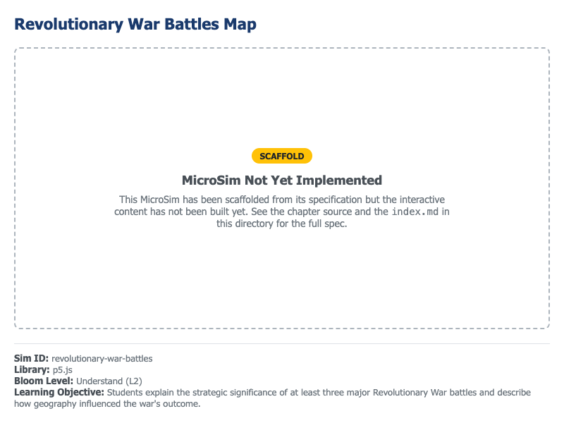

    Students explain the strategic significance of at least three major Revolutionary War battles and describe how geography influenced the war's outcome.

-   **[Social Movements of the 1960s–70s — Strategies and Outcomes](./social-movements-comparison/index.md)**

    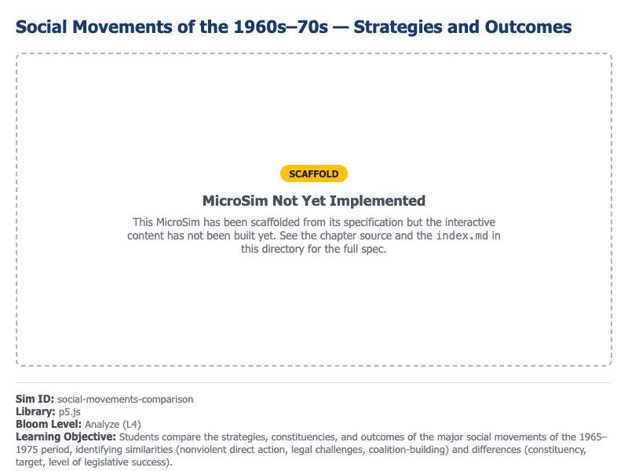

    Students compare the strategies, constituencies, and outcomes of the major social movements of the 1965–1975 period, identifying similarities and differences across movements.

-   **[Technology Power Shifts — Historical Comparison](./tech-power-shifts/index.md)**

    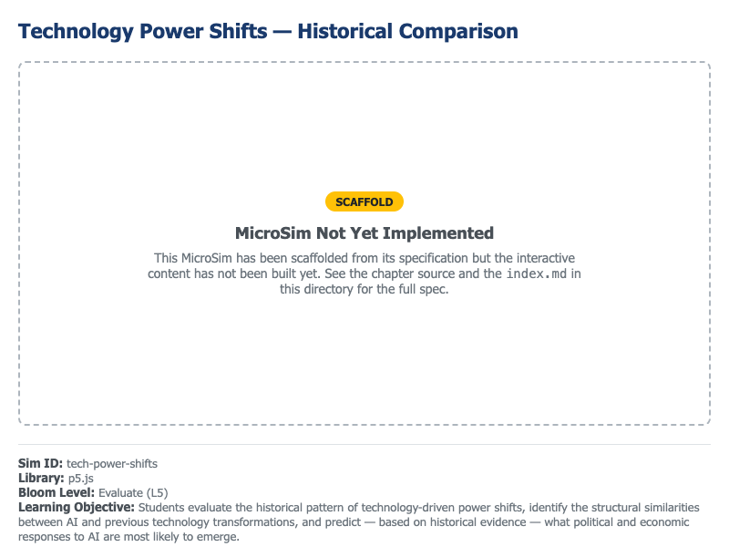

    Students evaluate the historical pattern of technology-driven power shifts, identify structural similarities between AI and previous technology transformations, and predict likely political and economic responses.

-   **[The Columbian Exchange Interactive Web](./columbian-exchange-web/index.md)**

    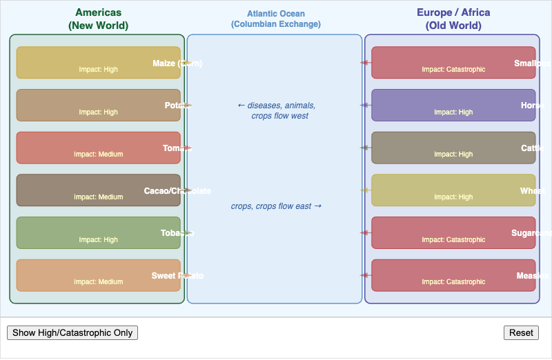

    Students explain the bidirectional nature of the Columbian Exchange and identify at least two transfers from each direction that had significant historical consequences.

-   **[The Transportation Revolution — Connections Map](./transportation-revolution-map/index.md)**

    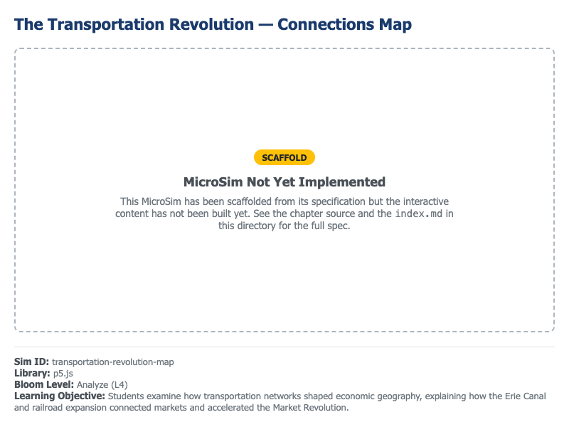

    Students examine how transportation networks shaped economic geography, explaining how the Erie Canal and railroad expansion connected markets and accelerated the Market Revolution.

-   **[Three Colonial Regions Comparison](./colonial-regions-comparison/index.md)**

    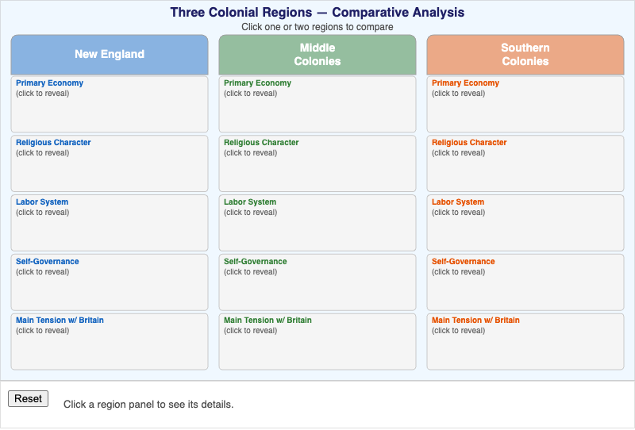

    Students compare and contrast the three colonial regions across at least three dimensions, identifying similarities and differences that shaped their political cultures.

-   **[Treaty of Versailles — Fourteen Points vs. Actual Outcome](./versailles-comparison/index.md)**

    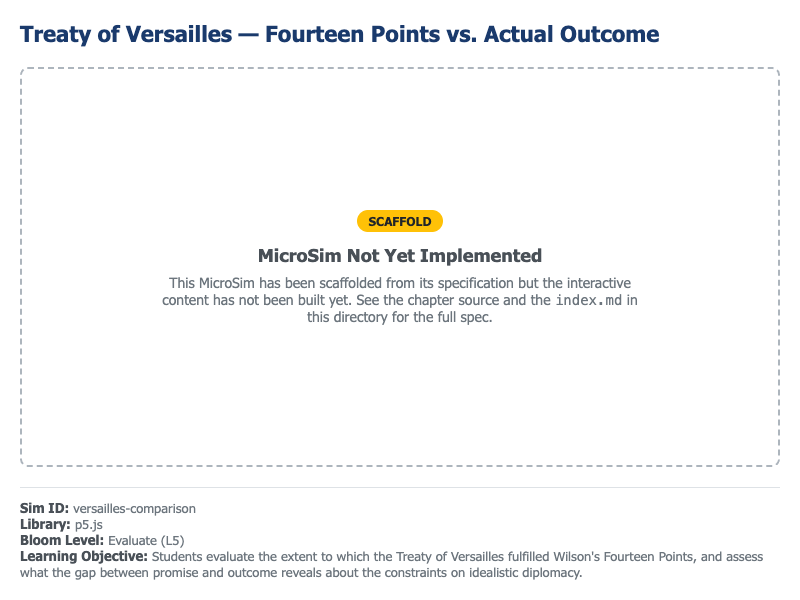

    Students evaluate the extent to which the Treaty of Versailles fulfilled Wilson's Fourteen Points, and assess what the gap reveals about the constraints on idealistic diplomacy.

-   **[Vertical vs. Horizontal Integration — Interactive Diagram](./integration-strategies/index.md)**

    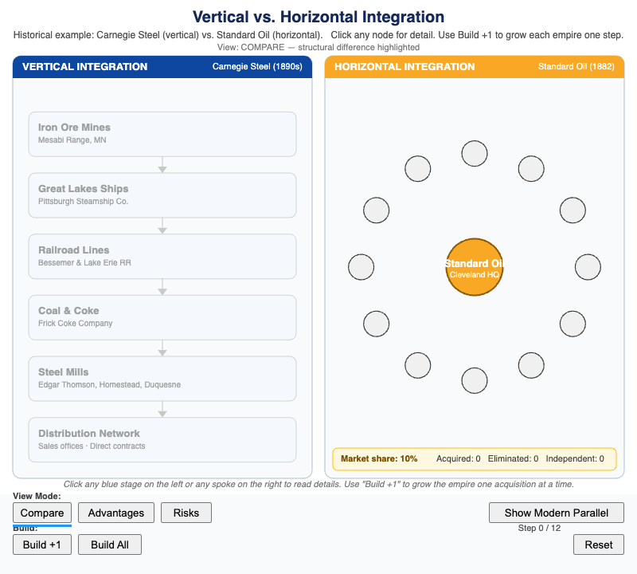

    Students explain the difference between vertical and horizontal integration and give a historical example of each strategy.

-   **[WWI Decision Tree — From Assassination to American Entry](./wwi-decision-tree/index.md)**

    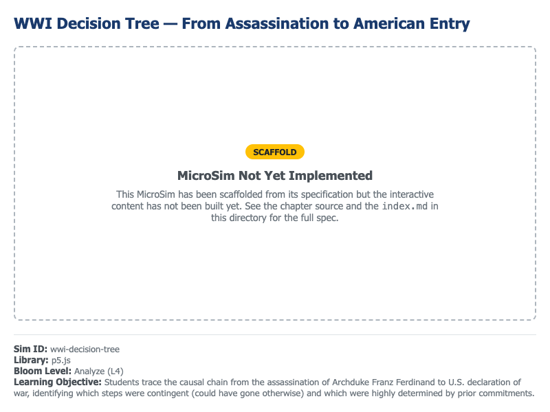

    Students trace the causal chain from the assassination of Archduke Franz Ferdinand to U.S. declaration of war, identifying which steps were contingent and which were determined by prior commitments.

-   **[WWII Timeline — From Blitzkrieg to Surrender](./wwii-timeline/index.md)**

    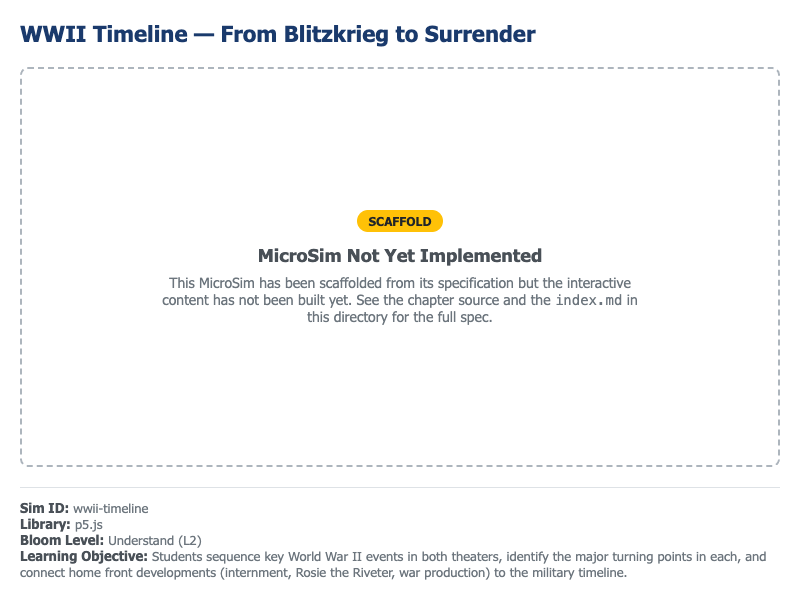

    Students sequence key World War II events in both theaters, identify major turning points, and connect home front developments to the military timeline.

